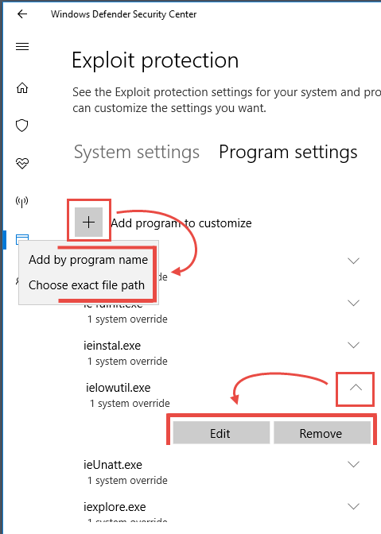

# Customize Exploit Protection

**Applies to:**

- Windows 10 Insider Preview

[!include[Prerelease information](prerelease.md)]

**Audience**

- Enterprise security administrators


**Manageability available with**

- Windows Defender Security Center app
- Group Policy
- PowerShell


Exploit Protection automatically applies a number of exploit mitigation techniques on both the operating system processes and on individual apps.

 It is part of [Windows Defender Exploit Guard](windows-defender-exploit-guard.md).
 
You configure these settings using the Windows Defender Security Center on an individual machine, and then export the configuration as an XML file that you can deploy to other machines. You can use Group Policy to distribute the XML file to multiple devices at once. You can also configure the mitigations with PowerShell.

 This topic lists each of the mitigations available in Exploit Protection, indicates whether the mitigation can be applied system-wide or to individual apps, and provides a brief description of how the mitigation works.

It also describes how to enable or configure the mitigations using Windows Defender Security Center, PowerShell, and MDM CSPs. This is the first step in creating a configuration that you can deploy across your network. The next step involves [generating or exporting, importing, and deploying the configuration to multiple devices](import-export-exploit-protection-emet-xml.md).


## Exploit Protection mitigations

All mitigations can be configured for individual apps. Some mitigations can also be applied at the operating system level.

You can set each of the mitigations to on, off, or to their default value as indicated in the following table. Some mitigations have additional options, these are indicated in the description in the table.

For the associated PowerShell cmdlets for each mitigation, see the [PowerShell reference table](#cmdlets-table) at the bottom of this topic.

Mitigation | Description | Can be applied to, and default value for system mitigations | Audit mode available
- | - | - | -
Control flow guard (CFG) | Ensures control flow integrity for indirect calls. Can optionally suppress exports and use strict CFG. | System and app-level (system default: **On** | No
Data Execution Prevention (DEP) | Prevents code from being run from data-only memory pages such as the heap and stacks. Only configurable for 32-bit (x86) apps, permanently enabled for all other architectures. Can optionally enable ATL thunk emulation. | System and app-level (system default: **On** | No
Force randomization for images (Mandatory ASLR) | Forcibly relocates images not compiled with /DYNAMICBASE. Can optionally fail loading images that don't have relocation information. | System and app-level (system default: **Off** | No
Randomize memory allocations (Bottom-Up ASLR) | Randomizes locations for virtual memory allocations including those for system structures heaps, stacks, TEBs, and PEBs. Can optionally use a wider randomization variance for 64-bit processes. | System and app-level (system default: **On** | No
Validate exception chains (SEHOP) | Ensures the integrity of an exception chain during exception dispatch. Only configurable for 32-bit (x86) applications. | System and app-level (system default: **On** | No
Validate heap integrity | Terminates a process when heap corruption is detected. | System and app-level (system default: **Off** | No
Arbitrary code guard (ACG) | Prevents the introduction of non-image-backed executable code and prevents code pages from being modified. Can optionally allow thread opt-out and allow remote downgrade (configurable only with PowerShell). | App-level only | Yes
Block low integrity images | Prevents the loading of images marked with Low Integrity. | App-level only | Yes
Block remote images | Prevents loading of images from remote devices. | App-level only | Yes
Block untrusted fonts | Prevents loading any GDI-based fonts not installed in the system fonts directory, notably fonts from the web. | App-level only | Yes
Code integrity guard | Restricts loading of images signed by Microsoft, WQL, and higher. Can optionally allow Windows Store signed images. | App-level only | Yes
Disable extension points | Disables various extensibility mechanisms that allow DLL injection into all processes, such as AppInit DLLs, window hooks, and Winsock service providers. | App-level only | No
Disable Win32k system calls | Prevents an app from using the Win32k system call table. | App-level only | Yes
Do not allow child processes | Prevents an app from creating child processes. | App-level only | Yes
Export address filtering (EAF) | Detects dangerous operations being resolved by malicious code. Can optionally validate access by modules commonly used by exploits. | App-level only | Yes
Import address filtering (IAF) | Detects dangerous operations being resolved by malicious code. Can optionally validate access by modules commonly used by exploits. | App-level only | Yes
Simulate execution (SimExec) | Ensures that calls to sensitive APIs return to legitimate callers. Only configurable for 32-bit (x86) applications. | App-level only | Yes
Validate API invocation (CallerCheck) | Ensures that sensitive APIs are invoked by legitimate callers. Only configurable for 32-bit (x86) applications. | App-level only | Yes
Validate handle usage | Causes an exception to be raised on any invalid handle references. | App-level only | No
Validate image dependency integrity | Enforces code signing for Windows image dependency loading. | App-level only | Yes
Validate stack integrity (StackPivot) | Ensures that the stack has not been redirected for sensitive APIs. | App-level only | Yes


### Configure system-level mitigations with the Windows Defender Security Center app

1. Open the Windows Defender Security Center by clicking the shield icon in the task bar or searching the start menu for **Defender**.

2. Click the **App & browser control** tile (or the app icon on the left menu bar) and then the **Exploit protection** label:

    
        
3.	Under the **System settings** section, find the mitigation you want to configure and select either:
    - **On by default**
    - **Off by default**
    -**Use default**

    >[!NOTE]
    >You may see a User Account Control window when changing some settings. Enter administrator credentials to apply the setting.

    Changing some settings may required a restart, which will be indicated in red text underneath the setting.

    

4. Repeat this for all the system-level mitigations you want to configure.

You can now [export these settings as an XML file](import-export-exploit-protection-emet-xml.md) or continue on to configure app-specific mitigations. 

Exporting the configuration as an XML file allows you to copy the configuration from one machine onto other machines.


### Configure app-specific mitigations with the Windows Defender Security Center app

1. Open the Windows Defender Security Center by clicking the shield icon in the task bar or searching the start menu for **Defender**.

2. Click the **App & browser control** tile (or the app icon on the left menu bar) and then the **Exploit protection settings** at the bottom of the screen:

    

    
3.	Go to the **Program settings** section and choose the app you want to apply mitigations to:

    1. If the app you want to configure is already listed, click it and then click **Edit**
    2. If the app is not listed, at the top of the list click **Add program to customize** and then choose how you want to add the app:
        - Use **Add by program name** to have the mitigation applied to any running process with that name. You must specify a file with an extension. You can enter a full path to limit the mitigation to only the app with that name in that location.
        - Use **Choose exact file path** to use a standard Windows Explorer file picker window to find and select the file you want.

        


4. After selecting the app, you'll see a list of all the mitigations that can be applied. To enable the mitigation, click the check box and then change the slider to **On**. Select any additional options. Choosing **Audit** will apply the mitigation in audit mode only. You will be notified if you need to restart the process or app, or if you need to restart Windows.

5. Repeat this for all the apps and mitigations you want to configure. Click **Apply** when you're done setting up your configuration.

    

You can now [export these settings as an XML file](import-export-exploit-protection-emet-xml.md) or return to configure system-level mitigations. 

Exporting the configuration as an XML file allows you to copy the configuration from one machine onto other machines.


 ## PowerShell reference

 You can use the Windows Defender Security Center app to configure exploit protection, or you can use PowerShell cmdlets.

 The configuration settings that were most recently modified will always be applied - regardless of whether you use PowerShell or Windows Defender Security Center. This means that if you use the app to configure a mitigation, then use PowerShell to configure the same mitigation, the app will update to show the changes you made with PowerShell. If you were to then use the app to change the mitigation again, that change would apply.

 >[!IMPORTANT]
 >Any changes that are deployed to a machine through Group Policy will override the local configuration. When setting up an initial configuration, use a machine that will not have a Group Policy configuration applied to ensure your changes aren't overriden.


 You can use the PowerShell verb `Get` or `Set` with the cmdlet `ProcessMitigation`. Using `Get` will list the current configuration status of any mitigations that have been enabled on the device - add the `-Name` cmdlet and app exe to see mitigations for just that app:

```PowerShell
Get-ProcessMitigation -Name processName.exe 
```

 Use `Set` to configure each mitigation in the following format:

 ```PowerShell
Set-ProcessMitigation -<scope> <app executable> -<action> <mitigation or options>,<mitigation or options>,<mitigation or options>
```


Where:

- \<Scope>:
    - `-Name` to indicate the mitigations should be applied to a specific app. Specify the app's executable after this flag.
    - `-System` to indicate the mitigation should be applied at the system level
- \<Action>:
    - `-Enable` to enable the mitigation
    - `-Disable` to disable the mitigation
- \<Mitigation>:
    - The mitigation's cmdlet as defined in the [mitigation cmdlets table](#cmdlets-table) below, along with any suboptions (surrounded with spaces). Each mitigation is seperated with a comma.


 For example, to enable the Data Execution Prevention (DEP) mitigation with ATL thunk emulation and for an executable called *testing.exe* in the folder *C:\Apps\LOB\tests*, and to prevent that executable from creating child processes, you'd use the following command:

 ```PowerShell
Set-ProcessMitigation -Name c:\apps\lob\tests\testing.exe -Enable DEP, EmulateAtlThunks, DisallowChildProcessCreation
```

 >[!IMPORTANT]
 >Seperate each mitigation option with commas.

 If you wanted to apply DEP at the system level, you'd use the following command:

 ```PowerShell
Set-Processmitigation -System -Enable DEP
```

 To disable mitigations, you can replace `-Enable` with `-Disable`. However, for app-level mitigations, this will force the mitigation to be disabled only for that app.

 If you need to restore the mitigation back to the system default, you need to include the `-Remove` cmdlet as well, as in the following example:

  ```PowerShell
Set-Processmitigation -Name test.exe -Remove -Disable DEP
```


  You can also set some mitigations to audit mode. Instead of using the PowerShell cmdlet for the mitigation, use the **Audit mode** cmdlet as specified in the [mitigation cmdlets table](#cmdlets-table) below. 

 For example, to enable Arbitrary Code Guard (ACG) in audit mode for the *testing.exe* used in the example above, you'd use the following command:

 ```PowerShell
Set-ProcesMitigation -Name c:\apps\lob\tests\testing.exe -Enable AuditDynamicCode
```

You can disable audit mode by using the same command but replacing `-Enable` with `-Disable`.

### PowerShell reference table

This table lists the PowerShell cmdlets (and associated audit mode cmdlet) that can be used to configure each mitigation. 

<a id="cmdlets-table"></a>


Mitigation | Applies to | PowerShell cmdlets | Audit mode cmdlet
- | - | - | -
Control flow guard (CFG) | System and app-level |   CFG,   StrictCFG,   SuppressExports  | Audit not available
Data Execution Prevention (DEP) | System and app-level |   DEP,   EmulateAtlThunks  | Audit not available
Force randomization for images (Mandatory ASLR) | System and app-level |   ForceRelocate  | Audit not available
Randomize memory allocations (Bottom-Up ASLR) | System and app-level |   BottomUp,   HighEntropy  | Audit not available
Validate exception chains (SEHOP) | System and app-level |   SEHOP,   SEHOPTelemetry  | Audit not available
Validate heap integrity | System and app-level |   TerminateOnHeapError  | Audit not available
Arbitrary code guard (ACG) | App-level only |   DynamicCode  |   AuditDynamicCode 
Block low integrity images | App-level only |   BlockLowLabel  |   AuditImageLoad 
Block remote images | App-level only |   BlockRemoteImages  | Audit not available 
Block untrusted fonts | App-level only |   DisableNonSystemFonts  |   AuditFont,   FontAuditOnly 
Code integrity guard | App-level only |   BlockNonMicrosoftSigned,   AllowStoreSigned  |   AuditMicrosoftSigned,   AuditStoreSigned 
Disable extension points | App-level only |   ExtensionPoint  | Audit not available
Disable Win32k system calls | App-level only |   DisableWin32kSystemCalls  |   AuditSystemCall
Do not allow child processes | App-level only |   DisallowChildProcessCreation  |   AuditChildProcess
Export address filtering (EAF) | App-level only |   EnableExportAddressFilterPlus,   EnableExportAddressFilter  <a href="#r1" id="t1">\[1\]</a> | Audit not available 
Import address filtering (IAF) | App-level only |   EnableImportAddressFilter  | Audit not available 
Simulate execution (SimExec) | App-level only |   EnableRopSimExec  | Audit not available 
Validate API invocation (CallerCheck) | App-level only |   EnableRopCallerCheck  | Audit not available 
Validate handle usage | App-level only |   StrictHandle  | Audit not available
Validate image dependency integrity | App-level only |   EnforceModuleDepencySigning  | Audit not available 
Validate stack integrity (StackPivot) | App-level only |   EnableRopStackPivot  | Audit not available 


<a href="#t1" id="r1">\[1\]</a>: Use the following format to enable EAF modules for dlls for a process:

```PowerShell
Set-ProcessMitigation -Name processName.exe -Enable EnableExportAddressFilterPlus -EAFModules dllName1.dll,dllName2.dll 
```


## Customize the notification

See the [Windows Defender Security Center](../windows-defender-security-center/windows-defender-security-center.md#customize-notifications-from-the-windows-defender-security-center) topic for more information about customizing the notification when a rule is triggered and blocks an app or file.

## Related topics

- [Protect devices from exploits with Windows Defender Exploit Guard](exploit-protection-exploit-guard.md)
- [Comparison with Enhanced Mitigation Experience Toolkit](emet-exploit-protection-exploit-guard.md)
- [Evaluate Exploit Protection](evaluate-exploit-protection.md)
- [Enable Exploit Protection](enable-exploit-protection.md)
- [Import, export, and deploy Exploit Protection configurations](import-export-exploit-protection-emet-xml.md)