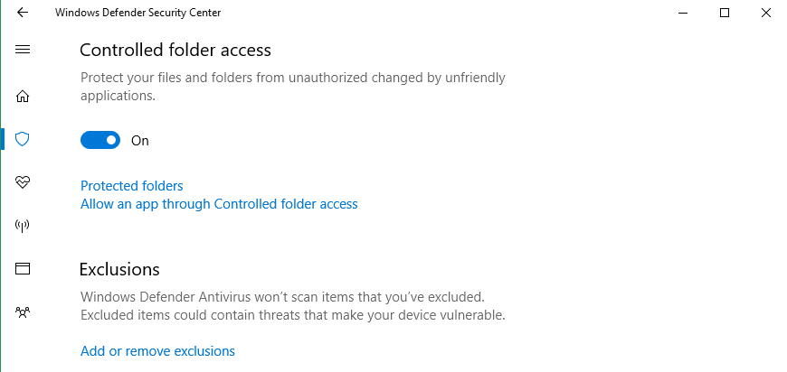
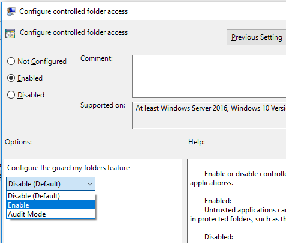

# Enable Controlled folder access


**Applies to:**

- Windows 10, version 1709


**Audience**

- Enterprise security administrators


**Manageability available with**

- Windows Defender Security Center app
- Group Policy
- PowerShell
- Configuration service providers for mobile device management


Controlled folder access helps you protect valuable data from malicious apps and threats, such as ransomware. It is part of [Windows Defender Exploit Guard](windows-defender-exploit-guard.md).

This topic describes how to enable Controlled folder access with the Windows Defender Security Center app, Group Policy, PowerShell, and mobile device management (MDM) configuration service providers (CSPs). 


## Enable and audit Controlled folder access

You can enable Controlled folder access with the Windows Defender Security Center app, Group Policy, PowerShell, or MDM CSPs. You can also set the feature to audit mode. Audit mode allows you to test how the feature would work (and review events) without impacting the normal use of the machine.

For further details on how audit mode works, and when you might want to use it, see the [audit Windows Defender Exploit Guard topic](audit-windows-defender-exploit-guard.md).

>[!NOTE]
>The Controlled folder access feature will display the state in the Windows Defender Security Center app under **Virus & threat protection settings**.
>If the feature is configured with Group Policy, PowerShell, or MDM CSPs, the state will change in the Windows Defender Security Center app after a restart of the device.
>If the feature is set to **Audit mode** with any of those tools, the Windows Defender Security Center app will show the state as **Off**.
>See [Use audit mode to evaluate Windows Defender Exploit Guard features](audit-windows-defender-exploit-guard.md) for more details on how audit mode works.


### Use the Windows Defender Security app to enable Controlled folder access

1. Open the Windows Defender Security Center by clicking the shield icon in the task bar or searching the start menu for **Defender**.

2. Click the **Virus & threat protection** tile (or the shield icon on the left menu bar) and then the **Virus & threat protection settings** label:

    
    
3.	Set the switch for the feature to **On**

    

### Use Group Policy to enable Controlled folder access

1.  On your Group Policy management machine, open the [Group Policy Management Console](https://technet.microsoft.com/library/cc731212.aspx), right-click the Group Policy Object you want to configure and click **Edit**.

3.  In the **Group Policy Management Editor** go to **Computer configuration**.

4.  Click **Policies** then **Administrative templates**.

5.  Expand the tree to **Windows components > Windows Defender Antivirus > Windows Defender Exploit Guard > Controlled folder access**.

6. Double-click the **Configure Controlled folder access** setting and set the option to **Enabled**. In the options section you must specify one of the following:
    - **Enable** - Malicious and suspicious apps will not be allowed to make changes to files in protected folders. A notification will be provided in the Windows event log
    - **Disable (Default)** - The Controlled folder access feature will not work. All apps can make changes to files in protected folders.
    - **Audit Mode** - If a malicious or suspicious app attempts to make a change to a file in a protected folder, the change will be allowed but will be recorded in the Windows event log. This allows you to assess the impact of this feature on your organization.

    

>[!IMPORTANT]
>To fully enable the Controlled folder access feature, you must set the Group Policy option to **Enabled** and also select **Enable** in the options drop-down menu.

### Use PowerShell to enable Controlled folder access

1. Type **powershell** in the Start menu, right click **Windows PowerShell** and click **Run as administrator**
2. Enter the following cmdlet:

    ```PowerShell
    Set-MpPreference -EnableControlledFolderAccess Enabled
    ```

You can enable the feauting in audit mode by specifying `AuditMode` instead of `Enabled`.

Use `Disabled` to turn the feature off.

### Use MDM CSPs to enable Controlled folder access

Use the [./Vendor/MSFT/Policy/Config/Defender/GuardedFoldersList](https://docs.microsoft.com/en-us/windows/client-management/mdm/policy-csp-defender#defender-guardedfolderslist) configuration service provider (CSP) to allow apps to make changes to protected folders. 


## Related topics

- [Protect important folders with Controlled folder access](controlled-folders-exploit-guard.md)
- [Customize Controlled folder access](customize-controlled-folders-exploit-guard.md) 
- [Evaluate Windows Defender Exploit Guard](evaluate-windows-defender-exploit-guard.md)
