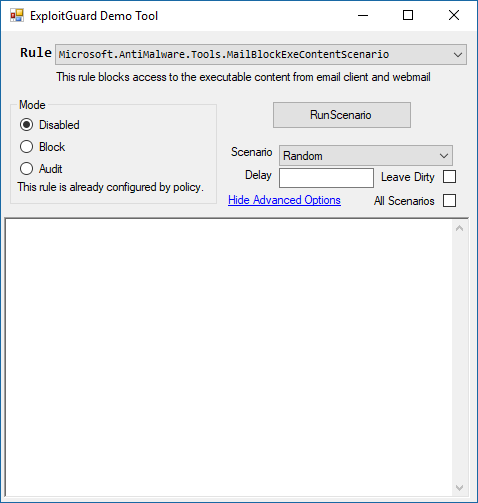

# Evaluate Attack surface reduction rules

**Applies to:**

- Windows 10, version 1709


**Audience**

- Enterprise security administrators


**Manageability available with**

- Windows Defender Security Center app
- Group Policy
- PowerShell


Attack surface reduction is a feature that is part of Windows Defender Exploit Guard [that helps prevent actions and apps that are typically used by exploit-seeking malware to infect machines](attack-surface-reduction-exploit-guard.md). 

This topic helps you evaluate Attack surface reduction. It explains how to demo the feature using a specialized tool, and how to enable audit mode so you can test the feature directly in your organization.

>[!NOTE]
>This topic uses a customized testing tool and PowerShell cmdlets to make it easy to enable the feature and test it. 
>For instructions on how to use Group Policy, Mobile Device Management (MDM), and System Center Configuration Manager to deploy these settings across your network, see the main [Attack surface reduction topic](attack-surface-reduction-exploit-guard.md).

>[!TIP]
>You can also visit the Windows Defender Testground website at [demo.wd.microsoft.com](https://demo.wd.microsoft.com?ocid=cx-wddocs-testground) to confirm the feature is working and see how it works.


## Use the demo tool to see how Attack surface reduction works

Use the **ExploitGuard ASR test tool** app to see how Attack surface reduction rules are applied in certain key protection and high-risk scenarios. These scenarios are typical infection vectors for malware that use exploits to spread and infect machines.

The tool is part of the Windows Defender Exploit Guard evaluation package:
- [Download the Exploit Guard Evaluation Package](https://aka.ms/mp7z2w)

This tool has a simple user interface that lets you choose a rule, configure it in blocking, audit, or disabled mode, and run a pre-created series of actions that would be evaluated by the rule.

When you run a scenario, you will see what the scenario entails, what the rule is set to, and what actions were taken.



Each scenario creates a fake or sample file or behavior that the rule would target and, if the rule was enabled, block from running.

>[!IMPORTANT]
>The settings you change while using this tool will be cleared when you close the tool. If you want to test the feature in a production environment, you should consider using [audit mode to measure impact](#use-audit-mode-to-measure-impact), or see the main [Attack surface reduction topic](attack-surface-reduction-exploit-guard.md).

**Run a rule using the demo tool:**

1. Open the Exploit Guard Evaluation Package and copy the file *ExploitGuard ASR test tool* to a location on your PC that is easy to access (such as your desktop). 

2. Run the tool by double-clicking the version that matches your operating system - either 64-bit (x64) or 32-bit (x86). If a Windows Defender SmartScreen notification appears, click **More details** and then **Run anyway**. 


    >[!IMPORTANT]
    >Make sure you use the version of the tool that is appropriate for the machine you are using. Use the x86 version for 32-bit versions of Windows 10, or use the x64 version for 64-bit versions of Windows 10.

3. Select the rule from the drop-down menu.

4. Select the mode, **Disabled**, **Block**, or **Audit**.
    1. Optionally, click **Show Advanced Options** and choose a specific scenario (or all scenarios sequentially by selecting **All Scenarios**), enter a delay, or click **Leave Dirty**.

5. Click **RunScenario**.

The scenario will run, and an output will appear describing the steps taken.

You can right-click on the output window and click **Open Event Viewer** to see the relevant event in Windows Event Viewer.

>[!TIP]
>You can click **Save Filter to Custom View...** in the Event Viewer to create a custom view so you can easily come back to this view as you continue to evaluate rules.


Choosing the **Mode** will change how the rule functions:

Mode option | Description
-|-
Disabled | The rule will not fire and no event will be recorded. This is the same as if you had not enabled Attack surface reduction at all.
Block | The rule will fire and the suspicious behavior will be blocked from running. An event will be recorded in the event log. This is the same as if you had enabled Attack surface reduction.
Audit | The rule wil fire, but the suspicious behavior will **not** be blocked from running. An event will be recorded in the event log as if the rule did block the behavior. This allows you to see how Attack surface reduction will work but without impacting how you use the machine.

Block mode will cause a notification to appear on the user's desktop:


You can [modify the notification to display your company name and links](customize-attack-surface-reduction.md#customize-the-notification) for users to obtain more information or contact your IT help desk.

For further details on how audit mode works, and when you might want to use it, see the [audit Windows Defender Exploit Guard topic](audit-windows-defender-exploit-guard.md).

The following sections describe what each rule does and what the scenarios entail for each rule.

### Rule: Block executable content from email client and webmail


This rule blocks certain files from being run or launched from an email. You can specify an individual scenario, based on the category of the file type or whether the email is in Microsoft Outlook or web mail.

The following table describes the category of the file type that will be blocked and the source of the email for each scenario in this rule:

Scenario name | File type | Program
- | - | -
Random | A scenario will be randomly chosen from this list | Microsoft Outlook or web mail
Mail Client PE | Executable files (such as .exe, .dll, or .scr) | Microsoft Outlook
Mail Client Script | Script files (such as a PowerShell .ps, VisualBasic .vbs, or JavaScript .js file) | Microsoft Outlook
Mail Client Script Archive | Script archive files | Microsoft Outlook
WebMail PE | Executable files (such as .exe, .dll, or .scr) | Web mail, such as gmail, outlook, hotmail
WebMail Script | Script files (such as a PowerShell .ps, VBScript .vbs, or JavaScript .js file)  | Web mail
WebMail Script Archive | Script archive files  | Web mail


### Rule: Block Office applications from creating child processes

>[!NOTE]
>There is only one scenario to test for this rule.

Office apps, such as Word or Excel, will not be allowed to create child processes. This is a typical malware behavior, especially for macro-based attacks that attempt to use Office apps to launch or download malicious executables.

### Rule: Block Office applications from creating executable content

This rule targets typical behaviors used by suspicious and malicious add-ons and scripts that create or launch executable files. This is a typical malware technique.

The following scenarios can be individually chosen:

- Random
    - A scenario will be randomly chosen from this list
- Extension Block
    - Extensions will be blocked from being used by Office apps. Typically these extensions use the Windows Scripting Host (.wsh files) to run scripts that automate certain tasks or provide user-created add-on features.


### Rule: Block Office applications from injecting into other processes


>[!NOTE]
>There is only one scenario to test for this rule.


Office apps, such as Word, Excel, or PowerPoint, will not be able to inject code into other processes. This is typically used by malware to run malicious code in an attempt to hide the activity from antivirus scanning engines.


### Rule: Impede JavaScript and VBScript to launch executables

JavaScript and VBScript scripts can be used by malware to launch other malicious apps. This rule prevents these scripts from being allowed to launch apps, thus preventing malicious use of the scripts to spread malware and infect machines.

- Random
    - A scenario will be randomly chosen from this list
- JScript
    - JavaScript will not be allowed to launch executable files
- VBScript
    - VBScript will not be allowed to launch executable files


### Rule: Block execution of potentially obfuscated scripts

Malware and other threats can attempt to obfuscate or hide their malicious code in some script files. This rule prevents scripts that appear to be obfuscated from running.


- Random
    - A scenario will be randomly chosen from this list
- AntiMalwareScanInterface
    - This scenario uses the [AntiMalwareScanInterface (AMSI)](https://msdn.microsoft.com/en-us/library/windows/desktop/dn889587(v=vs.85).aspx) to determine if a script is potentially obfuscated, and then blocks such a script
- OnAccess
    - Potentially obfuscated scripts will be blocked when an attempt is made to access them


## Review Attack surface reduction events in Windows Event Viewer

You can also review the Windows event log to see the events there were created when using the tool. You can use the custom view below or [locate them manually](event-views-exploit-guard.md#list-of-all-windows-defender-exploit-guard-events).

1. Type **Event viewer** in the Start menu to open the Windows Event Viewer.

2. On the left panel, under **Actions**, click **Import custom view...**

3. Navigate to the Exploit Guard Evaluation Package, and select the file *asr-events.xml*. Alternatively, [copy the XML directly](event-views-exploit-guard.md).

4. Click **OK**.

5. This will create a custom view that filters to only show the following events related to Attack surface reduction:

Event ID | Description
-|-
5007 | Event when settings are changed
1122 | Event when rule fires in Audit-mode 
1121 | Event when rule fires in Block-mode 


## Use audit mode to measure impact

You can also enable the Attack surface reduction feature in audit mode. This lets you see a record of what apps would have been blocked if you had enabled the feature.

You might want to do this when testing how the feature will work in your organization, to ensure it doesn't affect your line-of-business apps, and to get an idea of how often the rules will fire during normal use.

To enable audit mode, use the following PowerShell cmdlet:

```PowerShell
Set-MpPreference -AttackSurfaceReductionRules_Actions AuditMode
```

This enables all Attack surface reduction rules in audit mode.

>[!TIP]
>If you want to fully audit how Attack surface reduction will work in your organization, you'll need to use a management tool to deploy this setting to machines in your network(s).
You can also use Group Policy, Intune, or MDM CSPs to configure and deploy the setting, as described in the main [Attack surface reduction topic](attack-surface-reduction-exploit-guard.md).


## Customize Attack surface reduction

During your evaluation, you may wish to configure each rule individualy or exclude certain files and processes from being evaluated by the feature.

See the [Customize Exploit protection](customize-exploit-protection.md) topic for information on configuring the feature with management tools, including Group Policy and MDM CSP policies.


## Related topics
- [Reduce attack surfaces with Windows Defender Exploit Guard](attack-surface-reduction-exploit-guard.md)
- [Evaluate Windows Defender Exploit Guard](evaluate-windows-defender-exploit-guard.md)
- [Use audit mode to evaluate Windows Defender Exploit Guard](audit-windows-defender-exploit-guard.md)


