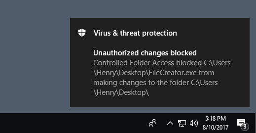

# Evaluate Controlled Folder Access

**Applies to:**

- Windows 10 Insider Preview

[!include[Prerelease information](prerelease.md)]

**Audience**

- Enterprise security administrators


**Manageability available with**

- Windows Defender Security Center app
- Group Policy
- PowerShell

Controlled Folder Access is a feature that is part of Windows Defender Exploit Guard [that helps protect your documents and files from modification by suspicious or malicious apps](controlled-folders-exploit-guard.md). 

It is especially useful in helping to protect your documents and information from [ransomware](https://www.microsoft.com/en-us/wdsi/threats/ransomware) that can attempt to encrypt your files and hold them hostage.

This topic helps you evaluate Controlled Folder Access. It explains how to demo the feature using a specialized tool, and how to enable audit mode so you can test the feature directly in your organisation.

>[!NOTE]
>This topic uses PowerShell cmdlets to make it easy to enable the feature and test it. 
>For instructions on how to use Group Policy, Mobile Device Management (MDM), and System Center Configuration Manager to deploy these settings across your network, see the main [Controlled Folder Access topic](controlled-folders-exploit-guard.md).


## Use the demo tool to see how Controlled Folder Access works

Use the **ExploitGuard CFA File Creator** tool to see how Controlled Folder Access can prevent a suspicious app from creating files in protected folders. 

The tool is part of the Windows Defender Exploit Guard evaluation package:
- [Download the Exploit Guard Evaluation Package](https://aka.ms/mp7z2w)

This tool can be run locally on an individual machine to see the typical behavior of Controlled Folder Access. The tool is considered by Windows Defender Exploit Guard to be suspicious and will be blocked from creating new files or making changes to existing files in any of your protected folders.

You can enable Controlled Folder Access, run the tool, and see what the experience is like when a suspicious app is prevented from accessing or modifying files in protected folders.


1. Type **powershell** in the Start menu.

2. Right-click **Windows PowerShell**, click **Run as administrator** and click **Yes** or enter admin credentials at the prompt.

3. Enter the following in the PowerShell window to enable Controlled Folder Access:
    ```PowerShell
    Set-MpPreference -EnableControlledFolderAccess Enabled
    ```

4. Open the Exploit Guard Evaluation Package and copy the file *ExploitGuard CFA File Creator.exe* to a location on your PC that is easy to access (such as your desktop).
 
5. Run the tool by double-clicking it. If a Windows Defender SmartScreen notification appears, click **More details** and then **Run anyway**. 

6. You'll be asked to specify a name and location for the file. You can choose anything you wish to test.

    

7. A notification will appear, indicating that the tool was prevented from creating the file, as in the following example:

    

## Review Controlled Folder Access events in Windows Event Viewer

You can also review the Windows event log to see the events there were created when using the tool:

1. Type **Event viewer** in the Start menu to open the Windows Event Viewer.

2. On the left panel, under **Actions**, click **Import custom view...**

3. Navigate to the Exploit Guard Evaluation Package, and select the file *cfa-events.xml*. Alternatively, [copy the XML directly](event-views-exploit-guard.md).

4. Click **OK**.

5. This will create a custom view that filters to only show the following events related to Controlled Folder Access:

Event ID | Description
-|-
5007 | Event when settings are changed
1124 | Audited Controlled Folder Access event
1123 | Blocked Controlled Folder Access event


## Use audit mode to measure impact

As with other Windows Defender EG features, you can enable the Controlled Folder Access feature in audit mode. This lets you see a record of what *would* have happened if you had enabled the setting.

You might want to do this when testing how the feature will work in your organization, to ensure it doesn't affect your line-of-business apps, and to get an idea of how many suspicious file modification attempts generally occur over a certain period.

To enable audit mode, use the following PowerShell cmdlet:

```PowerShell
Set-MpPreference -EnableControlledFolderAccess AuditMode
```

>[!TIP]
>If you want to fully audit how Controlled Folder Access will work in your organization, you'll need to use a management tool to deploy this setting to machines in your network(s).
You can also use Group Policy, Intune, MDM, or System Center Configuration Manager to configure and deploy the setting, as described in the main  [Controlled Folder Access topic](controlled-folders-exploit-guard.md).


For further details on how audit mode works, and when you might want to use it, see the [audit Windows Defender Exploit Guard topic](audit-windows-defender-exploit-guard.md).


## Customize protected folders and apps

During your evaluation, you may wish to add to the list of protected folders, or allow certain apps to modify files. 

See the main [Protect important folders with Controlled Folder Access](controlled-folders-exploit-guard.md) topic for configuring the feature with management tools, including Group Policy, PowerShell, and MDM CSP.

## Related topics
- [Protect important folders with controlled folder access](controlled-folders-exploit-guard.md)
- [Evaluate Windows Defender Exploit Guard](evaluate-windows-defender-exploit-guard.md)
- [Use audit mode to evaluate Windows Defender Exploit Guard](audit-windows-defender-exploit-guard.md)