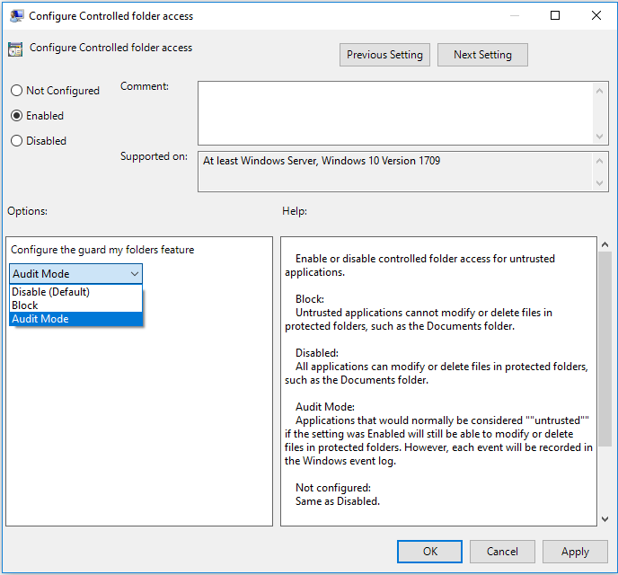

# Evaluate Controlled Folder Access

Controlled Folder Access is a feature that is part of Windows Defender Exploit Guard [that helps protect your documents and files from modification by suspicious or malicious apps](controlled-folders-exploit-guard.md). 

This topic helps you evaluate Controlled Folder Access. It explains how to demo the feature using a specialized tool, and how to enable audit mode so you can test the feature directly in your organisation.

## Use the File Creator tool to demo Controlled Folder Access

Use the File Creator tool to see how Controlled Folder Access can prevent a suspicious app from creating files in protected folders. 

The tool is part of the Windows Defender Exploit Guard evaluation package:
- [Download the Exploit Guard Evaluation Package](#)

This tool can be run locally on an individual machine to see the typical behavior of Controlled Folder Access. The tool is considered by Windows Defender Exploit Guard to be suspicious and will be blocked from creating new files or making changes to existing files in any of your protected folders.

You can enable Controlled Folder Access, run the tool, and see what the experience is like when a suspicious app is prevented from accessing or modifying files in protected folders.

1. Open the Exploit Guard Evaluation Package and copy the file *Filecreator* to a location on your PC that is easy to access (such as your desktop).

    >[!TIP]
    >You may need to change the extension in the filename from *Filecreator.rename* to *Filecreator.exe*

2. Open the **Local Group Policy Editor** by typing **Edit group policy** in the Start menu. 

3.  Under **Local Computer Policy**, expand **Computer configuration** > **Administrative templates** > **Windows components** > **Windows Defender Antivirus** > **Windows Defender Exploit Guard** > **Controlled Folder Access**.

4. Double-click the **Configure controlled folder access** setting and set the option to **Enabled**. In the **Options** section select **Enable**.

>[!IMPORTANT]
>To fully enable the Controlled Folder Access feature, you must set the Group Policy option to **Enabled** and also select **Enable** in the options drop-down menu.

 
4. Run the tool by double-clicking it. If a Windows Defender SmartScreen notification appears, click **More details** and then **Run anyway**. 

5. You'll be asked to specify a name and location for the file. You can choose anything you wish to test.

7. A notification will appear, indicating that the tool was prevented from creating the file, as in the following example:

8. You can also review the Windows Event log to see the events there were created:
    1. Type **Event viewer** in the Start menu to open the Windows Event Viewer.
    2. On the left panel, under **Actions**, click **Import custom view...**
    3. Navigate to the Exploit Guard Evaluation Package, and select the file *cfa-events.xml*.
    4. Click **OK**.
    5. This will create a custom view that filters to only show the following events related to Controlled Folder Access:

    Event ID | Description
    -|-
    Event when settings are changed | 5007
    Audited Controlled Folder Access event | 1124
    Blocked Controlled Folder Access event | 1123

## Use auditing mode to measure impact

As with other Windows Defender EG features, you can enable the Controlled Folder Access feature in auditing mode. This lets you see a record of what *would* have happened if you had enabled the setting.

You might want to do this when testing how the feature will work in your organization, to ensure it doesn't affect your line-of-business apps, and to get an idea of how many suspicious file modification attempts generally occur over a certain period.

To enable audit mode, see the GP option to **Audit Mode**.

>[!TIP]
>You will need to use a GP management tool, such as the [Group Policy Management Console](https://technet.microsoft.com/library/cc731212.aspx), to deploy this policy change to see how Controlled Folder Access would work in your network.

## Customize protected folders and apps

During your evaluation, you may wish to add to the list of protected folders, or allow certain apps to modify files. 

See the following sections in the main [Protect important folders with Controlled Folder Access](controlled-folders-exploit-guard.md) topic for configuring the feature with the Windows Defender Security Center, Group Policy, or mobile device management (MDM) policies:

- [Protect additional folders](controlled-folders-exploit-guard.md#protect-additional-folders)
- [Allow specifc apps to make changes to controlled folders](controlled-folders-exploit-guard.md#allow-specifc-apps-to-make-changes-to-controlled-folders)
