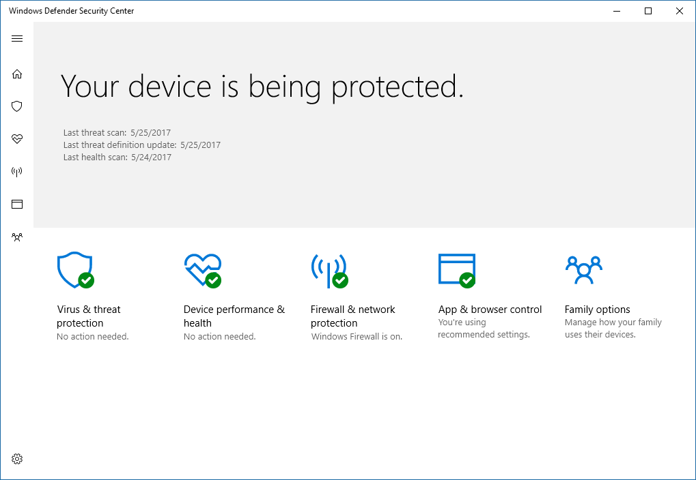
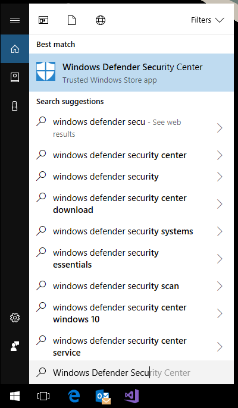

# The Windows Defender Security Center

**Applies to**

- Windows 10, version 1709

In Windows 10, version 1703 we introduced the new Windows Defender Security Center app, which brings together common Windows security features into one easy-to-use app.

Many settings that were previously part of the individual features and main Windows Settings have been combined and moved to the new app, which is installed out-of-the-box as part of Windows 10, version 1703.

The app includes the settings and status for the following security features:

- Virus & threat protection, including settings for Windows Defender Antivirus and Controlled folder access
- Device performance & health, which includes information about drivers, storage space, and general Windows Update issues
- Firewall & network protection, including Windows Firewall
- App & browser control, covering Windows Defender SmartScreen settings and Exploit protection mitigations
- Family options, which include a number of parental controls along with tips and information for keeping kids safe online

The Windows Defender Security Center app uses the [Security Center service](https://technet.microsoft.com/en-us/library/bb457154.aspx#EDAA) to provide the status and information on third-party antivirus and firewall products that are installed on the device. 

>[!IMPORTANT]
>Windows Defender AV and the Windows Defender Security Center app use similarly named services for specific purposes.  
>  
>The Windows Defender Security Center app uses the Windows Defender Security Center Service (*SecurityHealthService* or *Windows Security Health Servce*), which in turn utilizes the Security Center service ([*wscsvc*](https://technet.microsoft.com/en-us/library/bb457154.aspx#EDAA)) to ensure the app provides the most up-to-date information about the protection status on the endpoint, including protection offered by third-party antivirus products, Windows Firewall, and other security protection.  
>  
>These services do not affect the state of Windows Defender AV. Disabling or modifying these services will not disable Windows Defender AV, and will lead to a lowered protection state on the endpoint, even if you are using a third-party antivirus product.  
>  
>Windows Defender AV will be [disabled automatically when a third-party antivirus product is installed and kept up to date](../windows-defender-antivirus/windows-defender-antivirus-compatibility.md).
>  
>Disabling the Windows Security Center service will not disable Windows Defender AV or [Windows Firewall](https://docs.microsoft.com/en-us/windows/access-protection/windows-firewall/windows-firewall-with-advanced-security).  

> [!WARNING] 
> If you disable the Security Center service, or configure its associated Group Policy settings to prevent it from starting or running, the Windows Defender Security Center app may display stale or inaccurate information about any antivirus or firewall products you have installed on the device.  
>  
>It may also prevent Windows Defender AV from enabling itself if you have an old or outdated third-party antivirus, or if you uninstall any third-party antivirus products you may have previously installed. 
>  
>This will significantly lower the protection of your device and could lead to malware infection. 

## Open the Windows Defender Security Center app
- Right-click the icon in the notification area on the taskbar and click **Open**.

    
- Search the Start menu for **Windows Defender Security Center**.

    

> [!NOTE]
> Settings configured with management tools, such as Group Policy, Microsoft Intune, or System Center Configuration Manager, will generally take precedence over the settings in the Windows Defender Security Center. Review the settings for each feature in its appropriate library. Links for both home user and enterprise or commercial audiences are listed below.

## How the Windows Defender Security Center app works with Windows security features

The Windows Defender Security Center app operates as a separate app or process from each of the individual features, and will display notifications through the Action Center. 

It acts as a collector or single place to see the status and perform some configuration for each of the features.

Disabling any of the individual features (through Group Policy or other management tools, such as System Center Configuration Manager) will prevent that feature from reporting its status in the Windows Defender Security Center app. The Windows Defender Security Center app itself will still run and show status for the other security features.

> [!IMPORTANT] 
> Individually disabling any of the services will not disable the other services or the Windows Defender Security Center app.

For example, [using a third-party antivirus will disable Windows Defender Antivirus](https://docs.microsoft.com/en-us/windows/threat-protection/windows-defender-antivirus/deploy-manage-report-windows-defender-antivirus). However, the Windows Defender Security Center app will still run, show its icon in the taskbar, and display information about the other features, such as Windows Defender SmartScreen and Windows Firewall.

The presence of the third-party antivirus will be indicated under the **Virus & threat protection** section in the Windows Defender Security Center app.

## More information

See the following links for more information on the features in the Windows Defender Security Center app:
- Windows Defender Antivirus
    - IT administrators and IT pros can get configuration guidance from the [Windows Defender Antivirus in the Windows Defender Security Center topic](https://docs.microsoft.com/en-us/windows/threat-protection/windows-defender-antivirus/windows-defender-security-center-antivirus) and the [Windows Defender Antivirus documentation library](https://docs.microsoft.com/en-us/windows/threat-protection/windows-defender-antivirus/windows-defender-antivirus-in-windows-10)
    - Home users can learn more at the [Virus & threat protection in Windows Defender Security Center topic at support.microsoft.com](https://support.microsoft.com/en-us/help/4012987/windows-10-virus-threat-protection-windows-defender-security-center)
- Device performance & health
    - It administrators and IT pros can [configure the Load and unload device drivers security policy setting](https://docs.microsoft.com/en-us/windows/device-security/security-policy-settings/load-and-unload-device-drivers), and learn how to [deploy drivers during Windows 10 deployment using System Center Configuration Manager](https://docs.microsoft.com/en-us/windows/deployment/deploy-windows-sccm/add-drivers-to-a-windows-10-deployment-with-windows-pe-using-configuration-manager)
    - Home users can learn more at the [Track your device and performance health in Windows Defender Security Center topic at support.microsoft.com](https://support.microsoft.com/en-us/help/4012986/windows-defender-track-your-device-performance-health)
- Windows Firewall
    - IT administrators and IT pros can get configuration guidance from the [Windows Firewall with Advanced Security documentation library](https://docs.microsoft.com/en-us/windows/access-protection/windows-firewall/windows-firewall-with-advanced-security)
    - Home users can learn more at the [Firewall & network protection in Windows Defender Security Center topic at support.microsoft.com](https://support.microsoft.com/en-us/help/4012988/windows-10-firewall-network-protection-windows-defender-security-center)
- Windows Defender SmartScreen
    - IT administrators and IT pros can get configuration guidance from the [Windows Defender SmartScreen documentation library](https://docs.microsoft.com/en-us/windows/threat-protection/windows-defender-smartscreen/windows-defender-smartscreen-overview)
    - Home users can learn more at the [App & browser control in Windows Defender Security Center topic at support.microsoft.com](https://support.microsoft.com/en-us/help/4013218/windows-10-app-browser-control-in-windows-defender)
- Family options, which include a number of parental controls along with tips and information for keeping kids safe online
    - Home users can learn more at the [Help protection your family online in Windows Defender Security Center topic at support.microsoft.com](https://support.microsoft.com/en-us/help/4013209/windows-10-protect-your-family-online-in-windows-defender)

## Customize notifications from the Windows Defender Security Center

You can customize notifcations so they show information to users about how to get more help from your organization's help desk.

This information will also appear as a pop-out window on the Windows Defender Security Center app.

Users can click on the displayed information to get more help:
- Clicking **Call** or the phone number will open Skype to start a call to the displayed number
- Clicking **Email** or the email address will create a new email in the machine's default email app address to the displayed email
- Clicking **Help portal** or the website URL will open the machine's default web browser and go to the displayed address

### Use Group Policy to customize the notification

1.  On your Group Policy management machine, open the [Group Policy Management Console](https://technet.microsoft.com/library/cc731212.aspx), right-click the Group Policy Object you want to configure and click **Edit**.

3.  In the **Group Policy Management Editor** go to **Computer configuration**.

4.  Click **Policies** then **Administrative templates**.

5.  Expand the tree to **Windows components > Windows Defender Security Center > Enterprise Customization**.

6. Open the **Configure customized contact information** setting and set it to **Enabled**. Click **OK**.

7. Open the **Specify contact company name** setting and set it to **Enabled**. Enter your company or organization's name in the field in the **Options** section. Click **OK**.

8. To ensure the custom notification appear, you must also configure at least one of the following settings by opening them, setting them to **Enabled** and adding the contact information in the field under **Options**:
    1. Specify contact email address of Email ID
    2. Specify contact phone number or Skype ID
    3. Specify contact website

9. Click **OK** after configuring each setting to save your changes. 

>[!NOTE]
>The Windows Defender Security Center app is a client interface on Windows 10, version 1703. It is not the Windows Defender Security Center web portal that is used to review and manage [Windows Defender Advanced Threat Protection](https://docs.microsoft.com/en-us/windows/threat-protection/windows-defender-atp/windows-defender-advanced-threat-protection).

