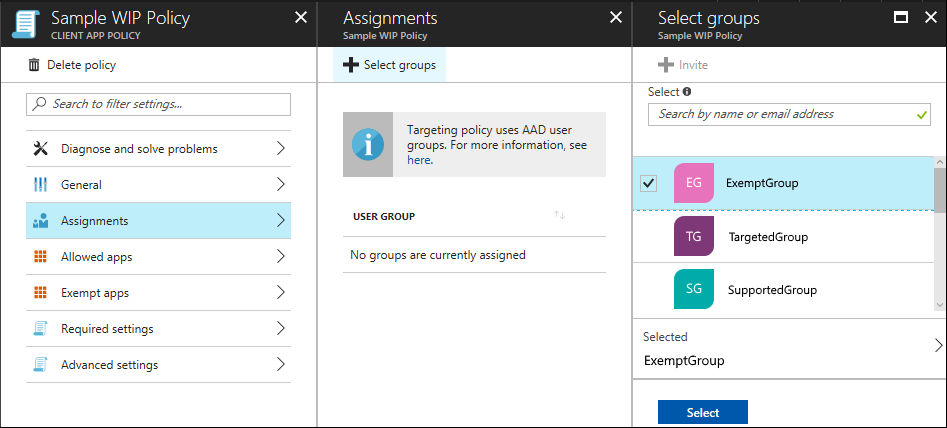

# Create and deploy a VPN policy for Windows Information Protection (WIP) using Microsoft Azure Intune
**Applies to:**

-   Windows 10, version 1703
-   Windows 10 Mobile, version 1703

After you've created and deployed your Windows Information Protection (WIP) policy, you can use Microsoft Azure Intune to create and deploy your Virtual Private Network (VPN) policy, linking it to your WIP policy.

## Create your VPN policy using Microsoft Azure Intune
Follow these steps to create the VPN policy you want to use with WIP.

**To create your VPN policy**

1.  Open the Microsoft Azure Intune mobile application management console, click **Device configuration**, and then click **Create Profile**.

    

2.  In the **Create Profile** blade, type a name for your profile, such as *Contoso_VPN_Win10*, into the **Name** box, add an optional description for your policy into the **Description** box, select **Windows 10 and later** from the **Platform** dropdown box, select **Custom** from the **Profile type** dropdown box, and then click **Configure**.

    

3. In the **Custom OMA-URI Settings** blade, click **Add**.

4. In the **Add Row** blade, type:

    - **Name.** Type a name for your setting, such as *EDPModeID*.
    
    - **Description.** Type an optional description for your setting.
    
    - **OMA-URI.** Type _./Vendor/MSFT/VPNv2/&lt;VPNProfileName&gt;/EDPModeId_ into the box.

    - **Data type.** Select **String** from the dropdown box
    
    - **Value.** Type your fully-qualified domain that should be used by the OMA-URI setting. For example, _corp.contoso.com_.

        

5. Click **OK** to save your setting info in the **Add Row** blade, and then click **OK** in the **Custom OMA-URI Settings** blade to save the setting with your policy.

6. Click **Create** to create the policy, including your OMA_URI info.

## Deploy your VPN policy using Microsoft Azure Intune
After you’ve created your VPN policy, you'll need to deploy it to the same group you deployed your Windows Information Protection (WIP) policy.

**To deploy your Custom VPN policy**

1.  On the **App policy** blade, click your newly-created policy, click **User groups** from the menu that appears, and then click **Add user group**.

    A list of user groups, made up of all of the security groups in your Azure Active Directory, appear in the **Add user group** blade.

2. Choose the group you want your policy to apply to, and then click **Select** to deploy the policy.

    The policy is deployed to the selected users' devices.

    

>[!NOTE]
>Help to make this topic better by providing us with edits, additions, and feedback. For info about how to contribute to this topic, see [Contributing to TechNet content](https://github.com/Microsoft/windows-itpro-docs/blob/master/CONTRIBUTING.md).