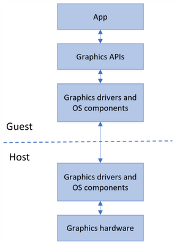

# Windows Sandbox

### Overview

Windows Sandbox provides a lightweight desktop environment to safely run applications in isolation. Software that's installed inside the Windows Sandbox environment remains in the "sandboxed" and can't affect the host machine. A sandbox is temporary. When it's closed, all the software and files and the state are permanently deleted. You get a brand-new instance of the sandbox every time you open the application.

Software and applications installed on the host aren't directly available in Windows Sandbox. If you need specific applications available inside the Windows Sandbox environment, they must be explicitly installed within the environment.

Windows Sandbox has the following properties:
- **Part of Windows**: Everything required for this feature is included in Windows 10 Pro and Enterprise. There's no need to download a VHD.
- **Pristine**: Every time Windows Sandbox runs, it's as clean as a brand-new installation of Windows.
- **Disposable**: Nothing persists on the device. Everything is discarded when the user closes the application.
- **Secure**: Uses hardware-based virtualization for kernel isolation. It relies on the Microsoft hypervisor to run a separate kernel that isolates Windows Sandbox from the host.
- **Efficient:** Uses the integrated kernel scheduler, smart memory management, and virtual GPU.

The following video provides an overview of Windows Sandbox.

[embed Ignite 2019 Sandbox talk video here, link is here: https://myignite.techcommunity.microsoft.com/sessions/79739?source=sessions ]

[!VIDEO https://www.microsoft.com/videoplayer/embed/***XXXXXX***]  
<!--
RedTiger ID for embedding video requested 3/10 - Open WorkItem 25505527
-->

## Architecture

### Dynamically generated image

At its core, Windows Sandbox is a lightweight virtual machine, so it needs an operating system image to boot from. Instead of giving the sandbox a separate copy of Windows to boot from, our Dynamic Base Image technology lets us use the copy of Windows that's already installed on the host.

Most OS files are immutable and can be freely shared with Windows Sandbox. A small portion of the OS file are mutable and we can't be shared. Windows Sandbox contains pristine copies of these files. A complete Windows image can be constructed from a combination of the sharable immutable files on the host and the pristine copies of mutable files. By using this scheme, Windows Sandbox has a full Windows installation to boot from without needing to download or store an additional copy of Windows.
 
Before Windows Sandbox is installed, the dynamic base image is stored in a compressed 25-MB package. Once it's installed, the dynamic base package occupies about 500 MB of disk space.


### Memory management

With traditional virtual machines (VMs) a portion of host memory is dedicated for exclusive use by the VM.  If the host later comes under resource pressure, it can't use the memory that was dedicated to the VM.  Nor can it provide more memory, if available, to the VM. Windows Sandbox treats memory more like how memory is allocated to applications. All apps on the machine can request the amount of memory that they need. The amount that they get will be a function of what other apps are running and how much memory they need. And the amount of memory available for use by an application can change over time.
 
### Dynamic working set

When using a VM, the user is effectively partitioning their machine. If the host is under memory pressure, it can't use the memory already allocated to the VM. But applications in the sandbox are treated as equal to apps running on the host, so when apps in sandbox are under memory pressure, you can give more memory to the sandbox (and the same applies to the host). Guest physical pages provided are virtualized.


### Memory sharing

Because Windows Sandbox runs the same operating system image as the host, it has been enhanced to use the same physical memory pages as the host for operating system binaries via a technology referred to as "direct map." For example, when ntdll.dll is loaded into memory in the sandbox, it uses the same executable pages as those of the binary when loaded on the host. Memory sharing between the host and sandbox results in a smaller memory footprint when compared to traditional VMs without compromising valuable host secrets.


### Integrated kernel scheduler

With ordinary virtual machines, the Microsoft hypervisor controls the scheduling of the virtual processors running in the VMs. Windows Sandbox uses a new technology called "integrated scheduling," which allows the host scheduler to decide when the sandbox receives CPU cycles.


Windows Sandbox employs a unique scheduling policy that allows the virtual processors of the sandbox to be scheduled in the same way as threads would be scheduled for a process. High-priority tasks on the host can preempt less important work in the sandbox. The benefit of the integrated scheduler is that the host manages Windows Sandbox as a process rather than a virtual machine, which results in a much more responsive host, similar to Linux KVM.
 
The goal is to treat Windows Sandbox like an app but with the security guarantees of a virtual machine.
 
### Snapshot and clone

As noted earlier, Windows Sandbox uses the Microsoft hypervisor. It essentially runs another copy of Windows that needs to be booted, and this can take some time. Rather than paying the full cost of booting the Windows Sandbox operating system every time Sandbox starts, two other technologies are utilized: *snapshot* and *clone.*
 
*Snapshot*  allows us to boot the sandbox environment once and preserve the memory, CPU, and device state to disk. Then we can restore the sandbox environment from disk and put it in memory, rather than booting it when we need a new instance of  Windows Sandbox. By cloning the in-memory snapshot of Windows Sandbox, start time is significantly improved.
 
### WDDM GPU virtualization

Hardware-accelerated rendering is key to a smooth and responsive user experience, especially for graphics-intense, or media-heavy uses. But virtual machines are isolated from their hosts and can't access advanced devices like GPUs. The role of graphics virtualization technologies is to bridge this gap and provide hardware acceleration in virtualized environments.
 
Microsoft has been working with its graphics ecosystem partners to integrate modern graphics virtualization capabilities directly into DirectX and WDDM, the driver model that's used for Windows display drivers.


At a high level, this form of graphics virtualization works as follows:

- Apps running in a Hyper-V VM use graphics APIs as normal.
- Graphics components in the VM, which have been enlightened to support virtualization, coordinate across the VM boundary with the host to execute graphics workloads.
- The host allocates and schedules graphics resources among apps in the VM alongside the apps that are running natively. Conceptually, they behave as one pool of graphics clients.

This process is illustrated here:



This enables the Windows Sandbox VM to benefit from hardware-accelerated rendering, with Windows dynamically allocating graphics resources where they are needed across the host and guest. The result is improved performance and responsiveness for apps running in Windows Sandbox, as well as improved battery life for graphics-heavy uses.

To take advantage of these benefits, a system with a compatible GPU and graphics drivers (WDDM 2.5 or newer) is required. Incompatible systems will render apps in Windows Sandbox with the Microsoft CPU-based rendering technology, Windows Advanced Rasterization Platform (WARP).
 
### Battery pass-through

Windows Sandbox is also aware of the host's battery state, which allows it to optimize power consumption. This is critical for a technology that's used on laptops, where battery life is often critical.

## Install Windows Sandbox

### Prerequisites
 
- Windows 10 Pro or Enterprise build 18305 or later (*Windows Sandbox is currently not supported on Home SKUs*)
- AMD64 architecture
- Virtualization capabilities enabled in BIOS
- At least 4 GB of RAM (8 GB recommended)
- At least 1 GB of free disk space (SSD recommended)
- At least 2 CPU cores (4 cores with hyperthreading recommended)

### Installation

1. Make sure your machine is using a Windows 10 Pro or Enterprise build version 18305 or later.
1. Enable virtualization on the machine.

   - If you're using a physical machine, make sure virtualization capabilities are enabled in the BIOS.
   - If you're using a virtual machine, run the following PowerShell command to enable nested virtualization:<br/> **Set -VMProcessor -VMName <VMName> -ExposeVirtualizationExtensions $true**
1. Use the search bar on the task bar and type **Turn Windows Features on and off**. Select **Windows Sandbox** and then **OK**. Restart the computer if you're prompted.

   - If the **Windows Sandbox** option is unavailable, your computer doesn't meet the requirements to run Windows Sandbox. If you think this is incorrect, review the prerequisite list as well as steps 1 and 2.
1.   Locate and select **Windows Sandbox** on the Start menu to run it for the first time.

### Usage 
1. Copy an executable file (and any other files needed to run the application) from the host into the Windows Sandbox window.
2. Run the executable file or installer inside the sandbox.
3.  When you're finished experimenting, close the sandbox. A dialog box will state that all sthe sandbox content will be discarded and permanently deleted. Select **ok**.
4. Confirm that your host machine doesn't exhibit any of the modifications that you made in Windows Sandbox.

## Use a .wsb file to configure Windows Sandbox

Windows Sandbox supports simple configuration files (that have a .wsb file extension), which provide a minimal set of customization parameters for Sandbox. This feature can be used with any Windows 10 build 18342 or later.

Windows Sandbox configuration files are formatted as XML and are associated with Sandbox via the .wsb file extension. To use a configuration file, double-click it to open it in the sandbox. You can also invoke it via the command line as shown here:<BR/>
    **C:\Temp> MyConfigFile.wsb** 

 A configuration file enables the user to control the following aspects of Windows Sandbox:
- **vGPU (virtualized GPU)** 
<br/>Enable or disable the virtualized GPU. If vGPU is disabled, the sandbox will use WARP (software rasterizer).
- **Networking** 
<br/>Enable or disable network access within the sandbox.
- **Mapped folders**
<br/>Share folders from the host with *read* or *write* permissions. Note that exposing host directories may allow malicious software to affect the system or steal data.
- **Logon command**
<br/>A command that's executed when Windows Sandbox starts. <LogonCommand>
- **Audio input**
<br/>Shares the host's microphone input into the andbox.
- **Video input**
  - Shares the host's webcam input into the sandbox.
- **Protected client**
  - Places increased security settings on the RDP session to the sandbox.
- **Printer redirection**
  - Shares printers from the host into the sandbox.
- **Clipboard redirection**
  - Shares the host clipboard with the sandbox so that text and files can be pasted back and forth.
- **Memory in MB**
<br/>The amount of memory, in megabytes, to assign to the sandbox.

### Keywords, values, and limits

**vGPU**: Enables or disables GPU sharing.

`<VGpu>value</VGpu>`

Supported values:
- *Enable*: Enables vGPU support in the sandbox.
- *Disable*: Disables vGPU support in the sandbox. If this value is set, the sandbox will use software rendering, which can be slower than virtualized GPU.
- *Default* This is the default value for vGPU support. Currently this means vGPU is disabled.

> [!NOTE]
> Enabling virtualized GPU can potentially increase the attack surface of the sandbox.

**Networking**: Enables or disables networking in the sandbox. You can disable network access to decrease the attack surface exposed by the sandbox.

`<Networking>value</Networking>`

Supported values:
- *Disable*: Disables networking in the sandbox.
- *Default*: This is the default value for networking support. This value enables networking by creating a virtual switch on the host and connects the sandbox to it via a virtual NIC.

> [!NOTE]
> Enabling networking can expose untrusted applications to the internal network.

**MappedFolders**: Wraps a list of MappedFolder objects.

`<MappedFolders>`
    list of MappedFolder objects
`</MappedFolders>`

> [!NOTE]
> Files and folders mapped in from the host can be compromised by apps in the sandbox or potentially affect the host.

**MappedFolder**: Specifies a single folder on the host machine that will be shared on the container desktop. Apps in the sandbox are run under the user account *WDAGUtilityAccount*. If no sandbox path is specified, a folder is mapped to the following path:<br/>`C:\Users\WDAGUtilityAccount\Desktop`

Example: "C:\Test" will be mapped as "C:\users\WDAGUtilityAccount\Desktop\Test by default.

```
<MappedFolder>
     <HostFolder>path to the host folder</HostFolder>
     <SandboxFolder>path to the sandbox folder</SandboxFolder>
     <ReadOnly>value</ReadOnly>
</MappedFolder>
```

*HostFolder*: Specifies the folder on the host machine to share to the sandbox. Note that the folder must already exist on the host, or the container will fail to start if the folder isn't found.

*SandboxFolder*: Specifies the destination in the Sandbox to map the folder to. If the folder doesn't exist, it will be created.

*ReadOnly*: If *true*, enforces *read-only* access to the shared folder from within the container. Supported values: true/false. Defaults to false.

> [!NOTE] 
> Files and folders mapped in from the host can be compromised by apps in the sandbox or potentially affect the host.

**LogonCommand**: Specifies a single command that will be invoked automatically after the sandbox logs on.

```
<LogonCommand>
    <Command>command to be invoked</Command>
</LogonCommand>
```

*Command*: A path to an executable or script inside of the container that will be executed after login.

> [!NOTE]
> Although very simple commands work (such as launching an executable or script), more-complicated scenarios that have multiple steps should be placed in a script file. This script file can be mapped to the container via a shared folder and then executed via the *LogonCommand* directive.

**Example 1**

The following config file can be used to easily test downloaded files inside the sandbox. To do this, the script disables networking and vGPU and restricts the shared downloads folder to *read-only* access in the container. For convenience, the logon command opens the downloads folder inside the container when it's started.

*Downloads.wsb*

```
<Configuration>
 <VGpu>Disable</VGpu>
 <Networking>Disable</Networking>
 <MappedFolders>
    <MappedFolder>
      <HostFolder>C:\Users\Public\Downloads</HostFolder>
      <ReadOnly>true</ReadOnly>
    </MappedFolder>
 </MappedFolders>
 <LogonCommand>
    <Command>explorer.exe C:\users\WDAGUtilityAccount\Desktop\Downloads</Command>
 </LogonCommand>
</Configuration>
```

**Example 2**

The following config file installs Visual Studio Code in the sandbox, which requires a slightly more complicated LogonCommand setup.

Two folders are mapped into the sandbox. The first folder (SandboxScripts) contains VSCodeInstall.cmd, which installs and runs Visual Studio Code. The second folder (CodingProjects) is assumed to contain project files that the developer wants to modify by using Visual Studio Code.

With the Visual Studio Code installer script already mapped into the sandbox, the LogonCommand can reference it.

*VSCodeInstall.cmd*

```
REM Download Visual Studio Code
curl -L "https://update.code.visualstudio.com/latest/win32-x64-user/stable" --output C:\users\WDAGUtilityAccount\Desktop\vscode.exe

REM Install and run Visual Studio Code
C:\users\WDAGUtilityAccount\Desktop\vscode.exe /verysilent /suppressmsgboxes
```

VSCode.wsb

```
<Configuration>
 <MappedFolders>
    <MappedFolder>
      <HostFolder>C:\SandboxScripts</HostFolder>
      <ReadOnly>true</ReadOnly>
    </MappedFolder>
    <MappedFolder>
      <HostFolder>C:\CodingProjects</HostFolder>
      <ReadOnly>false</ReadOnly>
    </MappedFolder>
 </MappedFolders>
 <LogonCommand>
    <Command>C:\users\wdagutilityaccount\desktop\SandboxScripts\VSCodeInstall.cmd</Command>
 </LogonCommand>
</Configuration>
```

**AudioInput**

Enables or disables audio input to Sandbox.

`<AudioInput>value</AudioInput>`

Supported values:
- *Enable*: Enables audio input in Sandbox. If this value is set, Sandbox will be able to receive audio input from the user. Applications that use a microphone may need this setting.
- *Disable*: Disables audio input in Sandbox. If this value is set, Sandbox can't receive audio input from the user. Applications that use a microphone may not function properly with this setting.
- *Default*: This is the default value for audio input support. Currently this means audio input is enabled.
 
**VideoInput**

Enables or disables video input to the sandbox.

`<VideoInput>value</VideoInput>`

Supported values:
- *Enable*: Enables video input in the sandbox. 
- *Disable*: Disables video input in the sandbox. Applications that use video input may not function properly in Windows Sandbox.
- *Default*: This is the default value for video input support. Currently this means video input is disabled. Applications that use video input may not function properly in Windows Sandbox.

**ProtectedClient**

Implements increased-security settings on the sandbox RDP session. These settings decrease the attack surface of the sandbox.

`<ProtectedClient>value</ProtectedClient>`

Supported values:
- *Enable*: Runs Windows Sandbox in Protected Client mode. If this value is set, the sandbox runs with extra security mitigations enabled.
- *Disable*: Runs the sandbox in standard mode without extra security mitigations.
- *Default*: This is the default value for Protected Client mode. Currently, this means the sandbox doesn't run in Protected Client mode.

> [!NOTE]
> This setting may restrict the user's ability to copy/paste files in and out of the sandbox.

**PrinterRedirection**

Enables or disables printer sharing from the host into the sandbox.

`<PrinterRedirection>value</PrinterRedirection>`

Supported values:
- *Enable*: Enables sharing of host printers into the sandbox.
- *Disable*: Disables printer redirection in the sandbox. If this value is set, the sandbox can't view printers from the host.
- *Default*: This is the default value for printer redirection support. Currently this means printer redirection is disabled.

**ClipboardRedirection**

Enables or disables clipboard sharing with the sandbox.

`<ClipboardRedirection>value</ClipboardRedirection>`

Supported values:
- *Disable*: Disables clipboard redirection in Sandbox. If this value is set, copy/paste in and out of Sandbox will be restricted. 
- *Default*: This is the default value for clipboard redirection. Currently copy/paste between the host and Sandbox are permitted under *Default*.

**MemoryInMB**

Specifies the amount of memory that the sandbox can use in megabytes (MB).

`<MemoryInMB>value</MemoryInMB>`

Supported values: An integer greater than 2048 (2GB).

<!--

FAQ (future)

Release Notes (future)

EnableVendorExtensions – Paul added new option for Windows Sandbox to enable/disable vGPU vendor extensions. This is as new as 12/2 
RailMode – allows a user to run programs in Rail mode rather than full desktop. Internal only at this time.

Known issues (future)

-->