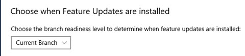

# Configure Windows Update for Business

**Applies to**

- Windows 10
- Windows 10 Mobile

> **Looking for consumer information?** See [Windows Update: FAQ](https://support.microsoft.com/help/12373/windows-update-faq) 

You can use Group Policy or your mobile device management (MDM) service to configure Windows Update for Business settings for your devices. The sections in this topic provide the Group Policy and MDM policies for Windows 10, version 1511 and above. The MDM policies use the OMA-URI setting from the [Policy CSP](https://msdn.microsoft.com/en-us/library/windows/hardware/dn904962.aspx).  

>[!IMPORTANT]
>For Windows Update for Business policies to be honored, the Telemetry level of the device must be set to **1 (Basic)** or higher.  If it is set to **0 (Security)**, Windows Update for Business policies will have no effect. For instructions, see [Configure the operating system telemetry level](https://technet.microsoft.com/en-us/itpro/windows/manage/configure-windows-telemetry-in-your-organization#configure-the-operating-system-telemetry-level).

Some Windows Update for Business policies are not applicable or behave differently for devices running Windows 10 Mobile Enterprise. Specifically, policies pertaining to Feature Updates will not be applied to Windows 10 Mobile Enterprise. All Windows 10 Mobile updates are recognized as Quality Updates, and can only be deferred or paused using the Quality Update policy settings. Additional information is provided in this topic and in [Manage updates for Windows 10 Mobile Enterprise and Windows 10 IoT Mobile](waas-mobile-updates.md).

## Start by grouping devices

By grouping devices with similar deferral periods, administrators are able to cluster devices into deployment or validation groups which can be as a quality control measure as updates are deployed in Windows 10.  With deferral windows and the ability to pause updates, administrators can effectively control and measure update deployments, updating a small pool of devices first to verify quality, prior to a broader roll-out to their organization. For more information, see [Build deployment rings for Windows 10 updates](waas-deployment-rings-windows-10-updates.md).  

>[!TIP]
>In addition to setting up multiple rings for your update deployments, also incorporate devices enrolled in the Windows Insider Program as part of your deployment strategy. This will provide you the chance to not only evaluate new features before they are broadly available to the public, but it also increases the lead time to provide feedback and influence Microsoft’s design on functional aspects of the product. For more information on Windows Insider program, see [https://insider.windows.com/](https://insider.windows.com/). 

## Configure devices for Current Branch (CB) or Current Branch for Business (CBB)

With Windows Update for Business, you can set a device to be on either the Current Branch (CB) or the Current Branch for Business (CBB) servicing branch. For more information on this servicing model, see [Windows 10 servicing options](waas-overview.md#servicing-branches). 

**Release branch policies**

| Policy | Sets registry key under **HKLM\Software** |
| --- | --- |
| GPO for version 1607 and above:  Computer Configuration > Administrative Templates > Windows Components > Windows Update > Defer Windows Updates > **Select when Feature Updates are received** | \Policies\Microsoft\Windows\WindowsUpdate\BranchReadinessLevel |
| GPO for version 1511:  Computer Configuration > Administrative Templates > Windows Components > Windows Update > **Defer Upgrades and Updates** | \Policies\Microsoft\Windows\WindowsUpdate\DeferUpgrade |
| MDM for version 1607 and above:  ../Vendor/MSFT/Policy/Config/Update/ **BranchReadinessLevel** | \Microsoft\PolicyManager\default\Update\BranchReadinessLevel |
| MDM for version 1511:  ../Vendor/MSFT/Policy/Config/Update/ **RequireDeferredUpgrade** | \Microsoft\PolicyManager\default\Update\RequireDeferUpgrade |

Starting with version 1703, users are able to configure their device's branch readiness level, by going to **Settings > Update & security > Windows Update > Advanced options**.

>[!NOTE]
>Users will not be able to change this setting if it was configured by policy.

## Configure when devices receive Feature Updates

After you configure the servicing branch (CB or CBB), you can then define if, and for how long, you would like to defer receiving Feature Updates following their availability from Microsoft on Windows Update.  You can defer receiving these Feature Updates for a period of up to 365 days from their release by setting the `DeferFeatureUpdatesPeriodinDays` value.  

>[!IMPORTANT]
>This policy does not apply to Windows 10 Mobile Enterprise.
>
>You can only defer up to 180 days prior to version 1703.

**Examples**

| Settings | Scenario and behavior |
| --- | --- |
| Device is on CB DeferFeatureUpdatesPeriodinDays=30 | Feature Update X is first publically available on Windows Update as a CB in January. Device will not receive update until February, 30 days later. |
| Device is on CBB DeferFeatureUpdatesPeriodinDays=30 | Feature Update X is first publically available on Windows Update as a CB in January. Four months later, in April, Feature Update X is released to CBB. Device will receive the Feature Update 30 days following this CBB release and will update in May. |

  
**Defer Feature Updates policies**

| Policy | Sets registry key under **HKLM\Software** |
| --- | --- |
| GPO for version 1607 and above:  Computer Configuration > Administrative Templates > Windows Components > Windows Update > Defer Windows Updates > **Select when Feature Updates are received** | \Policies\Microsoft\Windows\WindowsUpdate\DeferFeatureUpdates \Policies\Microsoft\Windows\WindowsUpdate\DeferFeatureUpdatesPeriodInDays |
| GPO for version 1511:  Computer Configuration > Administrative Templates > Windows Components > Windows Update > **Defer Upgrades and Updates** | \Policies\Microsoft\Windows\WindowsUpdate\DeferUpgradePeriod |
| MDM for version 1607 and above:  ../Vendor/MSFT/Policy/Config/Update/ **DeferFeatureUpdatesPeriodInDays** | \Microsoft\PolicyManager\default\Update\DeferFeatureUpdatesPeriodInDays |
| MDM for version 1511:  ../Vendor/MSFT/Policy/Config/Update/ **DeferUpgrade** | \Microsoft\PolicyManager\default\Update\RequireDeferUpgrade |

>[!NOTE]
>If not configured by policy, users can defer feature updates, by going to **Settings > Update & security > Windows Update > Advanced options**.

## Pause Feature Updates

You can also pause a device from receiving Feature Updates by a period of up to 60 days from when the value is set. After 60 days has passed, pause functionality will automatically expire and the device will scan Windows Update for applicable Feature Updates. Following this scan, Feature Updates for the device can then be paused again.

Starting with version 1703, when configuring pause through policy, a start date has to be set from which the pause begins. The pause period will be calculated by adding 60 days to the start date. 

In cases where the pause policy is first applied after the configured start date has passed, administrators will be able to extend the pause period up to a total of 60 days by configuring a later start date.

With version 1703, pausing through the settings app will provide a more consistent experience:
- Any active restart notification are cleared or closed
- Any pending restarts are canceled
- Any pending update installations are canceled
- Any update installation running when pause is activated will attempt to rollback

>[!IMPORTANT]
>This policy does not apply to Windows 10 Mobile Enterprise.

**Pause Feature Updates policies**

| Policy | Sets registry key under **HKLM\Software** |
| --- | --- |
| GPO for version 1607 and above:  Computer Configuration > Administrative Templates > Windows Components > Windows Update > Defer Windows Updates > **Select when Feature Updates are received** | **1607:** \Policies\Microsoft\Windows\WindowsUpdate\PauseFeatureUpdates **1703:** \Policies\Microsoft\Windows\WindowsUpdate\PauseFeatureUpdatesStartDate |
| GPO for version 1511:  Computer Configuration > Administrative Templates > Windows Components > Windows Update > **Defer Upgrades and Updates** | \Policies\Microsoft\Windows\WindowsUpdate\Pause |
| MDM for version 1607 and above:  ../Vendor/MSFT/Policy/Config/Update/ **PauseFeatureUpdates** | **1607:** \Microsoft\PolicyManager\default\Update\PauseFeatureUpdates  **1703:** \Microsoft\PolicyManager\default\Update\PauseFeatureUpdatesStartDate |
| MDM for version 1511:  ../Vendor/MSFT/Policy/Config/Update/ **DeferUpgrade** | \Microsoft\PolicyManager\default\Update\Pause |

You can check the date Feature Updates were paused at by checking the registry key **PausedFeatureDate** under **HKLM\SOFTWARE\Microsoft\WindowsUpdate\UpdatePolicy\Settings**. 

The local group policy editor (GPEdit.msc) will not reflect if your Feature Update Pause period has expired. Although the device will resume Feature Updates after 60 days automatically, the pause checkbox will remain checked in the policy editor.  To see if a device has auto-resumed taking Feature Updates, you can check the status registry key **PausedFeatureStatus** under **HKLM\SOFTWARE\Microsoft\WindowsUpdate\UpdatePolicy\Settings**.

| Value | Status|
| --- | --- |
| 0 | Feature Updates not paused |
| 1 | Feature Updates paused |
| 2 | Feature Updates have auto-resumed after being paused |

>[!NOTE]
>If not configured by policy, users can pause feature updates, by going to **Settings > Update & security > Windows Update > Advanced options**.

## Configure when devices receive Quality Updates

Quality Updates are typically published the first Tuesday of every month, though can be released at any time by Microsoft. You can define if, and for how long, you would like to defer receiving Quality Updates following their availability. You can defer receiving these Quality Updates for a period of up to 35 days from their release by setting the **DeferQualityUpdatesPeriodinDays** value.  

You can set your system to receive updates for other Microsoft products—known as Microsoft Updates (such as Microsoft Office, Visual Studio)—along with Windows Updates by setting the **AllowMUUpdateService** policy. When this is done, these Microsoft Updates will follow the same deferral and pause rules as all other Quality Updates.

>[!IMPORTANT]
>This policy defers both Feature and Quality Updates on Windows 10 Mobile Enterprise.

**Defer Quality Updates policies**

| Policy | Sets registry key under **HKLM\Software** |
| --- | --- |
| GPO for version 1607 and above:  Computer Configuration > Administrative Templates > Windows Components > Windows Update > Defer Windows Updates > **Select when Quality Updates are received** | \Policies\Microsoft\Windows\WindowsUpdate\DeferQualityUpdates \Policies\Microsoft\Windows\WindowsUpdate\DeferQualityUpdatesPeriodInDays  |
| GPO for version 1511:  Computer Configuration > Administrative Templates > Windows Components > Windows Update > **Defer Upgrades and Updates** | \Policies\Microsoft\Windows\WindowsUpdate\DeferUpdatePeriod |
| MDM for version 1607 and above:  ../Vendor/MSFT/Policy/Config/Update/ **DeferQualityUpdatesPeriodInDays** | \Microsoft\PolicyManager\default\Update\DeferQualityUpdatesPeriodInDays |
| MDM for version 1511:  ../Vendor/MSFT/Policy/Config/Update/ **DeferUpgrade** | \Microsoft\PolicyManager\default\Update\RequireDeferUpdate  |

>[!NOTE]
>If not configured by policy, users can defer quality updates, by going to **Settings > Update & security > Windows Update > Advanced options**.

## Pause Quality Updates

You can also pause a system from receiving Quality Updates for a period of up to 35 days from when the value is set.  After 35 days has passed, pause functionality will automatically expire and the system will scan Windows Updates for applicable Quality Updates. Following this scan, Quality Updates for the device can then be paused again.

Starting with version 1703, when configuring pause through policy, a start date has to be set from which the pause begins. The pause period will be calculated by adding 35 days to the start date. 

In cases where the pause policy is first applied after the configured start date has passed, administrators will be able to extend the pause period up to a total of 35 days by configuring a later start date.

With version 1703, pause will provide a more consistent experience:
- Any active restart notification are cleared or closed
- Any pending restarts are canceled
- Any pending update installations are canceled
- Any update installation running when pause is activated will attempt to rollback

>[!IMPORTANT]
>This policy pauses both Feature and Quality Updates on Windows 10 Mobile Enterprise.

**Pause Quality Updates policies**

| Policy | Sets registry key under **HKLM\Software** |
| --- | --- |
| GPO for version 1607 and above:  Computer Configuration > Administrative Templates > Windows Components > Windows Update > Defer Windows Updates > **Select when Quality Updates are received** |**1607:** \Policies\Microsoft\Windows\WindowsUpdate\PauseQualityUpdates **1703:** \Policies\Microsoft\Windows\WindowsUpdate\PauseQualityUpdatesStartTime  |
| GPO for version 1511:  Computer Configuration > Administrative Templates > Windows Components > Windows Update > **Defer Upgrades and Updates** | \Policies\Microsoft\Windows\WindowsUpdate\Pause |
| MDM for version 1607 and above:  ../Vendor/MSFT/Policy/Config/Update/ **PauseQualityUpdates** | **1607:** \Microsoft\PolicyManager\default\Update\PauseQualityUpdates **1703:** \Microsoft\PolicyManager\default\Update\PauseQualityUpdatesStartTime |
| MDM for version 1511:  ../Vendor/MSFT/Policy/Config/Update/ **DeferUpgrade** | \Microsoft\PolicyManager\default\Update\Pause |

You can check the date that Quality Updates were paused at by checking the registry key **PausedQualityDate** under **HKLM\SOFTWARE\Microsoft\WindowsUpdate\UpdatePolicy\Settings**. 

The local group policy editor (GPEdit.msc) will not reflect if your Quality Update Pause period has expired. Although the device will resume Quality Updates after 35 days automatically, the pause checkbox will remain checked in the policy editor.  To see if a device has auto-resumed taking Quality Updates, you can check the status registry key **PausedQualityStatus** under **HKLM\SOFTWARE\Microsoft\WindowsUpdate\UpdatePolicy\Settings**.

| Value | Status|
| --- | --- |
| 0 | Quality Updates not paused |
| 1 | Quality Updates paused |
| 2 | Quality Updates have auto-resumed after being paused |

>[!NOTE]
>If not configured by policy, users can pause quality updates, by going to **Settings > Update & security > Windows Update > Advanced options**.

## Exclude drivers from Quality Updates

In Windows 10, starting with version 1607, you can selectively option out of receiving driver update packages as part of your normal quality update cycle.  This policy will not pertain to updates to inbox drivers (which will be packaged within a security or critical update) or to Feature Updates, where drivers may be dynamically installed to ensure the Feature Update process can complete.

**Exclude driver policies**

| Policy | Sets registry key under **HKLM\Software** |
| --- | --- |
| GPO for version 1607 and above:  Computer Configuration > Administrative Templates > Windows Components > Windows Update > **Do not include drivers with Windows Updates** | \Policies\Microsoft\Windows\WindowsUpdate\ExcludeWUDriversInQualityUpdate  |
| MDM for version 1607 and above:  ../Vendor/MSFT/Policy/Config/Update/ **ExcludeWUDriversInQualityUpdate** | \Microsoft\PolicyManager\default\Update\ExcludeWUDriversInQualityUpdate |

## Summary: MDM and Group Policy for version 1703

Below are quick-reference tables of the supported Windows Update for Business policy values for Windows 10, version 1607 and above.

**GPO: HKLM\Software\Policies\Microsoft\Windows\WindowsUpdate**

| GPO Key |	Key type | Value |
| --- | --- | --- |
| BranchReadinessLevel	| REG_DWORD | 16: systems take Feature Updates for the Current Branch (CB) 32: systems take Feature Updates for the Current Branch for Business (CBB) Note: Other value or absent: receive all applicable updates (CB) |
| DeferQualityUpdates | REG_DWORD | 1: defer quality updates Other value or absent: don’t defer quality updates | 
| DeferQualityUpdatesPeriodinDays | REG_DWORD | 0-35: defer quality updates by given days |
| PauseQualityUpdatesStartDate | REG_DWORD | 1: pause quality updates Other value or absent: don’t pause quality updates |
|DeferFeatureUpdates | REG_DWORD | 1: defer feature updates Other value or absent: don’t defer feature updates |
| DeferFeatureUpdatesPeriodinDays | REG_DWORD | 0-365: defer feature updates by given days |
| PauseFeatureUpdatesStartDate | REG_DWORD |1: pause feature updates Other value or absent: don’t pause feature updates |
| ExcludeWUDriversInQualityUpdate | REG_DWORD | 1: exclude Windows Update drivers Other value or absent: offer Windows Update drivers |

**MDM: HKEY_LOCAL_MACHINE\Software\Microsoft\PolicyManager\default\Update**

| MDM Key | Key type | Value |
| --- | --- | --- |
| BranchReadinessLevel | REG_DWORD | 16: systems take Feature Updates for the Current Branch (CB) 32: systems take Feature Updates for the Current Branch for Business (CBB) Note: Other value or absent: receive all applicable updates (CB) |
| DeferQualityUpdatesPeriodinDays | REG_DWORD | 0-35: defer quality updates by given days |
| PauseQualityUpdatesStartDate | REG_DWORD | 1: pause quality updates Other value or absent: don’t pause quality updates |
| DeferFeatureUpdatesPeriodinDays | REG_DWORD | 0-365: defer feature updates by given days |
| PauseFeatureUpdatesStartDate | REG_DWORD | 1: pause feature updates Other value or absent: don’t pause feature updates |
| ExcludeWUDriversinQualityUpdate | REG_DWORD | 1: exclude Windows Update drivers Other value or absent: offer Windows Update drivers |

## Update devices to newer versions

Due to the changes in the Windows Update for Business feature set, Windows 10, version 1607, uses different GPO and MDM keys than those available in version 1511. Windows 10, version 1703, is also using a few new GPO and MDM keys than those available in version 1607. However,Windows Update for Business clients running version older versions will still see their policies honored after they update to a newer version; the old policy keys will continue to exist with their values ported forward during the update. Following the update to a newer version, it should be noted that only the old keys will be populated and not the new version keys, until the newer keys are explicitly defined on the device by the administrator.

### How older version policies are respected on newer versions

When a client running a newer version sees an update available on Windows Update, the client will first evaluate and execute against the Windows Updates for Business policy keys for it's version.  If these are not present, it will then check to see if any of the older version keys are set and defer accordingly.  Update keys for newer versions will always supersede the older equivalent.

### Comparing the version 1511 keys to the version 1607 keys

In the Windows Update for Business policies in version 1511, all the deferral rules were grouped under a single policy where pausing affected both upgrades and updates.  In Windows 10, version 1607, this functionality has been broken out into separate polices: deferral of Feature and Quality Updates can be enabled and paused independently of one other.   

<table><caption>Group Policy keys</caption><thead><th>Version 1511 GPO keys</th><th>Version 1607 GPO keys</th></thead>
<tbody><tr><td valign="top">**DeferUpgrade**: *enable/disable* Enabling allows user to set deferral periods for upgrades and updates.  It also puts the device on CBB (no ability to defer updates while on the CB branch).  **DeferUpgradePeriod**: *0 - 8 months*  **DeferUpdatePeriod**: *1 – 4 weeks*  **Pause**: *enable/disable* Enabling will pause both upgrades and updates for a max of 35 days </td><td>**DeferFeatureUpdates**: *enable/disable*  **BranchReadinessLevel** Set device on CB or CBB  **DeferFeatureUpdatesPeriodinDays**: *1 - 180 days*  **PauseFeatureUpdates**: *enable/disable* Enabling will pause Feature updates for a max of 60 days  **DeferQualityUpdates**: *Enable/disable*  **DeferQualityUpdatesPeriodinDays**: *0 - 35 days*  **PauseQualityUpdates**: *enable/disable* Enabling will pause Quality updates for a max of 35 days  **ExcludeWUDrivers**: *enable/disable* </td></tr>
</table>

<table><caption>MDM keys</caption><thead><th>Version 1511 MDM keys</th><th>Version 1607 MDM keys</th></thead>
<tbody><tr><td valign="top">**RequireDeferUpgade**: *bool* Puts the device on CBB (no ability to defer updates while on the CB branch).  **DeferUpgradePeriod**: *0 - 8 months*  **DeferUpdatePeriod**: *1 – 4 weeks*  **PauseDeferrals**: *bool* Enabling will pause both upgrades and updates for a max of 35 days </td><td>**BranchReadinessLevel** Set system on CB or CBB  **DeferFeatureUpdatesPeriodinDays**: *1 - 180 days*  **PauseFeatureUpdates**: *enable/disable* Enabling will pause Feature updates for a max of 60 days  **DeferQualityUpdatesPeriodinDays**: *0 - 35 days*  **PauseQualityUpdates**: *enable/disable* Enabling will pause Quality updates for a max of 35 days  **ExcludeWUDriversInQualityUpdate**: *enable/disable* </td></tr>
</tbody></table>

### Comparing the version 1607 keys to the version 1703 keys

| Version 1607 key | Version 1703 key |
| --- | --- |
| PauseFeatureUpdates | PauseFeatureUpdatesStartTime |
| PauseQualityUpdates | PauseQualityUpdatesStartTime |

## Related topics

- [Update Windows 10 in the enterprise](index.md)
- [Overview of Windows as a service](waas-overview.md)
- [Prepare servicing strategy for Windows 10 updates](waas-servicing-strategy-windows-10-updates.md)
- [Build deployment rings for Windows 10 updates](waas-deployment-rings-windows-10-updates.md)
- [Assign devices to servicing branches for Windows 10 updates](waas-servicing-branches-windows-10-updates.md)
- [Optimize update delivery for Windows 10 updates](waas-optimize-windows-10-updates.md)
- [Configure Delivery Optimization for Windows 10 updates](waas-delivery-optimization.md)
- [Configure BranchCache for Windows 10 updates](waas-branchcache.md)
- [Manage updates for Windows 10 Mobile Enterprise and Windows 10 IoT Mobile](waas-mobile-updates.md) 
- [Manage updates using Windows Update for Business](waas-manage-updates-wufb.md)
- [Integrate Windows Update for Business with management solutions](waas-integrate-wufb.md)
- [Walkthrough: use Group Policy to configure Windows Update for Business](waas-wufb-group-policy.md)
- [Walkthrough: use Intune to configure Windows Update for Business](waas-wufb-intune.md)
- [Manage Windows 10 updates using Windows Server Update Services](waas-manage-updates-wsus.md)
- [Manage Windows 10 updates using System Center Configuration Manager](waas-manage-updates-configuration-manager.md)
- [Manage device restarts after updates](waas-restart.md)