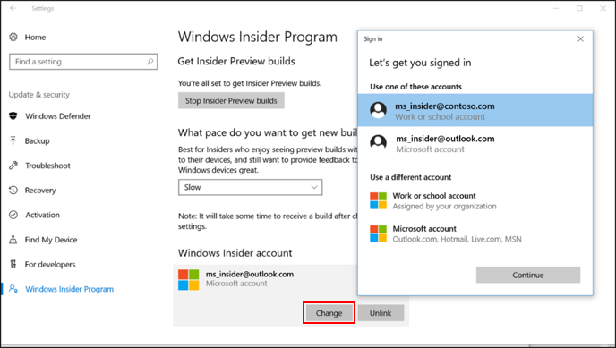

# Windows Insider Program for Business using Azure Active Directory

**Applies to**

- Windows 10

> **Looking for consumer information?** See [Windows Update: FAQ](https://support.microsoft.com/help/12373/windows-update-faq)

We recently added features and benefits to better support the IT Professionals and business users in our Insider community. This includes the option to download Windows 10 Insider Preview builds using your corporate credentials in Azure Active Directory (AAD). By enrolling devices in AAD, you increase the visibility of feedback submitted by users in your organization – especially on features that support your specific business needs. 

>[!NOTE]
>At this point, the Windows Insider Program for Business only supports Azure Active Directory (and not Active Directory on premises) as a corporate authentication method.

>[!TIP]
>New to Azure Active Directory? Go here for [an introduction to AAD](https://docs.microsoft.com/azure/active-directory/connect/active-directory-aadconnect), including guidance for [adding users](https://docs.microsoft.com/azure/active-directory/active-directory-users-create-azure-portal), [device registration](https://docs.microsoft.com/azure/active-directory/active-directory-device-registration-overview) and [integrating your on-premises directories with Azure AD](https://docs.microsoft.com/azure/active-directory/connect/active-directory-aadconnect).
>
>If your company is currently not using AAD – but has a paid subscription to  Office 365, Microsoft Dynamics CRM Online, Enterprise Mobility Suite, or other Microsoft services – you have a free subscription to Microsoft Azure Active Directory. This subscription  can be used to create users for enrollment in the Windows Insider Program for Business.

In order to get the most benefit out of the Windows Insider Program for Business, organizations should not use a test tenant of AAD. There will be no modifications to the AAD tenant to support the Windows Insider Program as it will only be used as an authentication method.

## Check if a device is connected to your company’s Azure Active Directory subscription
Simply go to **Settings > Accounts > Access work or school**. If a corporate account is on Azure Active Directory and it is connected to the device, you will see the account listed as highlighted in the image below.

## Enroll a device with an Azure Active Directory account
1. Visit [insider.windows.com](https://insider.windows.com). Sign-in with your corporate account in AAD and follow the on-screen registration directions. 
2. On your Windows 10 device, go to **Settings > Updates & Security >  Windows Insider Program**. 

>[!NOTE]
>Make sure that you have administrator rights to the machine and that it has latest Windows updates. 

3. Enter the AAD account that you used to register and follow the on-screen directions. 

## Switch device enrollment from your Microsoft account to your AAD account 
1. Visit [insider.windows.com](https://insider.windows.com) to register your AAD account. If you are signed in with your Microsoft account, sign out, then sign back in with your corporate AAD account. 
2. Click **Get started**, read and accept the privacy statement and program terms and click **Submit**. 
3. On your Windows 10 PC, go to **Settings > Updates & Security >  Windows Insider Program**. 
4. Under Windows Insider account, click your Microsoft account, then **Change** to open a Sign In box. 
5. Select your corporate account and click Continue to change your account. 

>[!NOTE]
>Your device must be connected to your corporate account in AAD for the account to appear in the account list.

## Frequently Asked Questions

### Will my test machines be affected by automatic registration?
All devices enrolled in the Windows Insider Program (physical or virtual) will receive Windows 10 Insider Preview builds (regardless of registration with MSA or AAD).

### Once I register with my corporate account in AAD, do I need to keep my Microsoft account for the Windows Insider Program?
No, once you set up your device using AAD credentials – all feedback and flighting on that machine will be under your AAD account. You may need MSA for other machines that aren’t being used on your corporate network or to get Windows store app updates.

### How do I stop receiving updates? 
You can simply “unlink” your account by going to **Settings > Updates & Security > Windows Insider Program**, select Windows Insider Account and click **Unlink**.

## Related Topics
- [Windows Insider Program for Business](waas-windows-insider-for-business.md)
- [Windows Insider Program for Business Frequently Asked Questions](waas-windows-insider-for-business-faq.md)
