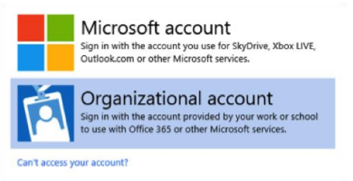

# Windows Insider Program for Business

**Applies to**

- Windows 10

> **Looking for consumer information?** See [Windows Update: FAQ](https://support.microsoft.com/help/12373/windows-update-faq)

For many IT pros, gaining visibility into feature updates early—before they’re available to the CB servicing branch—can be both intriguing and valuable for future end user communications as well as provide additional prestaging for CB machines. With Windows 10, feature flighting enables Windows Insiders to consume and deploy preproduction code to their test machines, gaining early visibility into the next build. Testing the early builds of Windows 10 helps both Microsoft and its customers because they have the opportunity to discover possible issues before the update is ever publicly available and can report it to Microsoft. Also, as flighted builds get closer to their release to CB, organizations can test their deployment on test devices for compatibility validation.

The Windows Insider Program for Business gives you the opportunity to: 
* Get early access to Windows Insider Preview Builds 
* Provide feedback to Microsoft in real-time via the Feedback Hub app.
* Sign-in with coproate credentials (Azure Active Directory) and increase the visibility of your organization's feedback with Microsoft – especially on features that support your productivity and business needs.

Microsoft recommends that all organizations have at least a few PCs enrolled in the Windows Insider Program, to include the Windows Insider Program in their deployment plans and to provide feedback on any issues they encounter to Microsoft via our Feedback Hub app. 

The Windows Insider Program isn’t intended to replace CB deployments in an organization. Rather, it provides IT pros and other interested parties with pre-release Windows builds that they can test and ultimately provide feedback on to Microsoft. 

## Getting started with Windows Insider Program for Business

To get started with the Windows Insider Program for Business, you will need to follow a few simple steps:

1. Navigate to [insider.windows.com](insider.windows.com) and go to **Get Started**.
2. Sign-in with you desired account. It can be either a Microsoft Account or your organizational Azure Active Directory Account.

3. Enroll your device by going to **Start > Settings > Update & security > Windows Insider Program** and selecting **Get Started**. Sign-in using the account you used to register for the Windows Insider Program.
4. After reading the privacy statement and clicking **Next**, **Confirm** and schedule a restart.

## Install your first preview build from the Windows Insider Program

After enrolling your devices, you are ready to install your first preview build. To do so, go to **Start** > **Settings** > **Update & security** > **Windows Insider Program** to select your Insider level. The device receives the most recent Windows Insider build for the Insider level you select. 

>[!TIP]
>Flighting rings are used to evaluate the quality of our software as it is released to progressively larger audiences. We will flight a Feature Update, application, etc. to the first ring if it passes all required automated testing in the lab. The flight will continue to be evaluated against a set of criteria to ensure it is ready to progress to the next ring.

The options for Insider level are:

### Release Preview

Best for Insiders who enjoy getting early access to updates for the Current Branch, Microsoft applications, and drivers, with minimal risk to their devices, and still want to provide feedback to make Windows devices great.

Insiders on this level receive builds of Windows just before Microsoft releases them for CB. Although these builds aren’t final, they are the most complete and stable builds available to Windows Insider Program participants. This level provides the best testing platform for organizations that conduct early application compatibility testing on Windows Insider PCs.

* The Release Preview Ring will only be visible when your Windows build version is the same as the Current Branch  
* The easiest way to go between the Development Branch to the Current Branch is to use the [Media Creation Tool](http://go.microsoft.com/fwlink/?LinkId=691209) (for PC) or [Windows Device Recovery Tool](http://go.microsoft.com/fwlink/p/?LinkId=522381) (for Mobile) to reinstall Windows  
Ring 

### Slow

The Slow Windows Insider level is for users who enjoy seeing new builds of Windows with minimal risk to their devices but still want to provide feedback to Microsoft about their experience with the new build.

* Builds are sent to the Slow Ring after feedback has been received from Insiders within the Fast Ring and analyzed by our Engineering teams.  
* These builds will include updates to fix key issues that would prevent many Windows Insiders from being able to use the build on a daily basis.  
* These builds are still may have issues that would be addressed in a future flight.

### Fast

Best for Insiders who enjoy being the first to get access to builds and feature upgrades, with some risk to their devices in order to identify issues, and provide suggestions and ideas to make Windows software and devices great 

* Windows Insiders with devices in the Fast Ring should be prepared for more issues that may block key activities that are important to you or may require significant workarounds. 
* Because we are also validating a build on a smaller set of devices before going to Fast, there is also a chance that some features may work on some devices but may fail in other device configurations. 
* Windows Insiders should be ready to reinstall Windows using the [Media Creation Tool](http://go.microsoft.com/fwlink/?LinkId=691209) or [Windows Device Recovery Tool](http://go.microsoft.com/fwlink/p/?LinkId=522381) when you are significantly blocked. • Please remember to report any issue to us through the Windows Insider Feedback Hub or the Windows Insider community Forum 

>[!NOTE]
>Once your machine is updated to Windows 10 and you select your desired flight ring, the process known as "Compatibility check" will need to run in the background. There is no manual way to force this process to run. This process allows for the discovery of your OS type (32-bit, 64-bit), build edition (Home, Pro, Enterprise), country and language settings, and other required information. Once this process is complete, your machine will be auto-targeted for the next available flight for your selected ring. For the first build on any given machine, this may take up to 24 hours to complete.

## How to switch between flight rings

During your time in the Windows Insider Program, you may want to change between flight rings for any number of reasons. Changing rings is a simple process that requires only a few clicks:

1. Go to **Settings > Updates & Security >  Windows Insider Program**
2. Under **Choose your level**, select between the following rings -
    * [Windows Insider Fast](#fast)
    * [Windows Insider Slow](#slow)
    * [Release Preview](#release-preview)

## How to switch between you MSA and your Corporate AAD account

The Windows Insider Program for Business now gives users the option to register and enroll devices using a corporate account in [Azure Active Directory](https://azure.microsoft.com/services/active-directory/) (AAD) as well as their Microsoft Account (MSA).

To switch between accounts, go to **Settings > Updates & Security >  Windows Insider Program**, and under **Windows Insider account** select **Change**.

>[!NOTE]
>If you would like to use your corporate account, your device must be connected to your corporate account in AAD for the account to appear in the account list.

## Sharing Feedback Via the Feedback Hub
As you know a key benefit to being a Windows Insider is Feedback. It’s definitely a benefit to us, and we hope it’s a benefit to you. Feedback is vital for making changes and improvements in Windows 10. Receiving quality and actionable feedback is key in achieving these goals.

When providing feedback, please consider the following: 
1. Please use the **Feedback Hub** app to submit your feedback to Microsoft.  
2. Check for existing feedback on the topic you are preparing to log. Another user may have already shared the same feedback. If they have, please “upvote” the existing feedback to help prevent duplicate submissions. Adding additional comments to existing feedback can help others by providing clarity to existing information or additional scenarios to review. 
3. Provide as much information to us as possible: include reproduction steps, screenshots, any detail you think would help us experience the issue as you have, so that we can work on a fix and get it into a new build as soon as possible.

### How to use your corporate AAD account for additional Feedback Hub benefits 
Get even more out of the Feedback Hub by signing in to the Feedback Hub using the same corporate account in AAD that are using to flight builds. One of the benefits of submitting feedback using your AAD account is the addition of a page to the Feedback Hub for your organization. Simply click the **My Company** page in the feedback hub to see and upvote all feedback submitted by other Insiders in your organization.

>[!NOTE]
>If you signed into the Feedback Hub previously with your MSA, your feedback and badges will not be transferred to your AAD sing-in. However, you can switch back to your MSA account in the Feedback Hub to access feedback you’ve submitted and badges you’ve earned.

## Not receiving Windows 10 Insider Preview build updates?

In some cases, your PC may not update to the latest Insider Preview build as expected. Here are items that you can review to troubleshoot this issue:

### Perform a manual check for updates 
Go to **Settings > Updates & Security**. Review available updates or select **Check for updates**.

>[!NOTE]
>If you have set Active Hours, ensure your device is left turned on and signed in during the off-hours so the install process can complete.

### Make sure Windows is activated 
Go to **Settings > Updates & Security > Activation** to verify Windows is activated.

### Make sure your coporate account in AAD is connected to your device
Open **Settings \ Accounts \ Access work or school**. If your PC is not listed as connected to your account in AAD, click Connect and enter your AAD account.

### Make sure you have selected a flight ring
Open **Settings > Update & Security > Windows Insider Program** and select your flight ring.

### Have you recently done a roll-back? 
If so, please double-check your flight settings under **Settings > Update & Security > Windows Insider Program**.

### Did you do a clean install? 
After a clean-install and initial setup of a Microsoft or coporate account (even one that has been used previously for flighting) the appropriate targeting needs to take place for your PC. This background process is known as Compatibility Checker and will run during idle time on your PC. This process may take up to 24 hours. Please leave your PC turned on to ensure this occurs in timely manner. 

### Are there known issues for your current build?
On rare occasion, there may be an issue with a build that could lead to issues with updates being received. Please check the most recent Blog Post or reach out to the Windows Insider team on Twitter for verification (*@WindowsInsider*). You can also check the **Feedback Hub** for announcments and known issues.

## Exiting flighting

After you’ve tried the latest Insider Preview builds, you may want to opt out. In order to do that, go to  **Settings > Update & Security > Windows Insider Program** and select **Stop Insider Preview Builds**. Follow the on-screen instructions to stop flighting to your device.

## Additional help resources

* [**Windows Blog**](https://blogs.windows.com/blog/tag/windows-insider-program/) - With each new build release we publish a Windows Blog post that outlines key feature changes as well as known issues that Insiders may encounter while using the build.
* [**Windows Insider Preview community forum**](https://answers.microsoft.com/en-us/insider/forum/insider_wintp) - Answers is Microsoft’s forum platform and there is an entire area dedicated to the Windows Insider Program. Insiders can filter between PC, Office, Edge, and many others.

## Learn More
- [Windows Insider Program for Business using Azure Active Directory](waas-windows-insider-for-business-aad.md)
- [WIPfB FAQ Stub]()

## Related Topics
- [Overview of Windows as a service](waas-overview.md)
- [Prepare servicing strategy for Windows 10 updates](waas-servicing-strategy-windows-10-updates.md)
- [Build deployment rings for Windows 10 updates](waas-deployment-rings-windows-10-updates.md)
- [Assign devices to servicing branches for Windows 10 updates](waas-servicing-branches-windows-10-updates.md)
- [Optimize update delivery for Windows 10 updates](waas-optimize-windows-10-updates.md)
- [Manage updates using Windows Update for Business](waas-manage-updates-wufb.md)
- [Manage Windows 10 updates using Windows Server Update Services (WSUS)](waas-manage-updates-wsus.md)
- [Manage Windows 10 updates using System Center Configuration Manager](waas-manage-updates-configuration-manager.md)