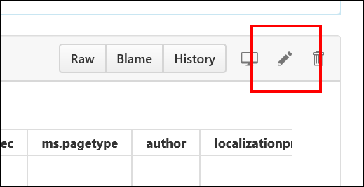
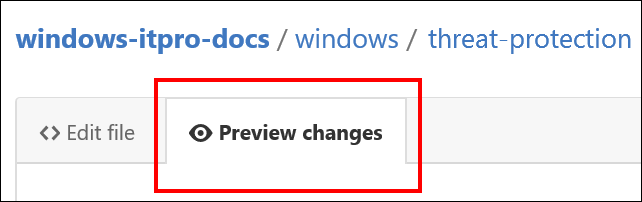

# Editing existing Windows IT professional documentation
You can make suggestions and update existing, public content with just a GitHub account and a simple click of a link. You can use GitHub pull requests to edit the technical articles in the Windows IT libraries and then ask us to "pull" your changes into the published articles. 

>[!NOTE]
>At this time, you can only edit the English (en-us) content.

Across the docs.microsoft.com site, if you see **Edit** in the right-hand corner of an article, you can suggest changes to it. You can specifically edit articles in the following libraries:

- [Windows 10](https://docs.microsoft.com/windows/windows-10)
- [Windows Server](/windows-server/)
- [Microsoft Edge](https://docs.microsoft.com/microsoft-edge/deploy)    
- [Surface](https://docs.microsoft.com/surface)
- [Surface Hub](https://docs.microsoft.com/surface-hub)
- [HoloLens](https://docs.microsoft.com/hololens)
- [Microsoft Store](https://docs.microsoft.com/microsoft-store)
- [Windows 10 for Education](https://docs.microsoft.com/education/windows)
- [Windows 10 for SMB](https://docs.microsoft.com/windows/smb)
- [Internet Explorer 11](https://docs.microsoft.com/internet-explorer)
- [Microsoft Desktop Optimization Pack](https://docs.microsoft.com/microsoft-desktop-optimization-pack)

**To edit a topic**

1. Go to the article that you want to update, and then click **Edit**.

    

2. Sign into (or sign up for) a GitHub account.
    
    You must have a GitHub account to get to the page that lets you edit a topic.

3. Click the **Pencil** icon (in the red box) to edit the content.

    

4.	Using Markdown language, make your changes to the topic. For info about how to edit content using Markdown, see:
    - **If you're linked to the Microsoft organization in GitHub:** [Windows authoring guide](https://aka.ms/WindowsAuthoring)
    
    - **If you're external to Microsoft:** [Mastering Markdown](https://guides.github.com/features/mastering-markdown/) 

5.	Make your suggested change, and then click **Preview Changes** to make sure it looks correct.

       

6. When you’re done editing the topic, scroll to the bottom of the page, and then click **Propose file change**.

    

    The **Comparing changes** screen shows the changes between your version of the article and the original content.

7.	On the **Comparing changes** screen, you’ll see if there are any problems with the file you’re checking in. (Occasionally there are merge conflicts, where you've edited the file one way, while someone else edited the same lines in the same file in a different way. Before you can propose your changes, you need to fix those conflicts.)

    If there are no problems, you’ll see the message, **Able to merge**.

    

8.	Click **Create pull request**.

9.	Enter a title and description to let us know what’s in the request.

10.	Scroll to the bottom of the page, and make sure that only your changed files are in this pull request. Otherwise, you could overwrite changes from other people.

11.	Click **Create pull request** again to actually submit your edits.

12. If you aren't a Microsoft employee, you need to [sign a Microsoft Contribution Licensing Agreement (CLA)](https://cla.microsoft.com/) before updating or adding to any Microsoft repositories. A bot running in GitHub checks whether you've signed the CLA - if not, you'll be prompted, in the pull request, to sign it.

   If you've previously contributed to topics in the Microsoft repositories, congratulations! You've already completed this step.

Next, the pull request is sent to one of our writers to review your edits for technical and editorial accuracy. If we have any suggestions or questions, we'll add them to the pull request where we can discuss them with you. If we accept your edits, you'll see your changes the next time the article is published. 
