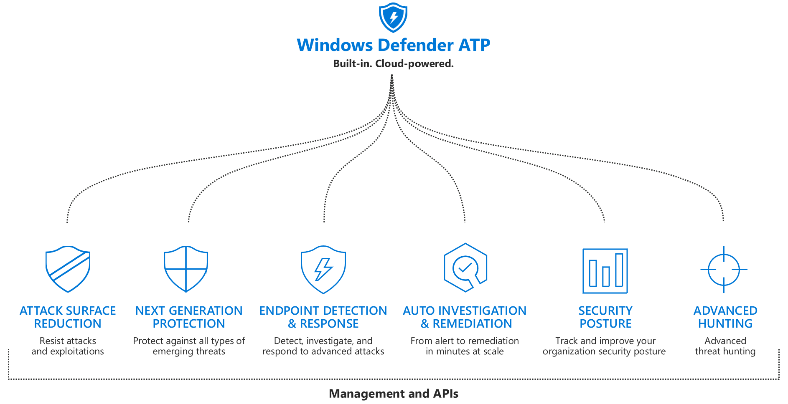
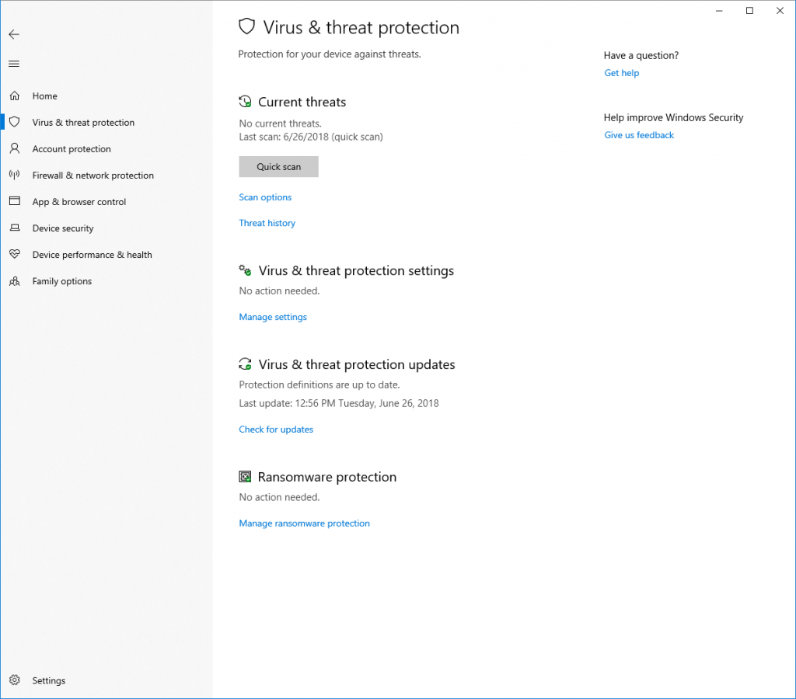
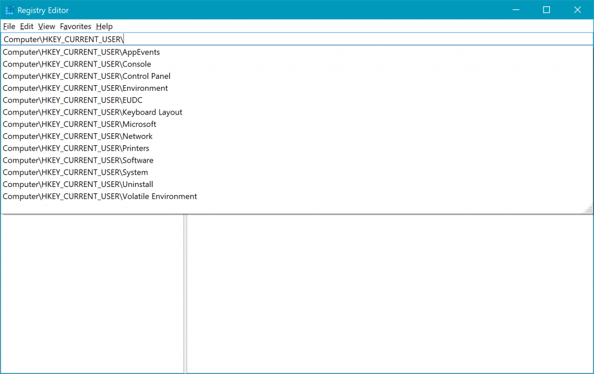
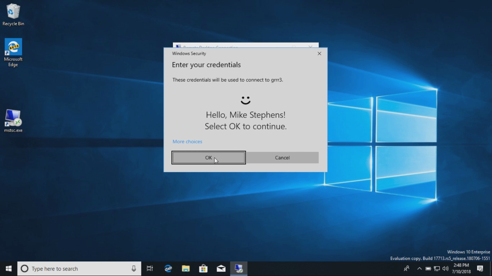
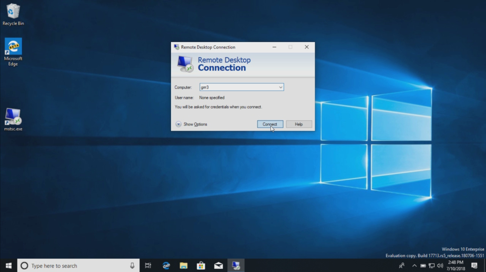
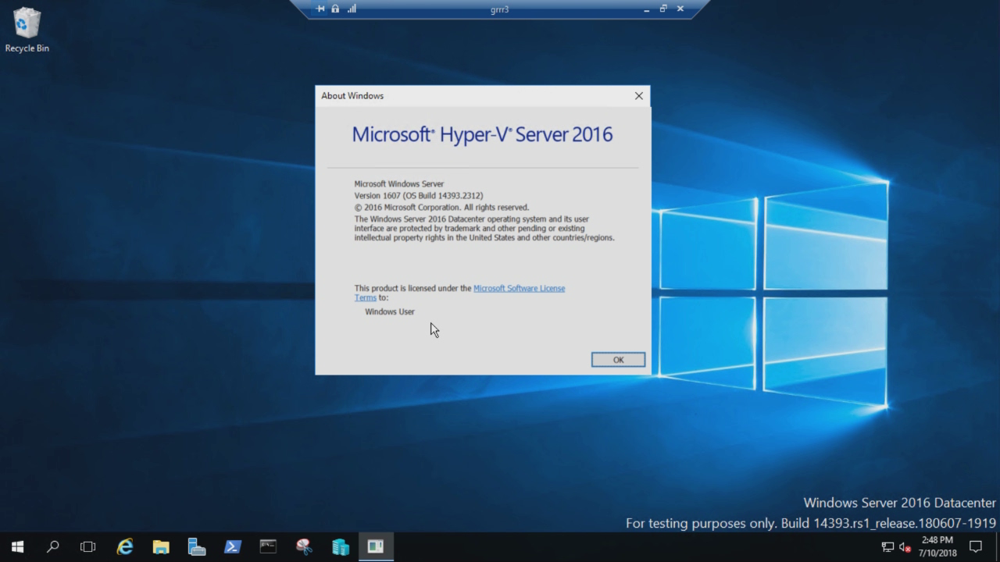

# What's new in Windows 10 Enterprise 2019 LTSC

**Applies to**
-   Windows 10 Enterprise 2019 LTSC

This article lists new and updated features and content that are of interest to IT Pros for Windows 10 Enterprise 2019 LTSC, compared to Windows 10 Enterprise 2016 LTSC (LTSB). For a brief description of the LTSC servicing channel and associated support, see [Windows 10 Enterprise LTSC](index.md).

>[!NOTE]
>Features in Windows 10 Enterprise 2019 LTSC are equivalent to Windows 10, version 1809. 

Windows 10 Enterprise LTSC 2019 builds on Windows 10 Pro, version 1809 adding premium features designed to address the needs of large and mid-size organizations (including large academic institutions), such as:
   - Advanced protection against modern security threats 
   - Full flexibility of OS deployment
   - Updating and support options
   - Comprehensive device and app management and control capabilities

The Windows 10 Enterprise LTSC 2019 release is an important release for LTSC users because it includes the cumulative enhancements provided in Windows 10 versions 1703, 1709, 1803, and 1809. Details about these enhancements are provided below. 

>[!IMPORTANT]
>The LTSC release is [intended for special use devices](https://techcommunity.microsoft.com/t5/Windows-IT-Pro-Blog/LTSC-What-is-it-and-when-should-it-be-used/ba-p/293181). Support for LTSC by apps and tools that are designed for the semi-annual channel release of Windows 10 might be limited.

## Microsoft Intune

>Microsoft Intune supports LTSC 2019 and later. 

## Security

This version of Window 10 includes security improvements for threat protection, information protection, and identity protection.

### Threat protection

#### Windows Defender ATP

The Windows Defender Advanced Threat Protection ([Windows Defender ATP](/windows/security/threat-protection/index)) platform inludes the security pillars shown in the following diagram. In this version of Windows, Windows Defender ATP includes powerful analytics, security stack integration, and centralized management for better detection, prevention, investigation, response, and management. 

##### Attack surface reduction 

Attack surface reduction includes host-based intrusion prevention systems such as [controlled folder access](/windows/security/threat-protection/windows-defender-exploit-guard/enable-controlled-folders-exploit-guard).
    - This feature can help prevent ransomware and other destructive malware from changing your personal files. In some cases, apps that you normally use might be blocked from making changes to common folders like **Documents** and **Pictures**. We’ve made it easier for you to add apps that were recently blocked so you can keep using your device without turning off the feature altogether.
    - When an app is blocked, it will appear in a recently blocked apps list, which you can get to by clicking **Manage settings** under the **Ransomware protection** heading. Click **Allow an app through Controlled folder access**. After the prompt, click the **+** button and choose **Recently blocked apps**. Select any of the apps to add them to the allowed list. You can also browse for an app from this page.

###### Windows Defender Firewall 

Windows Defender Firewall now supports Windows Subsystem for Linux (WSL) processes. You can add specific rules for a WSL process just as you would for any Windows process. Also, Windows Defender Firewall now supports notifications for WSL processes. For example, when a Linux tool wants to allow access to a port from the outside (like SSH or a web server like nginx), Windows Defender Firewall will prompt to allow access just like it would for a Windows process when the port starts accepting connections. This was first introduced in [Build 17627](https://docs.microsoft.com/windows/wsl/release-notes#build-17618-skip-ahead).

##### Windows Defender Device Guard

[Device Guard](/windows/security/threat-protection/device-guard/introduction-to-device-guard-virtualization-based-security-and-windows-defender-application-control) has always been a collection of technologies that can be combined to lock down a PC, including: 
- Software-based protection provided by code integrity policies 
- Hardware-based protection provided by Hypervisor-protected code integrity (HVCI)

But these protections can also be configured separately. And, unlike HVCI, code integrity policies do not require virtualization-based security (VBS). To help underscore the distinct value of these protections, code integrity policies have been rebranded as [Windows Defender Application Control](/windows/security/threat-protection/windows-defender-application-control/windows-defender-application-control). 

### Next-gen protection 

#### Office 365 Ransomware Detection

For Office 365 Home and Office 365 Personal subscribers, Ransomware Detection notifies you when your OneDrive files have been attacked and guides you through the process of restoring your files. For more information, see [Ransomware detection and recovering your files](https://support.office.com/en-us/article/ransomware-detection-and-recovering-your-files-0d90ec50-6bfd-40f4-acc7-b8c12c73637f?ui=en-US&rs=en-US&ad=US)

### Endpoint detection and response 

Endpoint detection and response is improved. Enterprise customers can now take advantage of the entire Windows security stack with Windows Defender Antivirus **detections** and Device Guard **blocks** being surfaced in the Windows Defender ATP portal. 

   Windows Defender is now called Windows Defender Antivirus and now shares detection status between M365 services and interoperates with Windows Defender ATP.  Additional policies have also been implemented to enhance cloud based protection, and new channels are available for emergency protection. For more information, see [Virus and threat protection](https://docs.microsoft.com/windows/security/threat-protection/windows-defender-security-center/wdsc-virus-threat-protection) and [Use next-gen technologies in Windows Defender Antivirus through cloud-delivered protection](https://docs.microsoft.com/windows/security/threat-protection/windows-defender-antivirus/utilize-microsoft-cloud-protection-windows-defender-antivirus). 
    
   We've also [increased the breadth of the documentation library for enterprise security admins](/windows/threat-protection/windows-defender-antivirus/windows-defender-antivirus-in-windows-10). The new library includes information on:
   - [Deploying and enabling AV protection](/windows/threat-protection/windows-defender-antivirus/deploy-windows-defender-antivirus)
   - [Managing updates](/windows/threat-protection/windows-defender-antivirus/manage-updates-baselines-windows-defender-antivirus)
   - [Reporting](/windows/threat-protection/windows-defender-antivirus/report-monitor-windows-defender-antivirus)
   - [Configuring features](/windows/threat-protection/windows-defender-antivirus/configure-windows-defender-antivirus-features)
   - [Troubleshooting](/windows/threat-protection/windows-defender-antivirus/troubleshoot-windows-defender-antivirus)

   Some of the highlights of the new library include [Evaluation guide for Windows Defender AV](/windows/threat-protection/windows-defender-antivirus//evaluate-windows-defender-antivirus) and [Deployment guide for Windows Defender AV in a virtual desktop infrastructure environment](/windows/threat-protection/windows-defender-antivirus/deployment-vdi-windows-defender-antivirus).

   New features for Windows Defender AV in Windows 10 Enterprise 2019 LTSC include:
   - [Updates to how the Block at First Sight feature can be configured](/windows/threat-protection/windows-defender-antivirus/configure-block-at-first-sight-windows-defender-antivirus)
   - [The ability to specify the level of cloud-protection](/windows/threat-protection/windows-defender-antivirus/specify-cloud-protection-level-windows-defender-antivirus)
   - [Windows Defender Antivirus protection in the Windows Defender Security Center app](/windows/threat-protection/windows-defender-antivirus/windows-defender-security-center-antivirus)

   We've [invested heavily in helping to protect against ransomware](https://blogs.windows.com/business/2016/11/11/defending-against-ransomware-with-windows-10-anniversary-update/#UJlHc6SZ2Zm44jCt.97), and we continue that investment with [updated behavior monitoring and always-on real-time protection](/windows/threat-protection/windows-defender-antivirus/configure-real-time-protection-windows-defender-antivirus).

   **Endpoint detection and response** is also enhanced. New **detection** capabilities include:
   - [Use the threat intelligence API to create custom alerts](/windows/threat-protection/windows-defender-atp/use-custom-ti-windows-defender-advanced-threat-protection) - Understand threat intelligence concepts, enable the threat intel application, and create custom threat intelligence alerts for your organization.
    - [Custom detection](https://docs.microsoft.com/windows/security/threat-protection/windows-defender-atp/overview-custom-detections). With custom detections, you can create custom queries to monitor events for any kind of behavior such as suspicious or emerging threats. This can be done by leveraging the power of Advanced hunting through the creation of custom detection rules. 
    - Improvements on OS memory and kernel sensors to enable detection of attackers who are using in-memory and kernel-level attacks.
    - Upgraded detections of ransomware and other advanced attacks.
    - Historical detection capability ensures new detection rules apply to up to six months of stored data to detect previous attacks that might not have been noticed.

   **Threat reponse** is improved when an attack is detected, enabling immediate action by security teams to contain a breach:
   - [Take response actions on a machine](/windows/threat-protection/windows-defender-atp/respond-machine-alerts-windows-defender-advanced-threat-protection) - Quickly respond to detected attacks by isolating machines or collecting an investigation package.
    - [Take response actions on a file](/windows/threat-protection/windows-defender-atp/respond-file-alerts-windows-defender-advanced-threat-protection) - Quickly respond to detected attacks by stopping and quarantining files or blocking a file.

Additional capabilities have been added to help you gain a holistic view on **investigations** include:
   - [Threat analytics](https://docs.microsoft.com/windows/security/threat-protection/windows-defender-atp/threat-analytics) - Threat Analytics is a set of interactive reports published by the Windows Defender ATP research team as soon as emerging threats and outbreaks are identified. The reports help security operations teams assess impact on their environment and provides recommended actions to contain, increase organizational resilience, and prevent specific threats.
   - [Query data using Advanced hunting in Windows Defender ATP](https://docs.microsoft.com/windows/security/threat-protection/windows-defender-atp/advanced-hunting-windows-defender-advanced-threat-protection)
   - [Use Automated investigations to investigate and remediate threats](https://docs.microsoft.com/windows/security/threat-protection/windows-defender-atp/automated-investigations-windows-defender-advanced-threat-protection)
   - [Investigate a user account](/windows/threat-protection/windows-defender-atp/investigate-user-windows-defender-advanced-threat-protection) - Identify user accounts with the most active alerts and investigate cases of potential compromised credentials.
   - [Alert process tree](/windows/threat-protection/windows-defender-atp/investigate-alerts-windows-defender-advanced-threat-protection#alert-process-tree) - Aggregates multiple detections and related events into a single view to reduce case resolution time.
   - [Pull alerts using REST API](/windows/threat-protection/windows-defender-atp/pull-alerts-using-rest-api-windows-defender-advanced-threat-protection) - Use REST API to pull alerts from Windows Defender ATP.

Other enhanced security features include:
- [Check sensor health state](/windows/threat-protection/windows-defender-atp/check-sensor-status-windows-defender-advanced-threat-protection) - Check an endpoint's ability to provide sensor data and communicate with the Windows Defender ATP service and fix known issues.
- [Managed security service provider (MSSP) support](https://docs.microsoft.com/windows/security/threat-protection/windows-defender-atp/mssp-support-windows-defender-advanced-threat-protection) - Windows Defender ATP adds support for this scenario by providing MSSP integration. The integration will allow MSSPs to take the following actions: Get access to MSSP customer's Windows Defender Security Center portal, fetch email notifications, and fetch alerts through security information and event management (SIEM) tools.
- [Integration with Azure Security Center](https://docs.microsoft.com/windows/security/threat-protection/windows-defender-atp/configure-server-endpoints-windows-defender-advanced-threat-protection#integration-with-azure-security-center) - Windows Defender ATP integrates with Azure Security Center to provide a comprehensive server protection solution. With this integration Azure Security Center can leverage the power of Windows Defender ATP to provide improved threat detection for Windows Servers.
- [Integration with Microsoft Cloud App Security](https://docs.microsoft.com/windows/security/threat-protection/windows-defender-atp/microsoft-cloud-app-security-integration) - Microsoft Cloud App Security leverages Windows Defender ATP endpoint signals to allow direct visibility into cloud application usage including the use of unsupported cloud services (shadow IT) from all Windows Defender ATP monitored machines.
- [Onboard Windows Server 2019](https://docs.microsoft.com/windows/security/threat-protection/windows-defender-atp/configure-server-endpoints-windows-defender-advanced-threat-protection#windows-server-version-1803-and-windows-server-2019) - Windows Defender ATP now adds support for Windows Server 2019. You'll be able to onboard Windows Server 2019 in the same method available for Windows 10 client machines. 
- [Onboard previous versions of Windows](https://docs.microsoft.com/windows/security/threat-protection/windows-defender-atp/onboard-downlevel-windows-defender-advanced-threat-protection) - Onboard supported versions of Windows machines so that they can send sensor data to the Windows Defender ATP sensor.
- [Enable conditional access to better protect users, devices, and data](https://docs.microsoft.com/windows/security/threat-protection/windows-defender-atp/conditional-access-windows-defender-advanced-threat-protection)

We've also added a new assessment for the Windows time service to the **Device performance & health** section. If we detect that your device’s time is not properly synced with our time servers and the time-syncing service is disabled, we’ll provide the option for you to turn it back on.

We’re continuing to work on how other security apps you’ve installed show up in the **Windows Security** app. There’s a new page called **Security providers** that you can find in the **Settings** section of the app. Click **Manage providers** to see a list of all the other security providers (including antivirus, firewall, and web protection) that are running on your device. Here you can easily open the providers’ apps or get more information on how to resolve issues reported to you through **Windows Security**.

This also means you’ll see more links to other security apps within **Windows Security**. For example, if you open the **Firewall & network protection** section, you’ll see the firewall apps that are running on your device under each firewall type, which includes domain, private, and public networks).

You can read more about ransomware mitigations and detection capability at:  
- [Averting ransomware epidemics in corporate networks with Windows Defender ATP](https://blogs.technet.microsoft.com/mmpc/2017/01/30/averting-ransomware-epidemics-in-corporate-networks-with-windows-defender-atp/)
- [Ransomware Protection in Windows 10 Anniversary Update whitepaper (PDF)](http://wincom.blob.core.windows.net/documents/Ransomware_protection_in_Windows_10_Anniversary_Update.pdf)
- [Microsoft Malware Protection Center blog](https://blogs.technet.microsoft.com/mmpc/category/research/ransomware/)

Also see [New capabilities of Windows Defender ATP further maximizing the effectiveness and robustness of endpoint security](https://blogs.windows.com/business/2018/04/17/new-capabilities-of-windows-defender-atp-further-maximizing-the-effectiveness-and-robustness-of-endpoint-security/#62FUJ3LuMXLQidVE.97)

Get a quick, but in-depth overview of Windows Defender ATP for Windows 10: [Windows Defender Advanced Threat Protection](/windows/security/threat-protection/windows-defender-atp/windows-defender-advanced-threat-protection).

For more information about features of Windows Defender ATP available in different editions of Windows 10, see the [Windows 10 commercial edition comparison](https://wincom.blob.core.windows.net/documents/Windows10_Commercial_Comparison.pdf).

### Information protection 

Improvements have been added to Windows Information Protection and BitLocker. 

#### Windows Information Protection

Windows Information Protection is now designed to work with Microsoft Office and Azure Information Protection. For more information, see [Deploying and managing Windows Information Protection (WIP) with Azure Information Protection](https://myignite.microsoft.com/sessions/53660?source=sessions).

Microsoft Intune helps you create and deploy your Windows Information Protection (WIP) policy, including letting you choose your allowed apps, your WIP-protection level, and how to find enterprise data on the network. For more info, see [Create a Windows Information Protection (WIP) policy using Microsoft Intune](/windows/threat-protection/windows-information-protection/create-wip-policy-using-intune) and [Associate and deploy your Windows Information Protection (WIP) and VPN policies by using Microsoft Intune](/windows/threat-protection/windows-information-protection/create-vpn-and-wip-policy-using-intune).

You can also now collect your audit event logs by using the Reporting configuration service provider (CSP) or the Windows Event Forwarding (for Windows desktop domain-joined devices). For info, see the brand-new topic, [How to collect Windows Information Protection (WIP) audit event logs](/windows/threat-protection/windows-information-protection/collect-wip-audit-event-logs).

This release enables support for WIP with Files on Demand, allows file encryption while the file is open in another app, and improves performance. For more information, see [OneDrive Files On-Demand For The Enterprise](https://techcommunity.microsoft.com/t5/OneDrive-Blog/OneDrive-Files-On-Demand-For-The-Enterprise/ba-p/117234).

### BitLocker

The minimum PIN length is being changed from 6 to 4, with a default of 6. For more information, see [BitLocker Group Policy settings](https://docs.microsoft.com/windows/device-security/bitlocker/bitlocker-group-policy-settings#bkmk-unlockpol3).

#### Silent enforcement on fixed drives

Through a Modern Device Management (MDM) policy, BitLocker can be enabled silently for standard Azure Active Directory (AAD) joined users. In Windows 10, version 1803 automatic BitLocker encryption was enabled for standard AAD users, but this still required modern hardware that passed the Hardware Security Test Interface (HSTI). This new functionality enables BitLocker via policy even on devices that don’t pass the HSTI. 

This is an update to the [BitLocker CSP](https://docs.microsoft.com/windows/client-management/mdm/bitlocker-csp), which was introduced in Windows 10, version 1703, and leveraged by Intune and others. 

This feature will soon be enabled on Olympia Corp as an optional feature.

####  Delivering BitLocker policy to AutoPilot devices during OOBE 

You can choose which encryption algorithm to apply to BitLocker encryption capable devices, rather than automatically having those devices encrypt themselves with the default algorithm. This allows the encryption algorithm (and other BitLocker policies that must be applied prior to encryption), to be delivered before BitLocker encryption begins. 

For example, you can choose the XTS-AES 256 encryption algorithm, and have it applied to devices that would normally encrypt themselves automatically with the default XTS-AES 128 algorithm during OOBE.

To achieve this:

1. Configure the [encryption method settings](https://docs.microsoft.com/intune/endpoint-protection-windows-10#windows-encryption) in the Windows 10 Endpoint Protection profile to the desired encryption algorithm. 
2. [Assign the policy](https://docs.microsoft.com/intune/device-profile-assign) to your Autopilot device group. 
    - **IMPORTANT**: The encryption policy must be assigned to **devices** in the group, not users.
3. Enable the Autopilot [Enrollment Status Page](https://docs.microsoft.com/windows/deployment/windows-autopilot/enrollment-status) (ESP) for these devices. 
    - **IMPORTANT**: If the ESP is not enabled, the policy will not apply before encryption starts.

### Identity protection

Improvements have been added are to Windows Hello for Business and Credential Guard.

#### Windows Hello for Business

New features in Windows Hello enable a better device lock experience, using multifactor unlock with new location and user proximity signals. Using Bluetooth signals, you can configure your Windows 10 device to automatically lock when you walk away from it, or to prevent others from accessing the device when  you are not present.

New features in [Windows Hello for Business](/windows/security/identity-protection/hello-for-business/hello-identity-verification.md) inlcude: 
- You can now reset a forgotten PIN without deleting company managed data or apps on devices managed by [Microsoft Intune](https://www.microsoft.com/cloud-platform/microsoft-intune).
- For Windows Phone devices, an administrator is able to initiate a remote PIN reset through the Intune portal.
- For Windows desktops, users are able to reset a forgotten PIN through **Settings > Accounts > Sign-in options**. For more details, check out [What if I forget my PIN?](/windows/security/identity-protection/hello-for-business/hello-features#pin-reset).

[Windows Hello](https://docs.microsoft.com/windows/security/identity-protection/hello-for-business/hello-features) now supports FIDO 2.0 authentication for Azure AD Joined Windows 10 devices and has enhanced support for shared devices, as described in the [Kiosk configuration](#kiosk-configuration) section. 
- Windows Hello is now [password-less on S-mode](https://www.windowslatest.com/2018/02/12/microsoft-make-windows-10-password-less-platform/).
- Support for S/MIME with Windows Hello for Business and APIs for non-Microsoft identity lifecycle management solutions.
- Windows Hello is part of the account protection pillar in Windows Defender Security Center. Account Protection will encourage password users to set up Windows Hello Face, Fingerprint or PIN for faster sign in, and will notify Dynamic lock users if Dynamic lock has stopped working because their phone or device Bluetooth is off.
- You can set up Windows Hello from lock screen for MSA accounts. We’ve made it easier for Microsoft account users to set up Windows Hello on their devices for faster and more secure sign-in. Previously, you had to navigate deep into Settings to find Windows Hello. Now, you can set up Windows Hello Face, Fingerprint or PIN straight from your lock screen by clicking the Windows Hello tile under Sign-in options.
- New [public API](https://docs.microsoft.com/uwp/api/windows.security.authentication.web.core.webauthenticationcoremanager.findallaccountsasync#Windows_Security_Authentication_Web_Core_WebAuthenticationCoreManager_FindAllAccountsAsync_Windows_Security_Credentials_WebAccountProvider_) for secondary account SSO for a particular identity provider.
- It is easier to set up Dynamic lock, and WD SC actionable alerts have been added when Dynamic lock stops working (ex: phone Bluetooth is off).
 
For more information, see: [Windows Hello and FIDO2 Security Keys enable secure and easy authentication for shared devices](https://blogs.windows.com/business/2018/04/17/windows-hello-fido2-security-keys/#OdKBg3pwJQcEKCbJ.97)

#### Windows Defender Credential Guard

Windows Defender Credential Guard is a security service in Windows 10 built to protect Active Directory (AD) domain credentials so that they can't be stolen or misused by malware on a user's machine. It is designed to protect against well-known threats such as Pass-the-Hash and credential harvesting.

Windows Defender Credential Guard has always been an optional feature, but Windows 10 in S mode turns this functionality on by default when the machine has been Azure Active Directory joined. This provides an added level of security when connecting to domain resources not normally present on devices running Windows 10 in S mode. Please note that Windows Defender Credential Guard is available only to S mode devices or Enterprise and Education Editions. 

For more information, see [Credential Guard Security Considerations](/windows/access-protection/credential-guard/credential-guard-requirements#security-considerations).

### Other security improvments

#### Windows security baselines

Microsoft has released new [Windows security baselines](https://docs.microsoft.com/windows/device-security/windows-security-baselines) for Windows Server and Windows 10. A security baseline is a group of Microsoft-recommended configuration settings with an explanation of their security impact. For more information, and to download the Policy Analyzer tool, see [Microsoft Security Compliance Toolkit 1.0](https://docs.microsoft.com/windows/device-security/security-compliance-toolkit-10).

**Windows security baselines** have been updated for Windows 10. A [security baseline](https://docs.microsoft.com/windows/device-security/windows-security-baselines) is a group of Microsoft-recommended configuration settings and explains their security impact. For more information, and to download the Policy Analyzer tool, see [Microsoft Security Compliance Toolkit 1.0](https://docs.microsoft.com/windows/device-security/security-compliance-toolkit-10).

The new [security baseline for Windows 10 version 1803](https://docs.microsoft.com/windows/security/threat-protection/security-compliance-toolkit-10) has been published. 

#### SMBLoris vulnerability

An issue, known as “SMBLoris�?, which could result in denial of service, has been addressed.

#### Windows Security Center

Windows Defender Security Center is now called **Windows Security Center**. 

You can still get to the app in all the usual ways – simply ask Cortana to open Windows Security Center(WSC) or interact with the taskbar icon. WSC lets you manage all your security needs, including **Windows Defender Antivirus** and **Windows Defender Firewall**. 

The WSC service now requires antivirus products to run as a protected process to register. Products that have not yet implemented this will not appear in the Windows Security Center user interface, and Windows Defender Antivirus will remain enabled side-by-side with these products. 

WSC now includes the Fluent Design System elements you know and love. You’ll also notice we’ve adjusted the spacing and padding around the app. It will now dynamically size the categories on the main page if more room is needed for extra info. We also updated the title bar so that it will use your accent color if you have enabled that option in **Color Settings**.

#### Group Policy Security Options

The security setting [**Interactive logon: Display user information when the session is locked**](/windows/device-security/security-policy-settings/interactive-logon-display-user-information-when-the-session-is-locked) has been updated to work in conjunction with the **Privacy** setting in **Settings** > **Accounts** > **Sign-in options**.

A new security policy setting
[**Interactive logon: Don't display username at sign-in**](/windows/device-security/security-policy-settings/interactive-logon-dont-display-username-at-sign-in) has been introduced in Windows 10 Enterprise 2019 LTSC. This security policy setting determines whether the username is displayed during sign in. It works in conjunction with the **Privacy** setting in **Settings** > **Accounts** > **Sign-in options**. The setting only affects the **Other user** tile.

#### Windows 10 in S mode

We’ve continued to work on the **Current threats** area in  [Virus & threat protection](https://docs.microsoft.com/windows/security/threat-protection/windows-defender-security-center/wdsc-virus-threat-protection), which now displays all threats that need action. You can quickly take action on threats from this screen: 

## Deployment

### Windows Autopilot

[Windows Autopilot](https://docs.microsoft.com/windows/deployment/windows-autopilot/windows-autopilot) is a deployment tool introduced with Windows 10, version 1709 and is also available for Windows 10 Enterprise 2019 LTSC (and later versions). Windows Autopilot provides a modern device lifecycle management service powered by the cloud to deliver a zero touch experience for deploying Windows 10. 

Windows Autopilot is currently available with Surface, Dell, HP, and Lenovo. Other OEM partners such as Panasonic, and Acer will support Autopilot soon. Check the [Windows IT Pro Blog](https://techcommunity.microsoft.com/t5/Windows-IT-Pro-Blog) or this article for updated information.

Using Intune, Autopilot now enables locking the device during provisioning during the Windows Out Of Box Experience (OOBE) until policies and settings for the device get provisioned, thereby ensuring that by the time the user gets to the desktop, the device is secured and configured correctly. 

You can also apply an Autopilot deployment profile to your devices using Microsoft Store for Business. When people in your organization run the out-of-box experience on the device, the profile configures Windows based on the Autopilot deployment profile you applied to the device. For more information, see [Manage Windows device deployment with Windows Autopilot Deployment](https://docs.microsoft.com/microsoft-store/add-profile-to-devices).

#### Windows Autopilot self-deploying mode

Windows Autopilot self-deploying mode enables a zero touch device provisioning experience. Simply power on the device, plug it into the Ethernet, and the device is fully configured automatically by Windows Autopilot. 

This self-deploying capability removes the current need to have an end user interact by pressing the “Next” button during the deployment process. 

You can utilize Windows Autopilot self-deploying mode to register the device to an AAD tenant, enroll in your organization’s MDM provider, and provision policies and applications, all with no user authentication or user interaction required. 

To learn more about Autopilot self-deploying mode and to see step-by-step instructions to perform such a deployment, [Windows Autopilot self-deploying mode](https://docs.microsoft.com/windows/deployment/windows-autopilot/self-deploying). 

#### Autopilot Reset	

IT Pros can use Autopilot Reset to quickly remove personal files, apps, and settings. A custom login screen is available from the lock screen that enables you to apply original settings and management enrollment (Azure Active Directory and device management) so that devices are returned to a fully configured, known, IT-approved state and ready to use. For more information, see [Reset devices with Autopilot Reset](https://docs.microsoft.com/education/windows/autopilot-reset).

## Sign-in

### Faster sign-in to a Windows 10 shared pc

If you have shared devices deployed in your work place, **Fast sign-in** enables users to sign in to a [shared Windows 10 PC](https://docs.microsoft.com/windows/configuration/set-up-shared-or-guest-pc) in a flash!

**To enable fast sign-in:**
1. Set up a shared or guest device with Windows 10, version 1809 or Windows 10 Enterprise 2019 LTSC.
2. Set the Policy CSP, and the **Authentication** and **EnableFastFirstSignIn** policies to enable fast sign-in.
3. Sign-in to a shared PC with your account. You'll notice the difference!

    

### Web sign-in to Windows 10

Until now, Windows logon only supported the use of identities federated to ADFS or other providers that support the WS-Fed protocol. We are introducing “web sign-in,” a new way of signing into your Windows PC. Web Sign-in enables Windows logon support for non-ADFS federated providers (e.g.SAML).

**To try out web sign-in:**
1. Azure AD Join your Windows 10 PC. (Web sign-in is only supported on Azure AD Joined PCs).
2. Set the Policy CSP, and the Authentication and EnableWebSignIn polices to enable web sign-in. 
3. On the lock screen, select web sign-in under sign-in options.
4. Click the “Sign in” button to continue.

## Deployment

### MBR2GPT.EXE

MBR2GPT.EXE is a new command-line tool introduced with Windows 10, version 1703 and also available in Windows 10 Enterprise 2019 LTSC (and later versions). MBR2GPT converts a disk from Master Boot Record (MBR) to GUID Partition Table (GPT) partition style without modifying or deleting data on the disk. The tool is designed to be run from a Windows Preinstallation Environment (Windows PE) command prompt, but can also be run from the full Windows 10 operating system (OS).

The GPT partition format is newer and enables the use of larger and more disk partitions. It also provides added data reliability, supports additional partition types, and enables faster boot and shutdown speeds. If you convert the system disk on a computer from MBR to GPT, you must also configure the computer to boot in UEFI mode, so make sure that your device supports UEFI before attempting to convert the system disk.

Additional security features of Windows 10 that are enabled when you boot in UEFI mode include: Secure Boot, Early Launch Anti-malware (ELAM) driver, Windows Trusted Boot, Measured Boot, Device Guard, Credential Guard, and BitLocker Network Unlock.

For details, see [MBR2GPT.EXE](/windows/deployment/mbr-to-gpt).

### Windows Autopilot

Information about Windows Autopilot support for LTSC 2019 is pending.

### DISM

The following new DISM commands have been added to manage feature updates:

    DISM /Online /Initiate-OSUninstall 
        – Initiates a OS uninstall to take the computer back to the previous installation of windows.
    DISM /Online /Remove-OSUninstall 
        – Removes the OS uninstall capability from the computer. 
    DISM /Online /Get-OSUninstallWindow 
        – Displays the number of days after upgrade during which uninstall can be performed.
    DISM /Online /Set-OSUninstallWindow 
        – Sets the number of days after upgrade during which uninstall can be performed.

For more information, see [DISM operating system uninstall command-line options](https://docs.microsoft.com/windows-hardware/manufacture/desktop/dism-uninstallos-command-line-options).

### Windows Setup

You can now run your own custom actions or scripts in parallel with Windows Setup. Setup will also migrate your scripts to next feature release, so you only need to add them once.

Prerequisites:  
- Windows 10, version 1803 or Windows 10 Enterprise 2019 LTSC, or later.
- Windows 10 Enterprise or Pro

For more information, see [Run custom actions during feature update](https://docs.microsoft.com/windows-hardware/manufacture/desktop/windows-setup-enable-custom-actions).

It is also now possible to run a script if the user rolls back their version of Windows using the PostRollback option.

    /PostRollback<location> [\setuprollback.cmd] [/postrollback {system / admin}]

For more information, see [Windows Setup Command-Line Options](https://docs.microsoft.com/windows-hardware/manufacture/desktop/windows-setup-command-line-options#21)

New command-line switches are also available to control BitLocker:

    Setup.exe /BitLocker AlwaysSuspend 
        – Always suspend bitlocker during upgrade.
    Setup.exe /BitLocker TryKeepActive 
        – Enable upgrade without suspending bitlocker but if upgrade, does not work then suspend bitlocker and complete the upgrade.
    Setup.exe /BitLocker ForceKeepActive 
        – Enable upgrade without suspending bitlocker, but if upgrade does not work, fail the upgrade.

For more information, see [Windows Setup Command-Line Options](https://docs.microsoft.com/windows-hardware/manufacture/desktop/windows-setup-command-line-options#33)

### Feature update improvements

Portions of the work done during the offline phases of a Windows update have been moved to the online phase. This has resulted in a significant reduction of offline time when installing updates. For more information, see [We're listening to you](https://insider.windows.com/en-us/articles/were-listening-to-you/).

### SetupDiag

[SetupDiag](https://docs.microsoft.com/windows/deployment/upgrade/setupdiag) is a new command-line tool that can help diagnose why a Windows 10 update failed.

SetupDiag works by searching Windows Setup log files. When searching log files, SetupDiag uses a set of rules to match known issues. In the current version of SetupDiag there are 53 rules contained in the rules.xml file, which is extracted when SetupDiag is run. The rules.xml file will be updated as new versions of SetupDiag are made available. 

## Windows Analytics

### Upgrade Readiness

>[!IMPORTANT]
>Upgrade Readiness will not allow you to assess an upgrade to an LTSC release (LTSC builds are not available as target versions). However, you can enroll devices running LTSC to plan for an upgrade to a semi-annual channel release.

Upgrade Readiness helps you ensure that applications and drivers are ready for a Windows 10 upgrade. The solution provides up-to-date application and driver inventory, information about known issues, troubleshooting guidance, and per-device readiness and tracking details. The Upgrade Readiness tool moved from public preview to general availability on March 2, 2017.

The development of Upgrade Readiness has been heavily influenced by input from the community the development of new features is ongoing. To begin using Upgrade Readiness, add it to an existing Operation Management Suite (OMS) workspace or sign up for a new OMS workspace with the Upgrade Readiness solution enabled.

For more information about Upgrade Readiness, see the following topics:

- [Windows Analytics blog](https://blogs.technet.microsoft.com/upgradeanalytics/)
- [Manage Windows upgrades with Upgrade Readiness](/windows/deployment/upgrade/manage-windows-upgrades-with-upgrade-readiness)

Upgrade Readiness provides insights into application and driver compatibility issues. New capabilities include better app coverage, post-upgrade health reports, and enhanced report filtering capabilities. For more information, see [Manage Windows upgrades with Upgrade Readiness](https://docs.microsoft.com/windows/deployment/upgrade/manage-windows-upgrades-with-upgrade-readiness).

### Update Compliance

Update Compliance helps you to keep Windows 10 devices in your organization secure and up-to-date.

Update Compliance is a solution built using OMS Log Analytics that provides information about installation status of monthly quality and feature updates. Details are provided about the deployment progress of existing updates and the status of future updates. Information is also provided about devices that might need attention to resolve issues.

For more information about Update Compliance, see [Monitor Windows Updates with Update Compliance](/windows/deployment/update/update-compliance-monitor).

New capabilities in Update Compliance let you monitor Windows Defender protection status, compare compliance with industry peers, and optimize bandwidth for deploying updates. For more information, see [Monitor Windows Updates and Windows Defender Antivirus with Update Compliance](https://docs.microsoft.com/windows/deployment/update/update-compliance-monitor).

### Device Health

Maintaining devices is made easier with Device Health, a new, premium analytic tool that identifies devices and drivers that crash frequently and might need to be rebuilt or replaced. For more information, see [Monitor the health of devices with Device Health](https://docs.microsoft.com/windows/deployment/update/device-health-monitor).

## Accessibility and Privacy

### Accessibility

"Out of box" accessibility is enhanced with auto-generated picture descriptions. For more information about accessibility, see [Accessibility information for IT Professionals](https://docs.microsoft.com/windows/configuration/windows-10-accessibility-for-itpros). Also see the accessibility section in the [What’s new in the Windows 10 April 2018 Update](https://blogs.windows.com/windowsexperience/2018/04/30/whats-new-in-the-windows-10-april-2018-update/) blog post.

### Privacy

In the Feedback and Settings page under Privacy Settings you can now delete the diagnostic data your device has sent to Microsoft. You can also view this diagnostic data using the [Diagnostic Data Viewer](https://docs.microsoft.com/windows/configuration/diagnostic-data-viewer-overview) app. 

## Configuration

### Kiosk configuration

Microsoft Edge has many improvements specifically targeted to Kiosks, however Edge is not available in the LTSC release of Windows 10. Internet Explorer is included in Windows 10 LTSC releases as its feature set is not changing, and it will continue to get security fixes for the life of a Windows 10 LTSC release.

If you wish to take advantage of [Kiosk capabilities in Edge](https://docs.microsoft.com/microsoft-edge/deploy/microsoft-edge-kiosk-mode-deploy), consider [Kiosk mode](https://docs.microsoft.com/windows/configuration/kiosk-methods) with a semi-annual release channel. 

### Co-management

Intune and System Center Configuration Manager policies have been added to enable hyrid Azure AD-joined authentication. Mobile Device Management (MDM) has added over 150 new policies and settings in this release, including the [MDMWinsOverGP](https://docs.microsoft.com/windows/client-management/mdm/policy-csp-controlpolicyconflict) policy, to enable easier transition to cloud-based management.

For more information, see [What's New in MDM enrollment and management](https://docs.microsoft.com/windows/client-management/mdm/new-in-windows-mdm-enrollment-management#whatsnew1803)

### OS uninstall period

The OS uninstall period is a length of time that users are given when they can optionally roll back a Windows 10 update.  With this release, administrators can use Intune or [DISM](#dism) to customize the length of the OS uninstall period.

### Azure Active Directory join in bulk

Using the new wizards in Windows Configuration Designer, you can [create provisioning packages to enroll devices in Azure Active Directory](/windows/configuration/provisioning-packages/provisioning-packages#configuration-designer-wizards). Azure AD join in bulk is available in the desktop, mobile, kiosk, and Surface Hub wizards.

### Windows Spotlight

The following new Group Policy and mobile device management (MDM) settings are added to help you configure Windows Spotlight user experiences:

- **Turn off the Windows Spotlight on Action Center**
- **Do not use diagnostic data for tailored experiences**
- **Turn off the Windows Welcome Experience**

[Learn more about Windows Spotlight.](/windows/configuration/windows-spotlight)

### Start and taskbar layout

Previously, the customized taskbar could only be deployed using Group Policy or provisioning packages. Windows 10 Enterprise 2019 LTSC adds support for customized taskbars to [MDM](/windows/configuration/customize-windows-10-start-screens-by-using-mobile-device-management).

[Additional MDM policy settings are available for Start and taskbar layout](/windows/configuration/windows-10-start-layout-options-and-policies). New MDM policy settings include:

- Settings for the User tile: [**Start/HideUserTile**](https://msdn.microsoft.com/windows/hardware/commercialize/customize/mdm/policy-configuration-service-provider#start-hideusertile), [**Start/HideSwitchAccount**](https://msdn.microsoft.com/windows/hardware/commercialize/customize/mdm/policy-configuration-service-provider#start-hideswitchaccount), [**Start/HideSignOut**](https://msdn.microsoft.com/windows/hardware/commercialize/customize/mdm/policy-configuration-service-provider#start-hidesignout), [**Start/HideLock**](https://msdn.microsoft.com/windows/hardware/commercialize/customize/mdm/policy-configuration-service-provider#start-hidelock), and [**Start/HideChangeAccountSettings**](https://msdn.microsoft.com/windows/hardware/commercialize/customize/mdm/policy-configuration-service-provider#start-hidechangeaccountsettings)
- Settings for Power: [**Start/HidePowerButton**](https://msdn.microsoft.com/windows/hardware/commercialize/customize/mdm/policy-configuration-service-provider#start-hidepowerbutton), [**Start/HideHibernate**](https://msdn.microsoft.com/windows/hardware/commercialize/customize/mdm/policy-configuration-service-provider#start-hidehibernate), [**Start/HideRestart**](https://msdn.microsoft.com/windows/hardware/commercialize/customize/mdm/policy-configuration-service-provider#start-hiderestart), [**Start/HideShutDown**](https://msdn.microsoft.com/windows/hardware/commercialize/customize/mdm/policy-configuration-service-provider#start-hideshutdown), and [**Start/HideSleep**](https://msdn.microsoft.com/windows/hardware/commercialize/customize/mdm/policy-configuration-service-provider#start-hidesleep)
- Additional new settings: [**Start/HideFrequentlyUsedApps**](https://msdn.microsoft.com/windows/hardware/commercialize/customize/mdm/policy-configuration-service-provider#start-hidefrequentlyusedapps), [**Start/HideRecentlyAddedApps**](https://msdn.microsoft.com/windows/hardware/commercialize/customize/mdm/policy-configuration-service-provider#start-hiderecentlyaddedapps), **AllowPinnedFolder**, **ImportEdgeAssets**, [**Start/HideRecentJumplists**](https://msdn.microsoft.com/windows/hardware/commercialize/customize/mdm/policy-configuration-service-provider#start-hiderecentjumplists), [**Start/NoPinningToTaskbar**](https://msdn.microsoft.com/windows/hardware/commercialize/customize/mdm/policy-configuration-service-provider#start-nopinningtotaskbar), [**Settings/PageVisibilityList**](https://msdn.microsoft.com/windows/hardware/commercialize/customize/mdm/policy-configuration-service-provider#settings-pagevisibilitylist), and [**Start/HideAppsList**](https://msdn.microsoft.com/windows/hardware/commercialize/customize/mdm/policy-configuration-service-provider#start-hideapplist).

## Windows Update

### Windows Update for Business

Windows Update for Business now provides greater control over updates, with the ability to pause and uninstall problematic updates using Intune.  For more information, see [Manage software updates in Intune](https://docs.microsoft.com/intune/windows-update-for-business-configure).

The pause feature has been changed, and now requires a start date to set up. Users are now able to pause through **Settings > Update & security > Windows Update > Advanced options** in case a policy has not been configured. We have also increased the pause limit on quality updates to 35 days. You can find more information on pause in [Pause Feature Updates](/windows/deployment/update/waas-configure-wufb#pause-feature-updates) and [Pause Quality Updates](/windows/deployment/update/waas-configure-wufb#pause-quality-updates).

Windows Update for Business managed devices are now able to defer feature update installation by up to 365 days (it used to be 180 days). In settings, users are able to select their branch readiness level and update deferal periods. See [Configure devices for Current Branch (CB) or Current Branch for Business (CBB)](/windows/deployment/update/waas-configure-wufb#configure-devices-for-current-branch-or-current-branch-for-business), [Configure when devices receive Feature Updates](/windows/deployment/update/waas-configure-wufb#configure-when-devices-receive-feature-updates) and [Configure when devices receive Quality Updates](/windows/deployment/update/waas-configure-wufb#configure-when-devices-receive-quality-updates) for details.

WUfB now has additional controls available to manage Windows Insider Program enrollment through policies. For more information, see [Manage Windows Insider Program flights](https://docs.microsoft.com/windows/deployment/update/waas-configure-wufb#configure-when-devices-receive-windows-insider-preview-builds).

Windows Update for Business now provides greater control over updates, with the ability to pause and uninstall problematic updates using Intune.  For more information, see [Manage software updates in Intune](https://docs.microsoft.com/intune/windows-update-for-business-configure).

The pause feature has been changed, and now requires a start date to set up. Users are now able to pause through **Settings > Update & security > Windows Update > Advanced options** in case a policy has not been configured. We have also increased the pause limit on quality updates to 35 days. You can find more information on pause in [Pause Feature Updates](/windows/deployment/update/waas-configure-wufb#pause-feature-updates) and [Pause Quality Updates](/windows/deployment/update/waas-configure-wufb#pause-quality-updates).

Windows Update for Business managed devices are now able to defer feature update installation by up to 365 days (it used to be 180 days). In settings, users are able to select their branch readiness level and update deferal periods. See [Configure devices for Current Branch (CB) or Current Branch for Business (CBB)](/windows/deployment/update/waas-configure-wufb#configure-devices-for-current-branch-or-current-branch-for-business), [Configure when devices receive Feature Updates](/windows/deployment/update/waas-configure-wufb#configure-when-devices-receive-feature-updates) and [Configure when devices receive Quality Updates](/windows/deployment/update/waas-configure-wufb#configure-when-devices-receive-quality-updates) for details.

WUfB now has additional controls available to manage Windows Insider Program enrollment through policies. For more information, see [Manage Windows Insider Program flights](https://docs.microsoft.com/windows/deployment/update/waas-configure-wufb#configure-when-devices-receive-windows-insider-preview-builds).

### Windows Insider for Business

We recently added the option to download Windows 10 Insider Preview builds using your corporate credentials in Azure Active Directory (AAD). By enrolling devices in AAD, you increase the visibility of feedback submitted by users in your organization – especially on features that support your specific business needs. For details, see [Windows Insider Program for Business](/windows/deployment/update/waas-windows-insider-for-business).

You can now register your Azure AD domains to the Windows Insider Program. For more information, see [Windows Insider Program for Business](https://docs.microsoft.com/windows/deployment/update/waas-windows-insider-for-business#getting-started-with-windows-insider-program-for-business).

### Optimize update delivery

With changes delivered in Windows 10 Enterprise 2019 LTSC, [Express updates](/windows/deployment/update/waas-optimize-windows-10-updates#express-update-delivery) are now fully supported with System Center Configuration Manager, starting with version 1702 of Configuration Manager, as well as with other third-party updating and management products that [implement this new functionality](https://technet.microsoft.com/windows-server-docs/management/windows-server-update-services/deploy/express-update-delivery-isv-support). This is in addition to current Express support on Windows Update, Windows Update for Business and WSUS.

>[!NOTE]
> The above changes can be made available to Windows 10, version 1607, by installing the April 2017 cumulative update.

Delivery Optimization policies now enable you to configure additional restrictions to have more control in various scenarios.

Added policies include:
- [Allow uploads while the device is on battery while under set Battery level](/windows/deployment/update/waas-delivery-optimization#allow-uploads-while-the-device-is-on-battery-while-under-set-battery-level)
- [Enable Peer Caching while the device connects via VPN](/windows/deployment/update/waas-delivery-optimization#enable-peer-caching-while-the-device-connects-via-vpn)
- [Minimum RAM (inclusive) allowed to use Peer Caching](/windows/deployment/update/waas-delivery-optimization#minimum-ram-allowed-to-use-peer-caching)
- [Minimum disk size allowed to use Peer Caching](/windows/deployment/update/waas-delivery-optimization#minimum-disk-size-allowed-to-use-peer-caching)
- [Minimum Peer Caching Content File Size](/windows/deployment/update/waas-delivery-optimization#minimum-peer-caching-content-file-size)

To check out all the details, see [Configure Delivery Optimization for Windows 10 updates](/windows/deployment/update/waas-delivery-optimization)

### Uninstalled in-box apps no longer automatically reinstall

Starting with Windows 10 Enterprise 2019 LTSC, in-box apps that were uninstalled by the user won't automatically reinstall as part of the feature update installation process.

Additionally, apps de-provisioned by admins on Windows 10 Enterprise 2019 LTSC machines will stay de-provisioned after future feature update installations. This will not apply to the update from Windows 10 Enterprise 2016 LTSC (or earlier) to Windows 10 Enterprise 2019 LTSC.

## Management

### New MDM capabilities

Windows 10 Enterprise 2019 LTSC adds many new [configuration service providers (CSPs)](/windows/configuration/provisioning-packages/how-it-pros-can-use-configuration-service-providers) that provide new capabilities for managing Windows 10 devices using MDM or provisioning packages. Among other things, these CSPs enable you to configure a few hundred of the most useful Group Policy settings via MDM - see [Policy CSP - ADMX-backed policies](https://msdn.microsoft.com/windows/hardware/commercialize/customize/mdm/policy-admx-backed).

Some of the other new CSPs are:

- The [DynamicManagement CSP](https://msdn.microsoft.com/windows/hardware/commercialize/customize/mdm/dynamicmanagement-csp) allows you to manage devices differently depending on location, network, or time. For example, managed devices can have cameras disabled when at a work location, the cellular service can be disabled when outside the country to avoid roaming charges, or the wireless network can be disabled when the device is not within the corporate building or campus. Once configured, these settings will be enforced even if the device can’t reach the management server when the location or network changes. The Dynamic Management CSP enables configuration of policies that change how the device is managed in addition to setting the conditions on which the change occurs.

- The [CleanPC CSP](https://msdn.microsoft.com/windows/hardware/commercialize/customize/mdm/cleanpc-csp) allows removal of user-installed and pre-installed applications, with the option to persist user data.

- The [BitLocker CSP](https://msdn.microsoft.com/windows/hardware/commercialize/customize/mdm/bitlocker-csp) is used to manage encryption of PCs and devices. For example, you can require storage card encryption on mobile devices, or require encryption for operating system drives.

- The [NetworkProxy CSP](https://msdn.microsoft.com/windows/hardware/commercialize/customize/mdm/networkproxy-csp) is used to configure a proxy server for ethernet and Wi-Fi connections.

- The [Office CSP](https://msdn.microsoft.com/windows/hardware/commercialize/customize/mdm/office-csp) enables a Microsoft Office client to be installed on a device via the Office Deployment Tool. For more information, see [Configuration options for the Office Deployment Tool](https://technet.microsoft.com/library/jj219426.aspx).

- The [EnterpriseAppVManagement CSP](https://msdn.microsoft.com/windows/hardware/commercialize/customize/mdm/enterpriseappvmanagement-csp) is used to manage virtual applications in Windows 10 PCs (Enterprise and Education editions) and enables App-V sequenced apps to be streamed to PCs even when managed by MDM.

IT pros can use the new [MDM Migration Analysis Tool (MMAT)](https://aka.ms/mmat) to determine which Group Policy settings have been configured for a user or computer and cross-reference those settings against a built-in list of supported MDM policies. MMAT can generate both XML and HTML reports indicating the level of support for each Group Policy setting and MDM equivalents.

[Learn more about new MDM capabilities.](https://msdn.microsoft.com/windows/hardware/commercialize/customize/mdm/new-in-windows-mdm-enrollment-management#whatsnew10)

MDM has been expanded to include domain joined devices with Azure Active Directory registration. Group Policy can be used with Active Directory joined devices to trigger auto-enrollment to MDM. For more information, see [Enroll a Windows 10 device automatically using Group Policy](https://docs.microsoft.com/windows/client-management/mdm/enroll-a-windows-10-device-automatically-using-group-policy).

Multiple new configuration items are also added. For more information, see [What's new in MDM enrollment and management](https://docs.microsoft.com/windows/client-management/mdm/new-in-windows-mdm-enrollment-management#whatsnew1709).

### Mobile application management support for Windows 10

The Windows version of mobile application management (MAM) is a lightweight solution for managing company data access and security on personal devices. MAM support is built into Windows on top of Windows Information Protection (WIP), starting in Windows 10 Enterprise 2019 LTSC.

For more info, see [Implement server-side support for mobile application management on Windows](https://msdn.microsoft.com/windows/hardware/commercialize/customize/mdm/implement-server-side-mobile-application-management).

### MDM diagnostics

In Windows 10 Enterprise 2019 LTSC, we continue our work to improve the diagnostic experience for modern management. By introducing auto-logging for mobile devices, Windows will automatically collect logs when encountering an error in MDM, eliminating the need to have always-on logging for memory-constrained devices. Additionally, we are introducing [Microsoft Message Analyzer](https://www.microsoft.com/download/details.aspx?id=44226) as an additional tool to help Support personnel quickly reduce issues to their root cause, while saving time and cost.

### Application Virtualization for Windows (App-V)

Previous versions of the Microsoft Application Virtualization Sequencer (App-V Sequencer) have required you to manually create your sequencing environment. Windows 10 Enterprise 2019 LTSC introduces two new PowerShell cmdlets, New-AppVSequencerVM and Connect-AppvSequencerVM, which automatically create your sequencing environment for you, including provisioning your virtual machine. Additionally, the App-V Sequencer has been updated to let you sequence or update multiple apps at the same time, while automatically capturing and storing your customizations as an App-V project template (.appvt) file, and letting you use PowerShell or Group Policy settings to automatically cleanup your unpublished packages after a device restart.

For more info, see the following topics:
- [Automatically provision your sequencing environment using Microsoft Application Virtualization Sequencer (App-V Sequencer)](/windows/application-management/app-v/appv-auto-provision-a-vm)
- [Automatically sequence multiple apps at the same time using Microsoft Application Virtualization Sequencer (App-V Sequencer)](/windows/application-management/app-v/appv-auto-batch-sequencing)
- [Automatically update multiple apps at the same time using Microsoft Application Virtualization Sequencer (App-V Sequencer)](/windows/application-management/app-v/appv-auto-batch-updating)
- [Automatically cleanup unpublished packages on the App-V client](/windows/application-management/app-v/appv-auto-clean-unpublished-packages)

### Windows diagnostic data

Learn more about the diagnostic data that's collected at the Basic level and some examples of the types of data that is collected at the Full level.

- [Windows 10, version 1703 basic level Windows diagnostic events and fields](/windows/configuration/basic-level-windows-diagnostic-events-and-fields-1703)
- [Windows 10, version 1703 Diagnostic Data](/windows/configuration/windows-diagnostic-data-1703)

### Group Policy spreadsheet

Learn about the new Group Policies that were added in Windows 10 Enterprise 2019 LTSC.

- [Group Policy Settings Reference for Windows and Windows Server](https://www.microsoft.com/download/details.aspx?id=25250)

### Mixed Reality Apps

This version of Windows 10 introduces [Windows Mixed Reality](https://blogs.windows.com/windowsexperience/2017/10/03/the-era-of-windows-mixed-reality-begins-october-17/). Organizations that use WSUS must take action to enable Windows Mixed Reality. You can also prohibit use of Windows Mixed Reality by blocking installation of the Mixed Reality Portal. For more information, see [Enable or block Windows Mixed Reality apps in the enterprise](https://docs.microsoft.com/windows/application-management/manage-windows-mixed-reality).

## Networking

### Network stack

Several network stack enhancements are available in this release. Some of these features were also available in Windows 10, version 1703. For more information, see [Core Network Stack Features in the Creators Update for Windows 10](https://blogs.technet.microsoft.com/networking/2017/07/13/core-network-stack-features-in-the-creators-update-for-windows-10/).

### Miracast over Infrastructure

In this version of Windows 10, Microsoft has extended the ability to send a Miracast stream over a local network rather than over a direct wireless link. This functionality is based on the [Miracast over Infrastructure Connection Establishment Protocol (MS-MICE)](https://msdn.microsoft.com/library/mt796768.aspx).

How it works:

Users attempt to connect to a Miracast receiver as they did previously. When the list of Miracast receivers is populated, Windows 10 will identify that the receiver is capable of supporting a connection over the infrastructure. When the user selects a Miracast receiver, Windows 10 will attempt to resolve the device's hostname via standard DNS, as well as via multicast DNS (mDNS). If the name is not resolvable via either DNS method, Windows 10 will fall back to establishing the Miracast session using the standard Wi-Fi direct connection.

Miracast over Infrastructure offers a number of benefits:

- Windows automatically detects when sending the video stream over this path is applicable.
- Windows will only choose this route if the connection is over Ethernet or a secure Wi-Fi network.
- Users do not have to change how they connect to a Miracast receiver. They use the same UX as for standard Miracast connections.
- No changes to current wireless drivers or PC hardware are required.
- It works well with older wireless hardware that is not optimized for Miracast over Wi-Fi Direct.
- It leverages an existing connection which both reduces the time to connect and provides a very stable stream.

Enabling Miracast over Infrastructure:

If you have a device that has been updated to Windows 10 Enterprise 2019 LTSC, then you automatically have this new feature. To take advantage of it in your environment, you need to ensure the following is true within your deployment:

- The device (PC, phone, or Surface Hub) needs to be running Windows 10, version 1703, Windows 10 Enterprise 2019 LTSC, or a later OS.
- A Windows PC or Surface Hub can act as a Miracast over Infrastructure *receiver*. A Windows PC or phone can act as a Miracast over Infrastructure *source*.
    - As a Miracast receiver, the PC or Surface Hub must be connected to your enterprise network via either Ethernet or a secure Wi-Fi connection (e.g. using either WPA2-PSK or WPA2-Enterprise security). If the Hub is connected to an open Wi-Fi connection, Miracast over Infrastructure will disable itself.
    - As a Miracast source, the  PC or phone must be connected to the same enterprise network via Ethernet or a secure Wi-Fi connection.
- The DNS Hostname (device name) of the device needs to be resolvable via your DNS servers. You can achieve this by either allowing your device to register automatically via Dynamic DNS, or by manually creating an A or AAAA record for the device's hostname.
- Windows 10 PCs must be connected to the same enterprise network via Ethernet or a secure Wi-Fi connection.

It is important to note that Miracast over Infrastructure is not a replacement for standard Miracast. Instead, the functionality is complementary, and provides an advantage to users who are part of the enterprise network. Users who are guests to a particular location and don’t have access to the enterprise network will continue to connect using the Wi-Fi Direct connection method.

## Registry editor improvements

We added a dropdown that displays as you type to help complete the next part of the path. You can also press **Ctrl + Backspace** to delete the last word, and **Ctrl + Delete** to delete the next word.

## Remote Desktop with Biometrics

Azure Active Directory and Active Directory users using Windows Hello for Business can use biometrics to authenticate to a remote desktop session.

To get started, sign into your device using Windows Hello for Business. Bring up **Remote Desktop Connection** (mstsc.exe), type the name of the computer you want to connect to, and click **Connect**.

- Windows remembers that you signed using Windows Hello for Business, and automatically selects Windows Hello for Business to authenticate you to your RDP session. You can also click **More choices** to choose alternate credentials.
- Windows uses facial recognition to authenticate the RDP session to the Windows Server 2016 Hyper-V server. You can continue to use Windows Hello for Business in the remote session, but you must use your PIN.

See the following example:

## See Also

[Windows 10 Enterprise LTSC](index.md): A short description of the LTSC servicing channel with links to information about each release.