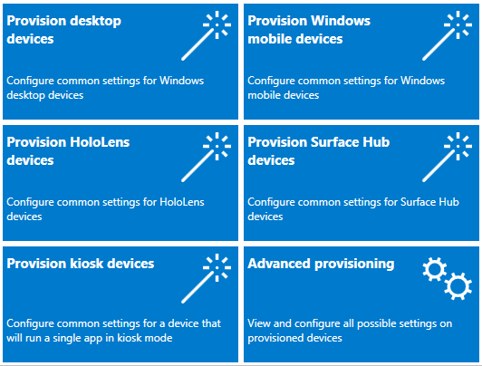

# What's new in Windows 10, version 1703 IT pro content

Below is a list of some of the new and updated content that discusses Information Technology (IT) pro features in Windows 10, version 1703 (also known as the Creators Update).

For more general info about Windows 10 features, see [Features available only on Windows 10](https://www.microsoft.com/windows/features). For info about previous versions of Windows 10, see [What's New in Windows 10](index.md).

>[!NOTE]
>For release dates and servicing options for each version, see [Windows 10 release information](https://technet.microsoft.com/en-us/windows/release-info). For a list of removed features, see [Features that are removed or deprecated in Windows 10 Creators Update](https://support.microsoft.com/help/4014193/features-that-are-removed-or-deprecated-in-windows-10-creators-update).
 
## Configuration

### Windows Configuration Designer

Previously known as *Windows Imaging and Configuration Designer (ICD)*, the tool for creating provisioning packages is renamed **Windows Configuration Designer**. The new Windows Configuration Designer is available in [Windows Store as an app](https://www.microsoft.com/store/apps/9nblggh4tx22). To run Windows Configuration Designer on earlier versions of Windows, you can still install Windows Configuration Designer from the [Windows Assessment and Deployment Kit (ADK)](https://developer.microsoft.com/windows/hardware/windows-assessment-deployment-kit).

Windows Configuration Designer in Windows 10, version 1703, includes several new wizards to make it easier to create provisioning packages.

[Learn more about Windows Configuration Designer.](../configure/provisioning-packages.md)

### Bulk enrollment in Azure Active Directory

Using the new wizards in Windows Configuration Designer, you can [create provisioning packages to enroll devices in Azure Active Directory](../configure/provisioning-packages.md#configuration-designer-wizards). Bulk enrollment in Azure AD is available in the desktop, mobile, kiosk, and Surface Hub wizards.

### Windows Spotlight

The following new Group Policy and mobile device management (MDM) settings are added to help you configure Windows Spotlight user experiences:

- **Turn off the Windows Spotlight on Action Center**
- **Do not use diagnostic data for tailored experiences**
- **Turn off the Windows Welcome Experience**

[Learn more about Windows Spotlight.](../configure/windows-spotlight.md)

### Start and taskbar layout

Enterprises have been able to apply customized Start and taskbar layouts to devices running Windows 10 Enterprise and Education. In Windows 10, version 1703, customized Start and taskbar layout can also be applied to Windows 10 Pro.

Additional MDM policy settings are available for Start and taskbar layout. For details, see [Manage Windows 10 Start and taskbar layout](../configure/windows-10-start-layout-options-and-policies.md).

Previously, the customized taskbar could only be deployed using Group Policy or provisioning packages. Windows 10, version 1703, adds support for customized taskbars to [MDM](../configure/customize-windows-10-start-screens-by-using-mobile-device-management.md).

### Lockdown Designer for Windows 10 Mobile lockdown files

The Lockdown Designer app helps you configure and create a lockdown XML file to apply to devices running Windows 10 Mobile, and includes a remote simulation to help you determine the layout for tiles on the Start screen. Using Lockdown Designer is easier than [manually creating a lockdown XML file](../configure/lockdown-xml.md).

[Learn more about the Lockdown Designer app.](../configure/mobile-lockdown-designer.md)

### Cortana at work

Cortana is Microsoft’s personal digital assistant, who helps busy people get things done, even while at work. Cortana has powerful configuration options, specifically optimized for your business. By signing in with an Azure Active Directory (Azure AD) account, your employees can give Cortana access to their enterprise/work identity, while getting all the functionality Cortana provides to them outside of work.

Using Azure AD also means that you can remove an employee’s profile (for example, when an employee leaves your organization) while respecting Windows Information Protection (WIP) policies and ignoring enterprise content, such as emails, calendar items, and people lists that are marked as enterprise data.

## Deployment

### MBR2GPT.EXE

MBR2GPT.EXE is a new command-line tool available in Windows 10 version 1703 and later versions. MBR2GPT converts a disk from Master Boot Record (MBR) to GUID Partition Table (GPT) partition style without modifying or deleting data on the disk. The tool is designed to be run from a Windows Preinstallation Environment (Windows PE) command prompt, but can also be run from the full Windows 10 operating system (OS).

The GPT partition format is newer and enables the use of larger and more disk partitions. It also provides added data reliability, supports additional partition types, and enables faster boot and shutdown speeds. If you convert the system disk on a computer from MBR to GPT, you must also configure the computer to boot in UEFI mode, so make sure that your device supports UEFI before attempting to convert the system disk.

Additional security features of Windows 10 that are enabled when you boot in UEFI mode include: Secure Boot, Early Launch Anti-malware (ELAM) driver, Windows Trusted Boot, Measured Boot, Device Guard, Credential Guard, and BitLocker Network Unlock.

For details, see [MBR2GPT.EXE](../deploy/mbr-to-gpt.md).

## Security

### Windows Defender Advanced Threat Protection

New features in Windows Defender Advanced Threat Protection (ATP) for Windows 10, version 1703 include:
- **Detection** 
  Enhancements to the detection capabilities include:
  - [Use the threat intelligence API to create custom alerts](../keep-secure/use-custom-ti-windows-defender-advanced-threat-protection.md) - Understand threat intelligence concepts, enable the threat intel application, and create custom threat intelligence alerts for your organization.
  - Improvements on OS memory and kernel sensors to enable detection of attackers who are using in-memory and kernel-level attacks
  - Upgraded detections of ransomware and other advanced attacks
  - Historical detection capability ensures new detection rules apply to up to six months of stored data to detect attacks that previously went unnoticed

- **Investigation** 
  Enterprise customers can now take advantage of the entire Windows security stack with Windows Defender Antivirus detections and Device Guard blocks being surfaced in the Windows Defender ATP portal. Other capabilities have been added to help you gain a holistic view on investigations.

   Other investigation enhancements include:
   - [Investigate a user account](../keep-secure/investigate-user-windows-defender-advanced-threat-protection.md) - Identify user accounts with the most active alerts and investigate cases of potential compromised credentials.
   - [Alert process tree](../keep-secure/investigate-alerts-windows-defender-advanced-threat-protection.md#alert-process-tree) - Aggregates multiple detections and related events into a single view to reduce case resolution time.
   - [Pull alerts using REST API](../keep-secure/pull-alerts-using-rest-api-windows-defender-advanced-threat-protection.md) - Use REST API to pull alerts from Windows Defender ATP.

- **Response** 
  When detecting an attack, security response teams can now take immediate action to contain a breach:
  - [Take response actions on a machine](../keep-secure/respond-machine-alerts-windows-defender-advanced-threat-protection.md) - Quickly respond to detected attacks by isolating machines or collecting an investigation package.
  - [Take response actions on a file](../keep-secure/respond-file-alerts-windows-defender-advanced-threat-protection.md) - Quickly respond to detected attacks by stopping and quarantining files or blocking a file.

- **Other features**
  - [Check sensor health state](../keep-secure/check-sensor-status-windows-defender-advanced-threat-protection.md) - Check an endpoint's ability to provide sensor data and communicate with the Windows Defender ATP service and fix known issues.

You can read more about ransomware mitigations and detection capability in Windows Defender Advanced Threat Protection in the blog: [Averting ransomware epidemics in corporate networks with Windows Defender ATP](https://blogs.technet.microsoft.com/mmpc/2017/01/30/averting-ransomware-epidemics-in-corporate-networks-with-windows-defender-atp/).

### Windows Defender Antivirus
Windows Defender is now called Windows Defender Antivirus, and we've [increased the breadth of the documentation library for enterprise security admins](../keep-secure/windows-defender-antivirus-in-windows-10.md).

The new library includes information on:
- [Deploying and enabling AV protection](../keep-secure/deploy-windows-defender-antivirus.md)
- [Managing updates](../keep-secure/manage-updates-baselines-windows-defender-antivirus.md)
- [Reporting](../keep-secure/report-monitor-windows-defender-antivirus.md)
- [Configuring features](../keep-secure/configure-windows-defender-antivirus-features.md)
- [Troubleshooting](../keep-secure/troubleshoot-windows-defender-antivirus.md)

Some of the highlights of the new library include:
- [Evaluation guide for Windows Defender AV](../keep-secure/evaluate-windows-defender-antivirus.md)
- [Deployment guide for Windows Defender AV in a virtual desktop infrastructure environment](../keep-secure/deployment-vdi-windows-defender-antivirus.md)

New features for Windows Defender AV in Windows 10, version 1703 include:

- [Updates to how the Block at First Sight feature can be configured](../keep-secure/configure-block-at-first-sight-windows-defender-antivirus.md)
- [The ability to specify the level of cloud-protection](../keep-secure/specify-cloud-protection-level-windows-defender-antivirus.md)
- [Windows Defender Antivirus protection in the Windows Defender Security Center app](../keep-secure/windows-defender-security-center-antivirus.md)

In Windows 10, version 1607, we [invested heavily in helping to protect against ransomware](https://blogs.windows.com/business/2016/11/11/defending-against-ransomware-with-windows-10-anniversary-update/#UJlHc6SZ2Zm44jCt.97), and we continue that investment in version 1703 with [updated beahvior monitoring and always-on real-time protection](.../keep-secure/configure-real-time-protection-windows-defender-antivirus.md).

You can read more about ransomware mitigations and detection capability in Windows Defender AV in the [Ransomware Protection in Windows 10 Anniversary Update whitepaper (PDF)](http://wincom.blob.core.windows.net/documents/Ransomware_protection_in_Windows_10_Anniversary_Update.pdf) and at the [Microsoft Malware Protection Center blog](https://blogs.technet.microsoft.com/mmpc/category/research/ransomware/).

### Device Guard and Credential Guard

Additional security qualifications for Device Guard and Credential Guard help protect vulnerabilities in UEFI runtime.
For more information, see [Device Guard Requirements](../keep-secure/requirements-and-deployment-planning-guidelines-for-device-guard.md#device-guard-requirements-for-improved-security) and [Credential Guard Security Considerations](../keep-secure/credential-guard.md#security-considerations).

### Group Policy Security Options

The security setting [**Interactive logon: Display user information when the session is locked**](../keep-secure/interactive-logon-display-user-information-when-the-session-is-locked.md) has been updated to work in conjunction with the **Privacy** setting in **Settings** > **Accounts** > **Sign-in options**.

A new security policy setting
[**Interactive logon: Don't display username at sign-in**](../keep-secure/interactive-logon-dont-display-username-at-sign-in.md) has been introduced in Windows 10 version 1703. This security policy setting determines whether the username is displayed during sign in. It works in conjunction with the **Privacy** setting in **Settings** > **Accounts** > **Sign-in options**. The setting only affects the **Other user** tile.

## Update

### Windows Update for Business

The pause feature has been changed, and now requires a start date to set up. Users are now able to pause through **Settings > Update & security > Windows Update > Advanced options** in case a policy has not been configured. We have also increased the pause limit on quality updates to 35 days. You can find more information on pause in [Pause Feature Updates](../update/waas-configure-wufb.md#pause-feature-updates) and [Pause Quality Updates](../update/waas-configure-wufb.md#pause-quality-updates).

Windows Update for Business managed devices are now able to defer feature update installation by up to 365 days (it used to be 180 days). In settings, users are able to select their branch readiness level and update deferal periods. See [Configure devices for Current Branch (CB) or Current Branch for Business (CBB)](../update/waas-configure-wufb.md#configure-devices-for-current-branch-or-current-branch-for-business), [Configure when devices receive Feature Updates](../update/waas-configure-wufb.md#configure-when-devices-receive-feature-updates) and [Configure when devices receive Quality Updates](../update/waas-configure-wufb.md#configure-when-devices-receive-quality-updates) for details.

### Optimize update delivery

[Express updates](../update/waas-optimize-windows-10-updates.md#express-update-delivery) are now supported on System Center Configuration Manager, starting with version 1702 of Configuration Manager, in addition to current Express support on Windows Update, Windows Update for Business and WSUS.

Delivery Optimization policies now enable you to configure additional restrictions to have more control in various scenarios.

Added policies include:
- [Allow uploads while the device is on battery while under set Battery level](../update/waas-delivery-optimization.md#allow-uploads-while-the-device-is-on-battery-while-under-set-battery-level)
- [Enable Peer Caching while the device connects via VPN](../update/waas-delivery-optimization.md#enable-peer-caching-while-the-device-connects-via-vpn)
- [Minimum RAM (inclusive) allowed to use Peer Caching](../update/waas-delivery-optimization.md#minimum-ram-allowed-to-use-peer-caching)
- [Minimum disk size allowed to use Peer Caching](../update/waas-delivery-optimization.md#minimum-disk-size-allowed-to-use-peer-caching)
- [Minimum Peer Caching Content File Size](../update/waas-delivery-optimization.md#minimum-peer-caching-content-file-size)

To check out all the details, see [Configure Delivery Optimization for Windows 10 updates](../update/waas-delivery-optimization.md)

## Management

### New MDM capabilities

Windows 10, version 1703 adds several new [configuration service providers (CSPs)](../configure/how-it-pros-can-use-configuration-service-providers.md) that provide new capabilities for managing Windows 10 devices using MDM. Some of the new CSPs are:

- The [DynamicManagement CSP](https://msdn.microsoft.com/windows/hardware/commercialize/customize/mdm/dynamicmanagement-csp) allows you to manage devices differently depending on location, network, or time. For example, managed devices can have cameras disabled when at a work location, the cellular service can be disabled when outside the country to avoid roaming charges, or the wireless network can be disabled when the device is not within the corporate building or campus. Once configured, these settings will be enforced even if the device can’t reach the management server when the location or network changes. The Dynamic Management CSP enables configuration of policies that change how the device is managed in addition to setting the conditions on which the change occurs.

- The [CleanPC CSP](https://msdn.microsoft.com/windows/hardware/commercialize/customize/mdm/cleanpc-csp) allows removal of user-installed and pre-installed applications, with the option to persist user data.

- The [BitLocker CSP](https://msdn.microsoft.com/windows/hardware/commercialize/customize/mdm/bitlocker-csp) is used to manage encryption of PCs and devices. For example, you can require storage card encryption on mobile devices, or require encryption for fixed drives and removable drives.

- The [NetworkProxy CSP](https://msdn.microsoft.com/windows/hardware/commercialize/customize/mdm/networkproxy-csp) is used to configure a proxy server for ethernet and Wi-Fi connections.

[Learn more about new MDM capabilities.](https://msdn.microsoft.com/windows/hardware/commercialize/customize/mdm/new-in-windows-mdm-enrollment-management#whatsnew10)

### Mobile application management support for Windows 10

The Windows version of mobile application management (MAM) is a lightweight solution for managing company data access and security on personal devices. MAM support is built into Windows on top of Windows Information Protection (WIP), starting in Windows 10, version 1703.

For more info, see [Implement server-side support for mobile application management on Windows](https://msdn.microsoft.com/windows/hardware/commercialize/customize/mdm/implement-server-side-mobile-application-management).

### Application Virtualization for Windows (App-V)
Previous versions of the Microsoft Application Virtualization Sequencer (App-V Sequencer) have required you to manually create your sequencing environment. Windows 10, version 1703 introduces two new PowerShell cmdlets, New-AppVSequencerVM and Connect-AppvSequencerVM, which automatically create your sequencing environment for you, including provisioning your virtual machine. Addtionally, the App-V Sequencer has been updated to let you sequence or update multiple apps at the same time, while automatically capturing and storing your customizations as an App-V project template (.appvt) file, and letting you use PowerShell or Group Policy settings to automatically cleanup your unpublished packages after a device restart.

For more info, see the following topics:
- [Automatically provision your sequencing environment using Microsoft Application Virtualization Sequencer (App-V Sequencer)](../manage/appv-auto-provision-a-vm.md)
- [Automatically sequence multiple apps at the same time using Microsoft Application Virtualization Sequencer (App-V Sequencer)](../manage/appv-auto-batch-sequencing.md)
- [Automatically update multiple apps at the same time using Microsoft Application Virtualization Sequencer (App-V Sequencer)](../manage/appv-auto-batch-updating.md)
- [Automatically cleanup unpublished packages on the App-V client](../manage/appv-auto-clean-unpublished-packages.md)

## New features in related products
The following new features aren't part of Windows 10, but help you make the most of it.

### Upgrade Readiness

Upgrade Readiness helps you ensure that applications and drivers are ready for a Windows 10 upgrade. The solution provides up-to-date application and driver inventory, information about known issues, troubleshooting guidance, and per-device readiness and tracking details. The Upgrade Readiness tool moved from public preview to general availability on March 2, 2017.

The development of Upgrade Readiness has been heavily influenced by input from the community the development of new features is ongoing. To begin using Upgrade Readiness, add it to an existing Operation Management Suite (OMS) workspace or sign up for a new OMS workspace with the Upgrade Readiness solution enabled.  

For more information about Upgrade Readiness, see the following topics:

- [Windows Analytics blog](https://blogs.technet.microsoft.com/upgradeanalytics/)
- [Manage Windows upgrades with Upgrade Readiness](../deploy/manage-windows-upgrades-with-upgrade-readiness.md)

### Update Compliance

Update Compliance helps you to keep Windows 10 devices in your organization secure and up-to-date.

Update Compliance is a solution built using OMS Logs and Analytics that provides information about installation status of monthly quality and feature updates. Details are provided about the deployment progress of existing updates and the status of future updates. Information is also provided about devices that might need attention to resolve issues.

For more information about Update Compliance, see [Monitor Windows Updates with Update Compliance](../manage/update-compliance-monitor.md).
