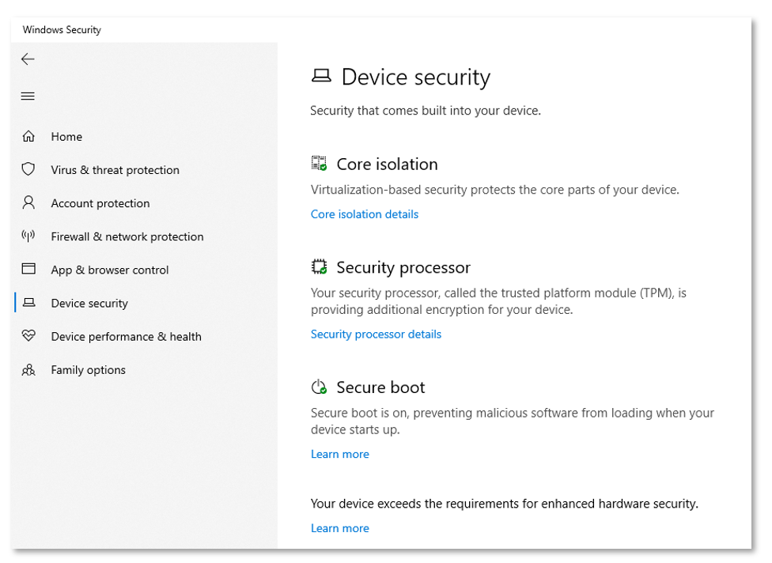

# What's new in Windows 10, version 1903 for IT Pros

**Applies to**
-   Windows 10, version 1903

This article lists new and updated features and content that are of interest to IT Pros for Windows 10 version 1903, also known as the Windows 10 May 2019 Update. This update also contains all features and fixes included in previous cumulative updates to Windows 10, version 1809. 

>[!NOTE]
>
>New disk space requirement for Windows 10, version 1903 applies only to OEMs for the manufacture of new PCs. This new requirement does not apply to existing devices.  PCs that don't meet new device disk space requirements will continue to receive updates and the 1903 update will require about the same amount of free disk space as previous updates.  For more information, see [Reserved storage](#reserved-storage).

## Deployment

### Windows Autopilot

[Windows Autopilot](/windows/deployment/windows-autopilot/windows-autopilot) is a collection of technologies used to set up and pre-configure new devices, getting them ready for productive use. The following Windows Autopilot features are available in Windows 10, version 1903 and later:

- [Windows Autopilot for pre-provisioned deployment](/autopilot/pre-provision) is new in this version of Windows. Pre-provisioned deployment enables partners or IT staff to pre-provision devices so they're fully configured and business ready for your users.
- The Intune [enrollment status page](/intune/windows-enrollment-status) (ESP) now tracks Intune Management Extensions.
- [Cortana voiceover](/windows-hardware/customize/desktop/cortana-voice-support) and speech recognition during OOBE is disabled by default for all Windows 10 Pro Education, and Enterprise SKUs.
- Windows Autopilot is self-updating during OOBE. From Windows 10, version 1903 Autopilot functional and critical updates begin downloading automatically during OOBE.
- Windows Autopilot sets the [diagnostics data](/windows/privacy/windows-diagnostic-data) level to Full on Windows 10 version 1903 and later during OOBE.

### SetupDiag

[SetupDiag](/windows/deployment/upgrade/setupdiag) is a command-line tool that can help diagnose why a Windows 10 update failed. SetupDiag works by searching Windows Setup log files. When log files are being searched, SetupDiag uses a set of rules to match known issues. In the current version of SetupDiag there are 53 rules contained in the rules.xml file, which is extracted when SetupDiag is run. The rules.xml file are updated as new versions of SetupDiag are made available.

### Reserved storage

[**Reserved storage**](https://techcommunity.microsoft.com/t5/Storage-at-Microsoft/Windows-10-and-reserved-storage/ba-p/428327): Reserved storage sets aside disk space to be used by updates, apps, temporary files, and system caches. It improves the day-to-day function of your PC by ensuring critical OS functions always have access to disk space.  Reserved storage is enabled automatically on new PCs with Windows 10, version 1903 or later pre-installed, and for clean installs.  It isn't enabled when updating from a previous version of Windows 10.

## Servicing

- [**Delivery Optimization**](/windows/deployment/update/waas-delivery-optimization): Improved Peer Efficiency for enterprises and educational institutions with complex networks is enabled with [new policies](/windows/client-management/mdm/policy-csp-deliveryoptimization). These new policies now support Microsoft 365 Apps for enterprise updates and Intune content.
- [**Automatic Restart Sign-on (ARSO)**](/windows-server/identity/ad-ds/manage/component-updates/winlogon-automatic-restart-sign-on--arso-): Windows automatically signs in as the user and lock their device in order to complete the update. This automatic sign-in ensures that when the user returns and unlocks the device, the update is completed.  
- [**Windows Update for Business**](https://techcommunity.microsoft.com/t5/Windows-IT-Pro-Blog/Windows-Update-for-Business-and-the-retirement-of-SAC-T/ba-p/339523): There's now a single, common start date for phased deployments (no more SAC-T designation). In addition, there's a new notification and reboot scheduling experience for end users, the ability to enforce update installation and reboot deadlines, and the ability to provide end user control over reboots for a specific time period.
- **Update rollback improvements**: You can now automatically recover from startup failures by removing updates if the startup failure was introduced after the installation of recent driver or quality updates. When a device is unable to start up properly after the recent installation of Quality of driver updates, Windows will now automatically uninstall the updates to get the device backed up and run normally.
- **Pause updates**: The ability to pause updates for both feature and monthly updates is extended. This extension ability is for all editions of Windows 10, including Home. You can pause both feature and monthly updates for up to 35 days (seven days at a time, up to five times). Once the 35-day pause period is reached, the device needs to be updated before pausing again.
- **Improved update notifications**: When there's an update requiring you to restart your device, a colored dot appears on the Power button in the Start menu and on the Windows icon in your taskbar.
- **Intelligent active hours**: To further enhance active hours, users are now able to let Windows Update intelligently adjust active hours based on their device-specific usage patterns. You must enable the intelligent active hours feature for the system to predict device-specific usage patterns.
- **Improved update orchestration to improve system responsiveness**: This feature improves system performance by intelligently coordinating Windows updates and Microsoft Store updates, so they occur when users are away from their devices to minimize disruptions.

## Security

### Windows Information Protection

With this release, Microsoft Defender for Endpoint extends discovery and protection of sensitive information with [Auto Labeling](/windows/security/information-protection/windows-information-protection/how-wip-works-with-labels#how-wip-protects-automatically-classified-files).

### Security configuration framework

With this release of Windows 10, Microsoft is introducing a [new taxonomy for security configurations](https://github.com/microsoft/SecCon-Framework/blob/master/windows-security-configuration-framework.md), called the **SECCON framework**, comprised of 5 device security configurations.

### Security baseline for Windows 10 and Windows Server

The draft release of the [security configuration baseline settings](/archive/blogs/secguide/security-baseline-draft-for-windows-10-v1903-and-windows-server-v1903) for Windows 10, version 1903 and for Windows Server version 1903 is available.

### Intune security baselines

[Intune Security Baselines](/intune/security-baselines) (Preview): Now includes many settings supported by Intune that you can use to help secure and protect your users and devices. You can automatically set these settings to values recommended by security teams.

### Microsoft Defender for Endpoint

- [Attack surface area reduction](/windows/security/threat-protection/windows-defender-atp/overview-attack-surface-reduction) - IT admins can configure devices with advanced web protection that enables them to define allowlists and blocklists for specific URLs and IP addresses.
- [Next generation protection](/microsoft-365/security/defender-endpoint/microsoft-defender-antivirus-in-windows-10) - Controls are extended to protection from ransomware, credential misuse, and attacks that are transmitted through removable storage.
  - Integrity enforcement capabilities - Enable remote runtime attestation of Windows 10 platform.
  - Tamper-proofing capabilities - Uses virtualization-based security to isolate critical Microsoft Defender for Endpoint security capabilities away from the OS and attackers.
- [Platform support](https://techcommunity.microsoft.com/t5/Windows-Defender-ATP/Protecting-Windows-Server-with-Windows-Defender-ATP/ba-p/267114) - In addition to Windows 10, Microsoft Defender for Endpoint's functionality are extended to support Windows 7 and Windows 8.1 clients, as well as macOS, Linux, and Windows Server with both its Endpoint Detection (EDR) and Endpoint Protection Platform (EPP) capabilities.

### Microsoft Defender for Endpoint next-gen protection technologies

- **Advanced machine learning**: Improved with advanced machine learning and AI models that enable it to protect against apex attackers using innovative vulnerability exploit techniques, tools and malware.
- **Emergency outbreak protection**: Provides emergency outbreak protection that automatically updates devices with new intelligence when a new outbreak is detected.
- **Certified ISO 27001 compliance**: Ensures that the cloud service is analyzed for threats, vulnerabilities and impacts, and that risk management and security controls are in place.
- **Geolocation support**: Support geolocation and sovereignty of sample data and configurable retention policies.

### Threat Protection

- [Windows Sandbox](https://techcommunity.microsoft.com/t5/Windows-Kernel-Internals/Windows-Sandbox/ba-p/301849): Isolated desktop environment where you can run untrusted software without the fear of lasting impact to your device.
- [Microphone privacy settings](https://support.microsoft.com/windows/windows-camera-microphone-and-privacy-a83257bc-e990-d54a-d212-b5e41beba857): A microphone icon appears in the notification area letting you see which apps are using your microphone.

- [Windows Defender Application Guard](/windows/security/threat-protection/windows-defender-application-guard/wd-app-guard-overview) enhancements:
  - Standalone users can install and configure their Windows Defender Application Guard settings without needing to change Registry key settings. Enterprise users can check their settings to see what their administrators have configured for their machines to better understand the behavior.
  - WDAG is now an extension in Google Chrome and Mozilla Firefox. Many users are in a hybrid browser environment, and would like to extend WDAG’s browser isolation technology beyond Microsoft Edge. In the latest release, users can install the WDAG extension in their Chrome or Firefox browsers. This extension will redirect untrusted navigation to the WDAG Edge browser. There's also a companion app to enable this feature in the Microsoft Store. Users can quickly launch WDAG from their desktop using this app. This feature is also available in Windows 10, version 1803 or later with the latest updates.

    To try this extension:
    1. Configure WDAG policies on your device.
    2. Go to the Chrome Web Store or Firefox Add-ons and search for Application Guard. Install the extension.
    3. Follow any of the other configuration steps on the extension setup page.
    4. Reboot the device.
    5. Navigate to an untrusted site in Chrome and Firefox.

  - WDAG allows dynamic navigation: Application Guard now allows users to navigate back to their default host browser from the WDAG Microsoft Edge. Previously, users browsing in WDAG Edge would see an error page when they try to go to a trusted site within the container browser. With this new feature, users are automatically redirected to their host default browser when they enter or select on a trusted site in WDAG Edge. This feature is also available in Windows 10, version 1803 or later with the latest updates.

- [Windows Defender Application Control (WDAC)](/windows/security/threat-protection/windows-defender-application-control/windows-defender-application-control): In Windows 10, version 1903, Windows Defender Application Control has many new features that light up key scenarios and provide feature parity with AppLocker.
  - [Multiple Policies](/windows/security/threat-protection/windows-defender-application-control/deploy-multiple-windows-defender-application-control-policies): Windows Defender Application Control now supports multiple simultaneous code integrity policies for one device in order to enable the following scenarios:
    1. Enforce and audit side-by-side.
    1. Simpler targeting for policies with different scope/intent.
    1. expanding a policy using a new supplemental policy.
  - [Path-Based Rules](/windows/security/threat-protection/windows-defender-application-control/create-path-based-rules): The path condition identifies an app by its location in the file system of the computer or on the network instead of a signer or hash identifier. Additionally, Windows Defender Application Control has an option that allows admins to enforce at runtime that only code from paths that aren't user-writeable is executed. When code tries to execute at runtime, the directory is scanned and files are checked for write permissions for unknown admins. If a file is found to be user writeable, the system blocks the executable from running unless it receives authorization from a source other than a path rule, such as a signer or hash rule.
    - This functionality brings WDAC to parity with AppLocker in terms of support for file path rules. WDAC improves upon the security of policies based on file path rules with the availability of the user-writability permission checks at runtime time. This capability isn't available with AppLocker.
  - [Allow COM Object Registration](/windows/security/threat-protection/windows-defender-application-control/allow-com-object-registration-in-windows-defender-application-control-policy): Previously, Windows Defender Application Control enforced a built-in allowlist for COM object registration. While this mechanism works for most common application usage scenarios, customers provided feedback that there are cases where more COM objects need to be allowed. The 1903 update to Windows 10 introduces the ability to specify allowed COM objects via their GUID in the WDAC policy.

#### System Guard

[System Guard](/windows/security/threat-protection/windows-defender-system-guard/system-guard-how-hardware-based-root-of-trust-helps-protect-windows) has a new feature in this version of Windows called **SMM Firmware Measurement**. This feature is built on top of [System Guard Secure Launch](/windows/security/threat-protection/windows-defender-system-guard/system-guard-secure-launch-and-smm-protection) to check that the System Management Mode (SMM) firmware on the device is operating in a healthy manner. Specifically, OS memory and secrets are protected from SMM.

This new feature is displayed under the Device Security page with the string `Your device exceeds the requirements for enhanced hardware security` if configured properly:

### Identity Protection

- [Windows Hello FIDO2 certification](https://fidoalliance.org/microsoft-achieves-fido2-certification-for-windows-hello/): Windows Hello is now a FIDO2 Certified authenticator and enables password-less sign-in for websites supporting FIDO2 authentication, such as Microsoft account and Microsoft Entra ID.
- [Streamlined Windows Hello PIN reset experience](/windows/security/identity-protection/hello-for-business/hello-videos#windows-hello-for-business-forgotten-pin-user-experience): Microsoft account users have a revamped Windows Hello PIN reset experience with the same look and feel as signing in on the web.
- Sign-in with [Password-less](/windows/security/identity-protection/hello-for-business/passwordless-strategy) Microsoft accounts: Sign in to Windows 10 with a phone number account. Then use Windows Hello for an even easier sign-in experience!
- [Remote Desktop with Biometrics](/windows/security/identity-protection/hello-for-business/hello-feature-remote-desktop#remote-desktop-with-biometrics): Microsoft Entra ID and Active Directory users using Windows Hello for Business can use biometrics to authenticate to a remote desktop session.

### Security management

- [Windows Defender Firewall now supports Windows Subsystem for Linux (WSL)](https://blogs.windows.com/windowsexperience/2018/04/19/announcing-windows-10-insider-preview-build-17650-for-skip-ahead/#II14f7VlSBcZ0Gs4.97): Lets you add rules for WSL process, just like for Windows processes.
- [Windows Security app](/windows/security/threat-protection/windows-defender-security-center/windows-defender-security-center) improvements now include Protection history, including detailed and easier to understand information about threats and available actions, Controlled Folder Access blocks are now in the Protection history, Windows Defender Offline Scanning tool actions, and any pending recommendations.
- [Tamper Protection](/microsoft-365/security/defender-endpoint/prevent-changes-to-security-settings-with-tamper-protection) lets you prevent others from tampering with important security features.

## Microsoft Edge

Several new features are coming in the next version of Microsoft Edge. For more information, see the [news from Build 2019](https://blogs.windows.com/msedgedev/2019/05/06/edge-chromium-build-2019-pwa-ie-mode-devtools/#2QJF4u970WjQ2Sv7.97).

## See Also

- [What's New in Windows Server, version 1903](/windows-server/get-started/whats-new-in-windows-server-1903-1909): New and updated features in Windows Server.
- [Windows 10 Features](https://www.microsoft.com/windows/features): Review general information about Windows 10 features.
- [What's New in Windows 10](./index.yml): See what's new in other versions of Windows 10.
- [What's new in Windows 10](/windows-hardware/get-started/what-s-new-in-windows): See what's new in Windows 10 hardware.
- [What's new in Windows 10 for developers](https://blogs.windows.com/buildingapps/2019/04/18/start-developing-on-windows-10-may-2019-update-today/#2Lp8FUFQ3Jm8KVcq.97): New and updated features in Windows 10 that are of interest to developers.
